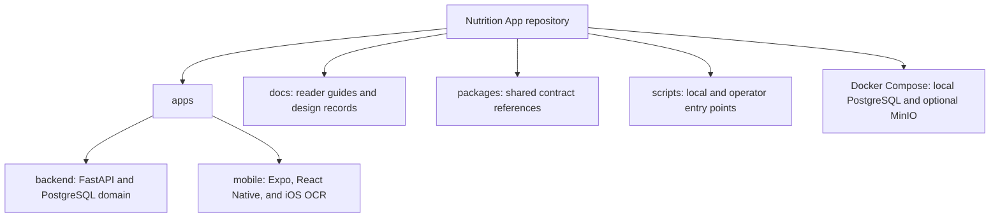
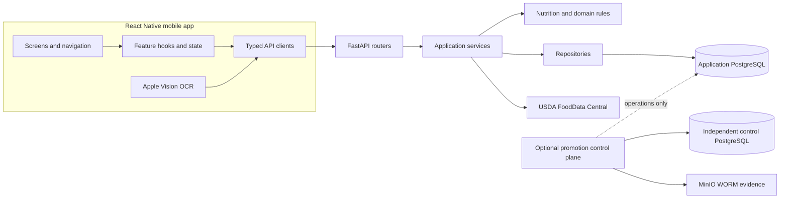

# Nutrition App

Nutrition App is an iOS-first nutrition tracker for building a personal food library, publishing
reusable recipes, scanning nutrition labels, and recording nutrition history without allowing
later edits to rewrite the past. A React Native mobile client talks to a FastAPI API backed by
PostgreSQL; Apple Vision performs OCR on the device, and the backend owns nutrition calculation,
validation, persistence, USDA integration, and historical guarantees.

The repository also contains an advanced production-hardening and promotion control plane. That
subsystem protects high-risk historical database conversion and deployment operations. It is
important for operators, but it is **not prerequisite reading** for ordinary Foods, Recipes,
Daily Logs, USDA, OCR, Search, or Targets work.

## Repository at a glance



| Area | Responsibility |
| --- | --- |
| `apps/backend` | Authoritative API behavior, nutrition rules, persistence, migrations, operators, and backend tests |
| `apps/mobile` | User experience, mobile state, typed API boundaries, and native Apple Vision integration |
| `docs` | Reader-oriented guides plus detailed stage, production-hardening, and release records |
| `packages` | Small shared contract references; not a generated client SDK |
| `scripts` | Development conveniences and explicit offline/operator commands |
| Compose files | Local application PostgreSQL and disposable Phase 5C4 MinIO qualification |

The [Repository Tour](docs/repository-tour.md) explains where to begin for each feature and which
advanced directories can be ignored during ordinary application work.

## What the app does

- Creates, edits, duplicates, favorites, searches, and soft-deletes personal Foods.
- Resolves serving-based and gram-based nutrition using decimal-safe calculations.
- Searches and previews USDA FoodData Central through a backend-owned integration.
- Builds Recipes from Foods or published nested Recipes.
- Publishes immutable Recipe revisions that can be logged safely over time.
- Records Daily Logs as nutrient snapshots so Food edits cannot rewrite historical totals.
- Recognizes nutrition labels on iOS with Apple Vision, parses structured observations, and
  preserves a bounded correction-provenance trace after confirmation.
- Compares snapshot-derived daily nutrition with FDA Daily Values and optional personal targets.
- Provides favorites, recents, unified saved/USDA discovery, and light/dark presentation.

## Screenshots

> **[Home / Daily Log Screenshot]**
>
> Replace this placeholder with the current Daily Log screen.

> **[Saved Foods and Search Screenshot]**
>
> Replace this placeholder with the combined saved-food and USDA discovery screen.

> **[Recipe Editor Screenshot]**
>
> Replace this placeholder with Recipe authoring and ingredient selection.

> **[Nutrition Label Review Screenshot]**
>
> Replace this placeholder with OCR confirmation and correction review.

## Architecture at a glance



For layer responsibilities, persistence boundaries, and the two migration streams, read the
[Architecture Guide](docs/architecture.md). For a six-month-return orientation, start with the
[Repository Tour](docs/repository-tour.md).

## Technology stack

| Area | Technology |
| --- | --- |
| Mobile | React Native 0.79, Expo 53, TypeScript, React Navigation, TanStack Query, Zod |
| Native OCR | Swift Expo module using Apple Vision |
| Backend | Python 3.10+, FastAPI, Pydantic, SQLAlchemy 2 |
| Primary data | PostgreSQL 16, Alembic |
| External data | USDA FoodData Central API |
| Advanced operational evidence | Independent PostgreSQL control database and MinIO object lock |
| Tests | Pytest, Jest, PostgreSQL concurrency suites, native Swift tests |
| Quality | Ruff and TypeScript compiler |

## Repository navigation

The root `src/Main.java` and IDE metadata are not part of the Nutrition App runtime. See the
[Repository Tour](docs/repository-tour.md#what-to-ignore) before inferring architecture from
top-level files.

## Quick start

### 1. Start PostgreSQL

```bash
docker compose up -d postgres
```

### 2. Start the backend

```bash
cd apps/backend
python3 -m venv .venv
source .venv/bin/activate
pip install -e ".[dev]"
cp .env.example .env
alembic upgrade head
uvicorn app.main:app --reload
```

The example explicitly selects `development` mode and PostgreSQL at `localhost:5432`. The API is
available at `http://localhost:8000`; FastAPI's interactive schema is at `/docs`. Liveness is
`/api/v1/health` and database-backed readiness is `/api/v1/ready`.

### 3. Start the mobile client

```bash
cd apps/mobile
npm ci
EXPO_PUBLIC_NUTRITION_DEPLOYMENT_MODE=development \
EXPO_PUBLIC_NUTRITION_API_URL=http://localhost:8000/api/v1 \
  npm start
```

Use a reachable LAN URL for a physical device. Native Apple Vision OCR requires an iOS development
build; it is not supplied by Expo Go. The rest of the application can be understood and tested
without configuring the production-hardening control plane.

For configuration modes, private deployment constraints, migration safety, and canary behavior,
read the [Development Guide](docs/development-guide.md#configuration-and-startup).

## Documentation

Start at the [Documentation Index](docs/README.md), or choose a path:

| Goal | Read first |
| --- | --- |
| Understand the codebase quickly | [Repository Tour](docs/repository-tour.md) |
| Understand layer boundaries | [Architecture Guide](docs/architecture.md) |
| Change Foods, servings, USDA, Search, or Targets | [Foods and Nutrition Domain](docs/foods-and-nutrition.md) |
| Change Recipes, publication, revisions, or Daily Logs | [Recipes and Nutrition History](docs/recipes-and-logging.md) |
| Change OCR, mobile data flow, or offline behavior | [OCR, Search, and Offline Behavior](docs/ocr-search-and-offline.md) |
| Understand architectural decisions | [Why This Exists](docs/why-this-exists.md) |
| Recall a specific decision quickly | [Architecture Decision Index](docs/architecture-decisions.md) |
| Look up project terminology | [Glossary](docs/reference/glossary.md) |
| Find the right code and tests for a change | [Development Guide](docs/development-guide.md) |
| Run and extend qualification | [Testing Guide](docs/testing.md) |
| Work on production promotion infrastructure | [Control Plane Guide](docs/control-plane.md) — optional |

The `production-hardening-*` and stage files under `docs/` are detailed design and qualification
records. They are valuable operational references but are not the recommended entry point for
feature development.

## Core invariants

- Daily nutrition totals aggregate immutable log snapshots, never current mutable Food nutrients.
- Missing nutrient data is different from an explicit zero.
- Recipe publication creates an immutable revision; editing a Recipe does not rewrite that
  revision.
- Recipe-based logs bind to a published revision and its amount definition.
- OCR confirmation stores bounded structured provenance, not label images or unbounded raw OCR
  content.
- Persisted resources are user-owned at API, service, and database relationship boundaries.
- Retryable creates bind a client request ID to an exact payload and committed response.
- Public production authentication is intentionally unavailable until a real identity provider is
  installed; configuration fails closed rather than falling back to a development identity.

The rationale is collected in [Why This Exists](docs/why-this-exists.md).

## Testing

```bash
cd apps/backend
pytest
ruff check .

cd ../mobile
npm test
npm run typecheck
```

PostgreSQL concurrency, control-database, performance, and MinIO tests are opt-in because they need
explicit disposable services. The [Testing Guide](docs/testing.md) maps each suite to the invariant
it proves and gives the required commands.

## Roadmap and release status

The original product roadmap—foundation, Foods and Daily Logs, USDA, Recipes, OCR, parser and
confirmation, Targets, favorites, and discovery—is implementation-complete with automated contract
coverage. Physical-device OCR, accessibility, populated lifecycle, theme, keyboard, and live
failure-recovery QA remain release work; see [Roadmap Closeout](docs/stage7-roadmap-closeout.md) and
[Release Candidate QA](docs/rc1-release-qa.md).

Production hardening is intentionally separate. The repository contains historical conversion,
qualification, role separation, write-fence prerequisites, and an independent promotion admission
control plane. Runtime consumption of the independent control gate, provider switching, activation,
and public multi-user authentication are not claimed complete. See the optional
[Control Plane Guide](docs/control-plane.md) for the exact boundary.

## Next reading

- Start with the [Repository Tour](docs/repository-tour.md) when returning after a break.
- Use the [Architecture Decision Index](docs/architecture-decisions.md) to refresh a remembered
  design choice quickly.
- Choose a feature guide from the [Documentation Index](docs/README.md) before opening code.
- Read the optional [Control Plane Guide](docs/control-plane.md) only when working on Phase 5 or
  production operations.
