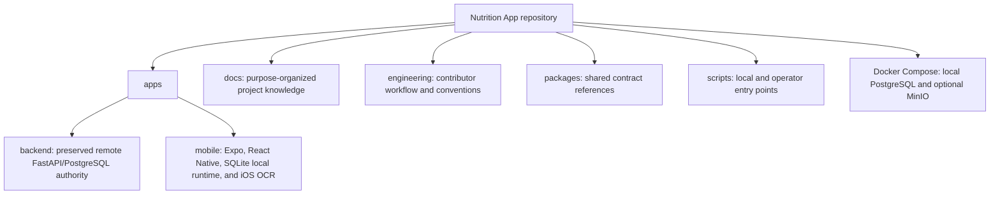
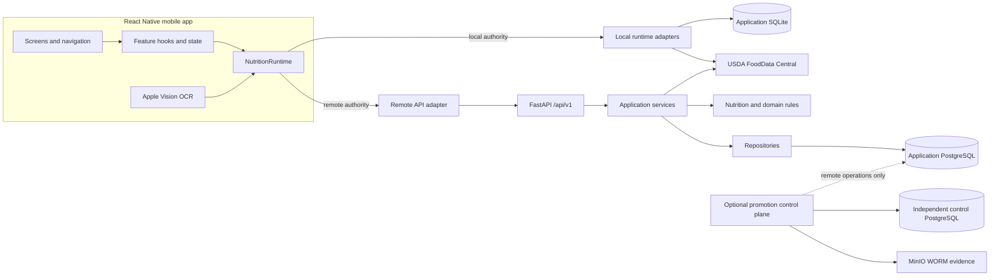

# Nutrition App

Nutrition App is an iOS-first nutrition tracker for building a personal food library, publishing
reusable recipes, scanning nutrition labels, and recording nutrition history without allowing
later edits to rewrite the past. The React Native client enters application data through an
explicit `NutritionRuntime` authority boundary. In the default local-first path, on-device SQLite
is the authoritative application-data store and the local runtime owns Foods, Recipes, Daily Logs,
Targets, OCR parsing/confirmation, and USDA import. The existing FastAPI/PostgreSQL system remains
available as an alternate remote/reference authority. Apple Vision performs OCR on device. The two
authorities do not synchronize, dual-write, fail over, or silently mix.

The repository also contains an advanced production-hardening and promotion control plane. That
subsystem protects high-risk historical database conversion and deployment operations. It is
important for operators, but it is **not prerequisite reading** for ordinary Foods, Recipes,
Daily Logs, USDA, OCR, Search, or Targets work.

## Repository at a glance


```mermaid
flowchart TD
    Repo["Nutrition App repository"] --> Apps["apps"]
    Apps --> Backend["backend: preserved remote FastAPI/PostgreSQL authority"]
    Apps --> Mobile["mobile: Expo, React Native, SQLite local runtime, and iOS OCR"]
    Repo --> Docs["docs: purpose-organized project knowledge"]
    Repo --> Engineering["engineering: contributor workflow and conventions"]
    Repo --> Packages["packages: shared contract references"]
    Repo --> Scripts["scripts: local and operator entry points"]
    Repo --> Compose["Docker Compose: local PostgreSQL and optional MinIO"]
```

| Area | Responsibility |
| --- | --- |
| `apps/backend` | Preserved remote FastAPI/PostgreSQL authority, remote domain behavior, migrations, operators, and backend tests |
| `apps/mobile` | User experience, `NutritionRuntime`, authoritative local SQLite runtime, remote adapter, and native Apple Vision integration |
| `docs` | Current project, architecture, feature, operations, reference, and historical knowledge |
| `engineering` | Change lifecycle, Git conventions, review, merge, release, and automation ownership |
| `packages` | Small shared contract references; not a generated client SDK |
| `scripts` | Discoverable repository lifecycle, validation, runtime, qualification, and packaging entry points |
| Compose files | Optional remote/reference PostgreSQL and disposable Phase 5C4 qualification infrastructure |

The [Repository Tour](docs/project/repository-tour.md) explains where to begin for each feature and which
advanced directories can be ignored during ordinary application work.

## What the app does

- Creates, edits, duplicates, favorites, searches, and soft-deletes personal Foods.
- Resolves serving-based and gram-based nutrition using decimal-safe calculations.
- Searches and previews USDA FoodData Central through a backend-owned integration.
- Builds Recipes from Foods or published nested Recipes.
- Publishes immutable Recipe revisions that can be logged safely over time.
- Records Daily Logs as nutrient snapshots so Food edits cannot rewrite historical totals.
- Recognizes nutrition labels on iOS with Apple Vision, parses structured observations, and
  preserves a bounded correction-provenance trace after confirmation.
- Compares snapshot-derived daily nutrition with FDA Daily Values and optional personal targets.
- Provides favorites, recents, unified saved/USDA discovery, and light/dark presentation.

## Screenshots

> **[Home / Daily Log Screenshot]**
>
> Replace this placeholder with the current Daily Log screen.

> **[Saved Foods and Search Screenshot]**
>
> Replace this placeholder with the combined saved-food and USDA discovery screen.

> **[Recipe Editor Screenshot]**
>
> Replace this placeholder with Recipe authoring and ingredient selection.

> **[Nutrition Label Review Screenshot]**
>
> Replace this placeholder with OCR confirmation and correction review.

## Architecture at a glance


```mermaid
flowchart LR
    subgraph Mobile["React Native mobile app"]
        Screen["Screens and navigation"] --> Hook["Feature hooks and state"]
        Hook --> Runtime["NutritionRuntime"]
        Vision["Apple Vision OCR"] --> Runtime
    end

    Runtime -->|local authority| Local["Local runtime adapters"]
    Local --> LocalDB[("Application SQLite")]
    Local --> USDA["USDA FoodData Central"]

    Runtime -->|remote authority| Remote["Remote API adapter"]
    Remote --> API["FastAPI /api/v1"]
    API --> Service["Application services"]
    Service --> Domain["Nutrition and domain rules"]
    Service --> Repository["Repositories"]
    Repository --> AppDB[("Application PostgreSQL")]
    Service --> USDA

    Control["Optional promotion control plane"] -.->|remote operations only| AppDB
    Control --> ControlDB[("Independent control PostgreSQL")]
    Control --> WORM["MinIO WORM evidence"]
```

Exactly one application-data branch is authoritative in a running context. Local SQLite and remote
FastAPI/PostgreSQL are alternatives, not synchronized copies.

For layer responsibilities, persistence boundaries, and the two migration streams, read the
[Architecture Overview](docs/architecture/overview.md). For a six-month-return orientation, start with the
[Repository Tour](docs/project/repository-tour.md).

## Technology stack

| Area | Technology |
| --- | --- |
| Mobile | React Native 0.86, Expo 57, TypeScript 6, React Navigation 7, TanStack Query, Zod |
| Local application data | `expo-sqlite`, fresh semantic SQLite schema, schema-version migration engine |
| Native OCR | Swift Expo module using Apple Vision |
| Remote backend | Python 3.10+, FastAPI, Pydantic, SQLAlchemy 2 |
| Remote application data | PostgreSQL 16, Alembic |
| External data | USDA FoodData Central API; direct local adapter or remote backend integration |
| Advanced operational evidence | Independent PostgreSQL control database and MinIO object lock |
| Tests | Pytest, Jest, native/file-backed SQLite qualification, PostgreSQL concurrency suites, native Swift tests |
| Quality | Ruff and TypeScript compiler |

## Quick start

### 1. Start the mobile client with the local SQLite authority

```bash
cd apps/mobile
npm ci
EXPO_PUBLIC_NUTRITION_DATA_AUTHORITY=local \
EXPO_PUBLIC_NUTRITION_DEPLOYMENT_MODE=development \
  npm start
```

This is the local-first application-data runtime. Foods, Recipes, Daily Logs, Targets, OCR
confirmation, and saved nutrition persist in on-device SQLite without FastAPI or PostgreSQL. USDA
still requires upstream network access and a request-time personal credential when local USDA is
configured. Native Apple Vision OCR requires an iOS development build; it is not supplied by Expo
Go.

### 2. Optional: start the preserved remote FastAPI/PostgreSQL authority

Use this path for remote-mode development, PostgreSQL-specific behavior, or backend work:

```bash
docker compose up -d postgres
cd apps/backend
python3 -m venv .venv
source .venv/bin/activate
python -m pip install -r requirements-dev.lock
python -m pip install --no-build-isolation --no-deps -e .
cp .env.example .env
alembic upgrade 0020_immutable_provenance_enforcement
uvicorn app.main:app --reload
```

The remote API is available at `http://localhost:8000`; FastAPI's interactive schema is at
`/docs`. Liveness is `/api/v1/health` and database-backed readiness is `/api/v1/ready`. Current
remote migration heads and special operational migration boundaries are recorded in
[Current State](docs/project/current-state.md).

### 3. Point the mobile client at remote authority

```bash
cd apps/mobile
EXPO_PUBLIC_NUTRITION_DATA_AUTHORITY=remote \
EXPO_PUBLIC_NUTRITION_DEPLOYMENT_MODE=development \
EXPO_PUBLIC_NUTRITION_API_URL=http://localhost:8000/api/v1 \
  npm start
```

Remote mode preserves the existing API/authentication/PostgreSQL boundary. Use a reachable LAN URL
for a physical device. Authority selection is explicit: there is no fallback, dual-write,
synchronization, or silent mixing between local and remote data.

For configuration modes, private deployment constraints, migration safety, and canary behavior,
read the [Development Guide](docs/project/development-guide.md#configuration-and-startup).
Implementation lessons from completed Epic work are recorded in the
[Implementation Lessons](docs/project/implementation-lessons.md) document.

## Engineering workflow

Contributors should start with [Contributing](CONTRIBUTING.md) and the
[Engineering Workflow](engineering/README.md). The workflow defines branch and commit conventions,
review and merge expectations, release tagging, and how the mandatory session contract fits around
focused implementation work. The [Script Index](scripts/README.md) maps stable automation entry
points without requiring contributors to inspect each script.

### Planning to implementation

Feature delivery follows a gated artifact sequence: Roadmap, Grill, Feature PRD, Architecture
Review, and Implementation Backlog. The backlog is then reconciled into a GitHub Epic and
reviewable child issues by the reusable [GitHub backlog tooling](scripts/github/README.md).

Backlog headings become GitHub Milestones, optional backlog labels become issue labels, and an
optional GitHub Project provides the execution states Backlog, Ready, In Progress, Review, and
Done. Contributors implement issues in their documented dependency order, use the Epic as the
delivery index, and keep the repository planning documents authoritative for product and
architecture behavior.

Read the [GitHub Implementation Workflow](docs/project/github-workflow.md) before creating or
changing delivery issues from an approved backlog.

## Documentation

Start at the [Documentation Index](docs/README.md), or choose a path:

| Goal | Read first |
| --- | --- |
| Understand enduring project scope and priorities | [Project Constitution](docs/project/constitution.md) |
| Understand the current Version 1.1 starting point | [Current State](docs/project/current-state.md) |
| Onboard an engineer or implementation agent | [Project Onboarding](docs/project/onboarding.md) |
| Understand the codebase quickly | [Repository Tour](docs/project/repository-tour.md) |
| Understand layer boundaries | [Architecture Overview](docs/architecture/overview.md) |
| Change Foods, servings, USDA, Search, or Targets | [Foods and Nutrition Domain](docs/features/foods-and-nutrition.md) |
| Change Recipes, publication, revisions, or Daily Logs | [Recipes and Nutrition History](docs/features/recipes-and-logging.md) |
| Change OCR, mobile data flow, or offline behavior | [OCR, Search, and Offline Behavior](docs/features/ocr-search-and-offline.md) |
| Understand architectural decisions | [Project Invariants](docs/project/invariants.md) |
| Recall a specific decision quickly | [Architecture Decision Index](docs/architecture/decisions.md) |
| Look up project terminology | [Glossary](docs/reference/glossary.md) |
| Find the right code and tests for a change | [Development Guide](docs/project/development-guide.md) |
| Turn an approved backlog into GitHub delivery work | [GitHub Implementation Workflow](docs/project/github-workflow.md) |
| Review the completed Epic 2 local-first runtime backlog | [Epic 2 Implementation Backlog](docs/project/version-1.1/epic-2/implementation-backlog.md) |
| Operate or review the one-time PostgreSQL-to-SQLite transfer | [E2-15 Transfer Architecture and Runbook](docs/project/version-1.1/epic-2/e2-15-transfer-architecture.md) |
| Extend the current E1-17 accessibility foundations | [E1-17 Stage 1 Accessibility Foundations](docs/project/version-1.1/epic-1/accessibility-remediation-stage-1.md) |
| Review the E1-17 Daily Log and mutation accessibility pass | [E1-17 Stage 2 Daily Log, Mutations, Cleanup, and Recovery](docs/project/version-1.1/epic-1/accessibility-remediation-stage-2.md) |
| Review the completed Epic 1 release evidence | [Epic 1 End-to-End Release Qualification](docs/project/version-1.1/epic-1/release-qualification.md) |
| Run and extend qualification | [Testing Guide](docs/operations/testing.md) |
| Work on production promotion infrastructure | [Control Plane Guide](docs/operations/control-plane.md) — optional |
| Qualify the Version 1.0 backend/control release | [Version 1.0 PostgreSQL Release Qualification](docs/operations/version-1.0-release-qualification.md) |

Active guides, operational references, and historical engineering knowledge have separate
directories. Use the [Documentation Index](docs/README.md) to load only the context required by the
task.

## Core invariants

[Project Invariants](docs/project/invariants.md) is the canonical list and rationale. It covers
immutable nutrition history, publication revisions, unknown-versus-zero semantics, ownership,
idempotency, OCR provenance, deployment configuration, write fencing, and qualification. Other
documents link there rather than maintaining partial copies.

## Testing

```bash
cd apps/backend
pytest
ruff check .

cd ../mobile
npm test
npm run typecheck
```

PostgreSQL concurrency, control-database, performance, and MinIO tests are opt-in because they need
explicit disposable services. The [Testing Guide](docs/operations/testing.md) maps each suite to the invariant
it proves and gives the required commands.

## Roadmap and release status

Version 1.0 is the completed baseline for Version 1.x maintenance and Version 1.1 development. The
[Version 1.1 Product Roadmap](docs/project/version-1.1/version-1.1-roadmap.md) is the authoritative parent for
Version 1.1 product scope. [Current State](docs/project/current-state.md) is the canonical release,
migration-head, deployment, and unsupported-boundary summary. The
[Historical Knowledge Index](docs/historical/README.md) preserves the original roadmap, Stage 7,
RC1, production-hardening chronology, and Version 1.0 release evidence without placing them in the
default implementation path.

## Next reading

- Start with the [Repository Tour](docs/project/repository-tour.md) when returning after a break.
- Use [Project Onboarding](docs/project/onboarding.md) to establish a bounded reading path.
- Use the [Architecture Decision Index](docs/architecture/decisions.md) to refresh a remembered
  design choice quickly.
- Choose a feature guide from the [Documentation Index](docs/README.md) before opening code.
- Read the optional [Control Plane Guide](docs/operations/control-plane.md) only when working on Phase 5 or
  production operations.
