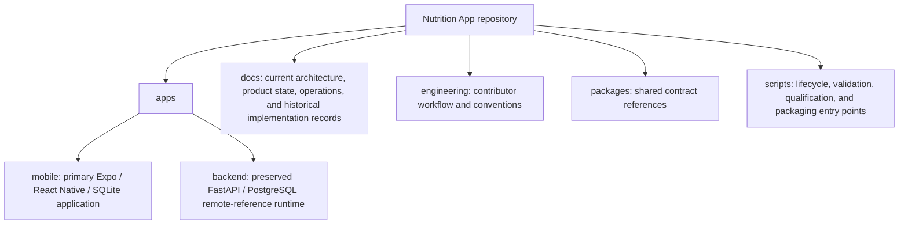
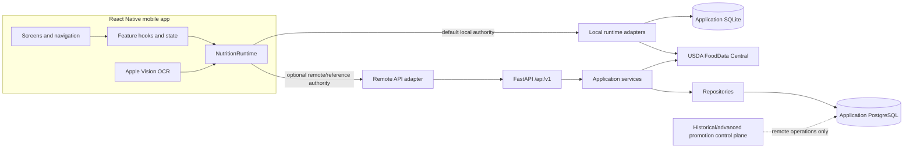

# Nutrition App

Nutrition App is an iOS-first, local-first nutrition tracker for building a personal food library, publishing reusable recipes, scanning nutrition labels, searching USDA FoodData Central, recording immutable nutrition history, and comparing daily intake against personalized nutrition targets.

The default application runtime is fully local: on-device SQLite is authoritative for Foods, Recipes, Daily Logs, Targets, OCR confirmation, USDA imports, and application state. Apple Vision performs nutrition-label OCR on device. The repository also preserves the original FastAPI/PostgreSQL implementation as an alternate remote/reference authority, but local and remote runtimes never synchronize, dual-write, fail over, or silently mix.

## Current product state

The application is in a complete, usable post-1.0 state and is currently evolving through incremental feature and UI releases. The local-first SQLite runtime, native iOS OCR path, secure USDA credential flow, immutable Daily Log history, immutable Recipe publication revisions, transfer/import tooling, accessibility foundations, and personalized general-adult nutrition targets are implemented and covered by automated qualification.

Recent product work includes:

- Local-first SQLite authority for the complete personal nutrition workflow.
- Native Apple Vision nutrition-label OCR and structured confirmation/correction flow.
- Direct USDA FoodData Central search/import with secure on-device credential storage.
- Personalized calorie, protein, carbohydrate, fat, saturated-fat, calcium, iron, vitamin D, potassium, magnesium, and fiber targets where supported by the general-adult profile.
- FDA Daily Value fallback/reference behavior where personalization is unavailable or inappropriate.
- Immutable Daily Log nutrition snapshots so later Food and Recipe edits cannot rewrite history.
- Immutable Recipe publication revisions with generated Food compatibility projections.
- Explicit local/remote runtime authority selection with no synchronization or hidden fallback.
- Physical-iPhone release qualification in addition to Jest, TypeScript, Expo configuration, SQLite, PostgreSQL, and native tests.

## Repository at a glance


```mermaid
flowchart TD
    Repo["Nutrition App repository"] --> Apps["apps"]
    Apps --> Mobile["mobile: primary Expo / React Native / SQLite application"]
    Apps --> Backend["backend: preserved FastAPI / PostgreSQL remote-reference runtime"]
    Repo --> Docs["docs: current architecture, product state, operations, and historical implementation records"]
    Repo --> Engineering["engineering: contributor workflow and conventions"]
    Repo --> Packages["packages: shared contract references"]
    Repo --> Scripts["scripts: lifecycle, validation, qualification, and packaging entry points"]
```

| Area | Responsibility |
| --- | --- |
| `apps/mobile` | Primary user experience, `NutritionRuntime`, authoritative local SQLite runtime, remote adapter, secure USDA credential flow, and native Apple Vision integration |
| `apps/backend` | Preserved remote FastAPI/PostgreSQL authority, reference domain implementation, migrations, operators, and backend tests |
| `docs` | Current product/architecture guides plus clearly separated historical implementation evidence |
| `engineering` | Change lifecycle, Git conventions, review, merge, release, and automation ownership |
| `packages` | Small shared contract references; not a generated client SDK |
| `scripts` | Repository lifecycle, validation, runtime, qualification, transfer, and packaging entry points |

The [Repository Tour](docs/project/repository-tour.md) explains where to begin for each feature and which advanced directories can be ignored during ordinary application work.

## What the app does

- Creates, edits, duplicates, favorites, searches, and soft-deletes personal Foods.
- Resolves serving-based and gram-based nutrition using decimal-safe calculations.
- Searches USDA FoodData Central directly from the local runtime and imports selected foods.
- Builds Recipes from Foods or published nested Recipes.
- Publishes immutable Recipe revisions that remain safe to log over time.
- Records Daily Logs as immutable nutrient snapshots so later Food or Recipe edits cannot rewrite historical totals.
- Recognizes nutrition labels on iOS with Apple Vision, parses structured observations, and preserves correction provenance after confirmation.
- Compares daily nutrition with personalized targets where supported and FDA Daily Values where appropriate.
- Provides favorites, recents, unified saved/USDA discovery, light/dark presentation, and accessibility-focused navigation/focus behavior.
- Supports a one-time PostgreSQL-to-SQLite transfer path for installations migrating from the preserved remote runtime.

## Runtime architecture


```mermaid
flowchart LR
    subgraph Mobile["React Native mobile app"]
        Screen["Screens and navigation"] --> Hook["Feature hooks and state"]
        Hook --> Runtime["NutritionRuntime"]
        Vision["Apple Vision OCR"] --> Runtime
    end

    Runtime -->|default local authority| Local["Local runtime adapters"]
    Local --> LocalDB[("Application SQLite")]
    Local --> USDA["USDA FoodData Central"]

    Runtime -->|optional remote/reference authority| Remote["Remote API adapter"]
    Remote --> API["FastAPI /api/v1"]
    API --> Service["Application services"]
    Service --> Repository["Repositories"]
    Repository --> AppDB[("Application PostgreSQL")]
    Service --> USDA

    Control["Historical/advanced promotion control plane"] -.->|remote operations only| AppDB
```

Exactly one application-data authority is active in a running context. Local SQLite and remote FastAPI/PostgreSQL are alternatives, not synchronized copies.

For layer responsibilities, persistence boundaries, and migration streams, read the [Architecture Overview](docs/architecture/overview.md). For a quick orientation, start with the [Repository Tour](docs/project/repository-tour.md).

## Technology stack

| Area | Technology |
| --- | --- |
| Primary mobile application | React Native 0.86, Expo 57, TypeScript 6, React Navigation 7, TanStack Query, Zod |
| Primary application data | `expo-sqlite`, fresh semantic SQLite schema, schema-version migration engine |
| Native OCR | Swift Expo module using Apple Vision |
| External nutrition data | USDA FoodData Central API through the local runtime or preserved remote backend |
| Alternate/reference backend | Python 3.10+, FastAPI, Pydantic, SQLAlchemy 2 |
| Alternate/reference application data | PostgreSQL 16, Alembic |
| Advanced historical operations | Independent PostgreSQL control database and MinIO object-lock evidence for promotion workflows |
| Tests | Pytest, Jest, native/file-backed SQLite qualification, PostgreSQL concurrency suites, native Swift tests |
| Quality | Ruff, TypeScript compiler, Expo configuration validation, physical-device qualification |

## Quick start

### Primary path: local SQLite authority

```bash
cd apps/mobile
npm ci
EXPO_PUBLIC_NUTRITION_DATA_AUTHORITY=local \
EXPO_PUBLIC_NUTRITION_DEPLOYMENT_MODE=development \
  npm start
```

This is the normal application runtime. Foods, Recipes, Daily Logs, Targets, OCR confirmation, and saved nutrition persist in on-device SQLite without FastAPI or PostgreSQL. USDA requires upstream network access and a configured personal credential. Native Apple Vision OCR requires an iOS development or release build and is not provided by Expo Go.

For a self-contained Release build on a physical iPhone:

```bash
cd apps/mobile
export EXPO_PUBLIC_NUTRITION_DATA_AUTHORITY=local
export EXPO_PUBLIC_NUTRITION_DEPLOYMENT_MODE=development
unset EXPO_PUBLIC_NUTRITION_API_URL
unset EXPO_PUBLIC_NUTRITION_PRIVATE_AUTH_TOKEN
npx expo run:ios --configuration Release --device
```

A Release build bundles JavaScript into the installed application and does not require Metro after installation.

### Optional: preserved remote FastAPI/PostgreSQL authority

Use the remote path only for remote-mode development, PostgreSQL-specific behavior, historical qualification, or backend/reference work:

```bash
docker compose up -d postgres
cd apps/backend
python3 -m venv .venv
source .venv/bin/activate
python -m pip install -r requirements-dev.lock
python -m pip install --no-build-isolation --no-deps -e .
cp .env.example .env
alembic upgrade 0020_immutable_provenance_enforcement
uvicorn app.main:app --reload
```

Then start the mobile client explicitly in remote mode:

```bash
cd apps/mobile
EXPO_PUBLIC_NUTRITION_DATA_AUTHORITY=remote \
EXPO_PUBLIC_NUTRITION_DEPLOYMENT_MODE=development \
EXPO_PUBLIC_NUTRITION_API_URL=http://localhost:8000/api/v1 \
  npm start
```

There is no automatic fallback, synchronization, dual-write, or authority mixing between the two runtimes.

## Engineering workflow

Contributors should start with [Contributing](CONTRIBUTING.md) and the [Engineering Workflow](engineering/README.md). Feature delivery uses approved planning artifacts and GitHub Epics/issues for implementation sequencing. Epics and issues are engineering-planning units; product release versions describe complete application states and are not derived from Epic or issue numbers.

The local-first migration work under `docs/project/version-1.1/` is retained as implementation history and qualification evidence. It should not be read as meaning the current product is still at the Version 1.1 starting state.

## Documentation

Start at the [Documentation Index](docs/README.md). The most useful current documents are:

| Goal | Read first |
| --- | --- |
| Understand the current application state | [Current State](docs/project/current-state.md) |
| Understand enduring project scope and priorities | [Project Constitution](docs/project/constitution.md) |
| Onboard an engineer or implementation agent | [Project Onboarding](docs/project/onboarding.md) |
| Understand the codebase quickly | [Repository Tour](docs/project/repository-tour.md) |
| Understand runtime and persistence boundaries | [Architecture Overview](docs/architecture/overview.md) |
| Change Foods, servings, USDA, Search, or Targets | [Foods and Nutrition Domain](docs/features/foods-and-nutrition.md) |
| Change Recipes, publication, revisions, or Daily Logs | [Recipes and Nutrition History](docs/features/recipes-and-logging.md) |
| Change OCR or offline/local behavior | [OCR, Search, and Offline Behavior](docs/features/ocr-search-and-offline.md) |
| Review canonical invariants | [Project Invariants](docs/project/invariants.md) |
| Find the right code and tests for a change | [Development Guide](docs/project/development-guide.md) |
| Run qualification | [Testing Guide](docs/operations/testing.md) |
| Review completed local-first implementation history | [Version 1.1 / Epic 2 backlog](docs/project/version-1.1/epic-2/implementation-backlog.md) |
| Review historical PostgreSQL/control-plane qualification | [Version 1.0 PostgreSQL Release Qualification](docs/operations/version-1.0-release-qualification.md) |

## Core invariants

[Project Invariants](docs/project/invariants.md) is the canonical list and rationale. Important guarantees include immutable Daily Log nutrition history, immutable Recipe publication revisions, fixed historical source identity, exact nutrition/decimal semantics, immutable OCR correction provenance, explicit authority selection, ownership enforcement, idempotency/replay behavior, transactional rollback, and confirmed-versus-unresolved mutation outcomes.

## Testing

Primary mobile validation:

```bash
cd apps/mobile
npm test -- --runInBand
npm run typecheck
npm run config:validate
```

Backend/reference validation:

```bash
cd apps/backend
pytest
ruff check .
```

Additional PostgreSQL concurrency, control-database, native SQLite, transfer, performance, and native iOS qualification suites are documented in the [Testing Guide](docs/operations/testing.md).

## Release status

The repository contains historical Version 1.0 and Version 1.1 planning/qualification material because those documents record how the application reached its current architecture. Current product state should be taken from this README and [Current State](docs/project/current-state.md), not inferred from the names of historical planning directories.

The primary application today is the local-first iOS runtime backed by SQLite. FastAPI/PostgreSQL remains intentionally preserved for alternate/reference operation and historical compatibility, not as a prerequisite for normal use.
