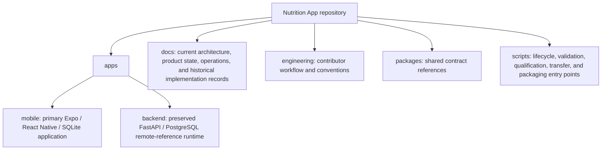
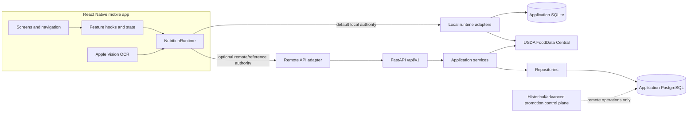

# Nutrition App

Nutrition App is an iOS-first, local-first nutrition tracker for building a personal food library, publishing reusable recipes, scanning nutrition labels, searching USDA FoodData Central, recording immutable nutrition history, and comparing daily intake against personalized nutrition targets.

The default application runtime is fully local: on-device SQLite is authoritative for Foods, Recipes, Daily Logs, Targets, OCR confirmation, USDA imports, and application state. Apple Vision performs nutrition-label OCR on device. The repository also preserves the original FastAPI/PostgreSQL implementation as an alternate remote/reference authority, but local and remote runtimes never synchronize, dual-write, fail over, or silently mix.

## Current product state

Version 2.0 is the current product line. Root `VERSION` is the canonical repository release authority and contains `2.0.0`; mobile, Expo, backend, and current documentation metadata mirror that release identity. Version 1.1 and Version 1.2 records remain retained as historical planning, implementation, and qualification provenance rather than current release authority.

Current capabilities include:

- Local-first SQLite authority for the complete personal nutrition workflow.
- Native Apple Vision nutrition-label OCR and structured confirmation/correction flow.
- Direct USDA FoodData Central search/import with secure on-device credential storage.
- Personalized calorie, protein, carbohydrate, fat, saturated-fat, calcium, iron, vitamin D, potassium, magnesium, and fiber targets where supported by the general-adult profile.
- FDA Daily Value fallback/reference behavior where personalization is unavailable or inappropriate.
- Immutable Daily Log nutrition snapshots so later Food and Recipe edits cannot rewrite history.
- Immutable Recipe publication revisions with generated Food compatibility projections.
- Explicit local/remote runtime authority selection with no synchronization or hidden fallback.
- One-time PostgreSQL-to-SQLite transfer tooling for installations moving from the preserved remote runtime.
- Accessibility-focused navigation, focus management, and physical-iPhone release qualification.

## Repository at a glance


```mermaid
flowchart TD
    Repo["Nutrition App repository"] --> Apps["apps"]
    Apps --> Mobile["mobile: primary Expo / React Native / SQLite application"]
    Apps --> Backend["backend: preserved FastAPI / PostgreSQL remote-reference runtime"]
    Repo --> Docs["docs: current architecture, product state, operations, and historical implementation records"]
    Repo --> Engineering["engineering: contributor workflow and conventions"]
    Repo --> Packages["packages: shared contract references"]
    Repo --> Scripts["scripts: lifecycle, validation, qualification, transfer, and packaging entry points"]
```

| Area | Responsibility |
| --- | --- |
| `apps/mobile` | Primary user experience, `NutritionRuntime`, authoritative local SQLite runtime, remote adapter, secure USDA credential flow, and native Apple Vision integration |
| `apps/backend` | Preserved remote FastAPI/PostgreSQL authority, reference domain implementation, migrations, operators, and backend tests |
| `docs` | Current product/architecture guides plus clearly separated historical implementation evidence |
| `engineering` | Change lifecycle, Git conventions, review, merge, release, and automation ownership |
| `packages` | Small shared contract references; not a generated client SDK |
| `scripts` | Repository lifecycle, validation, runtime, qualification, transfer, and packaging entry points |

The [Repository Tour](docs/project/repository-tour.md) explains where to begin for each feature and which advanced directories can be ignored during ordinary application work.

## What the app does

- Creates, edits, duplicates, favorites, searches, and soft-deletes personal Foods.
- Resolves serving-based and gram-based nutrition using decimal-safe calculations.
- Searches USDA FoodData Central directly from the local runtime and imports selected foods.
- Builds Recipes from Foods or published nested Recipes.
- Publishes immutable Recipe revisions that remain safe to log over time.
- Records Daily Logs as immutable nutrient snapshots so later Food or Recipe edits cannot rewrite historical totals.
- Recognizes nutrition labels on iOS with Apple Vision, parses structured observations, and preserves correction provenance after confirmation.
- Compares daily nutrition with personalized targets where supported and FDA Daily Values where appropriate.
- Provides favorites, recents, unified saved/USDA discovery, light/dark presentation, and accessibility-focused navigation/focus behavior.
- Supports a one-time PostgreSQL-to-SQLite transfer path for installations migrating from the preserved remote runtime.

## Runtime architecture


```mermaid
flowchart LR
    subgraph Mobile["React Native mobile app"]
        Screen["Screens and navigation"] --> Hook["Feature hooks and state"]
        Hook --> Runtime["NutritionRuntime"]
        Vision["Apple Vision OCR"] --> Runtime
    end

    Runtime -->|default local authority| Local["Local runtime adapters"]
    Local --> LocalDB[("Application SQLite")]
    Local --> USDA["USDA FoodData Central"]

    Runtime -->|optional remote/reference authority| Remote["Remote API adapter"]
    Remote --> API["FastAPI /api/v1"]
    API --> Service["Application services"]
    Service --> Repository["Repositories"]
    Repository --> AppDB[("Application PostgreSQL")]
    Service --> USDA

    Control["Historical/advanced promotion control plane"] -.->|remote operations only| AppDB
```

Exactly one application-data authority is active in a running context. Local SQLite and remote FastAPI/PostgreSQL are alternatives, not synchronized copies.

For layer responsibilities, persistence boundaries, and migration streams, read the [Architecture Overview](docs/architecture/overview.md). For a quick orientation, start with the [Repository Tour](docs/project/repository-tour.md).

## Technology stack

| Area | Technology |
| --- | --- |
| Primary mobile application | React Native 0.86, Expo 57, TypeScript 6, React Navigation 7, TanStack Query, Zod |
| Primary application data | `expo-sqlite`, fresh semantic SQLite schema, schema-version migration engine |
| Native OCR | Swift Expo module using Apple Vision |
| External nutrition data | USDA FoodData Central API through the local runtime or preserved remote backend |
| Alternate/reference backend | Python 3.12, FastAPI, Pydantic, SQLAlchemy 2 |
| Alternate/reference application data | PostgreSQL 16, Alembic |
| Advanced historical operations | Independent PostgreSQL control database and MinIO object-lock evidence for promotion workflows |
| Tests | Pytest, Jest, native/file-backed SQLite qualification, PostgreSQL concurrency suites, native Swift tests |
| Quality | Ruff, TypeScript compiler, Expo configuration validation, physical-device qualification |

## Quick start

### Primary path: local SQLite authority

The normal application runtime is local-first. Foods, Recipes, Daily Logs,
Targets, OCR confirmation, and saved nutrition persist in authoritative
on-device SQLite without FastAPI or PostgreSQL. USDA requires upstream network
access and a configured personal credential. Native Apple Vision OCR requires
an iOS native development or Release build and is not provided by Expo Go.

Use Node 24 for the mobile project. On a fresh checkout, or whenever the locked
JavaScript dependencies need to be reconciled, install them once:

```bash
cd apps/mobile
npm ci
```

`npm ci` is setup/dependency reconciliation. It is not a required step before
every Metro restart or native rebuild.

#### Canonical local-iOS development commands

Ordinary JavaScript/TypeScript-only changes do not require native
recompilation when the appropriate development build is already installed.
Start Metro and reload/relaunch the installed app.

Changes to native modules, native dependencies, Expo/native configuration,
config plugins, or other inputs that alter the generated iOS project require a
fresh native generation/rebuild.

All development commands below select local application-data authority
explicitly.

##### Destructive simulator reset and rebuild

Use this when the simulator installation and its authoritative local data should
be discarded deliberately:

```bash
cd apps/mobile
export EXPO_PUBLIC_NUTRITION_DATA_AUTHORITY=local
export EXPO_PUBLIC_NUTRITION_DEPLOYMENT_MODE=development
unset EXPO_PUBLIC_NUTRITION_API_URL
unset EXPO_PUBLIC_NUTRITION_PRIVATE_AUTH_TOKEN

xcrun simctl uninstall booted com.portfolio.nutritionapp
npx expo prebuild --clean --platform ios
npx expo run:ios --no-build-cache
```

`simctl uninstall` removes the installed application before rebuilding. That
deletes the simulator app sandbox, including the authoritative Nutrition App
SQLite database. This is intentionally destructive.

`expo prebuild --clean` deletes and regenerates the generated native iOS
project. `expo run:ios --no-build-cache` clears native Derived Data/build cache
before compiling and installing the new Debug build.

##### Native simulator rebuild without intentionally clearing app data

Use this when native/config/plugin/dependency changes require a fresh generated
project and native binary, but the existing simulator app sandbox should be
retained:

```bash
cd apps/mobile
export EXPO_PUBLIC_NUTRITION_DATA_AUTHORITY=local
export EXPO_PUBLIC_NUTRITION_DEPLOYMENT_MODE=development
unset EXPO_PUBLIC_NUTRITION_API_URL
unset EXPO_PUBLIC_NUTRITION_PRIVATE_AUTH_TOKEN

npx expo prebuild --clean --platform ios
npx expo run:ios --no-build-cache
```

This regenerates the ignored `apps/mobile/ios/` project and clears the native
build cache, but it does not intentionally uninstall
`com.portfolio.nutritionapp`. Installing the rebuilt app over the existing
installation is therefore distinct from the destructive reset workflow above.

##### Simulator launch without rebuilding

For JS/TS iteration when a native Debug build is already installed, start Metro
in one terminal:

```bash
cd apps/mobile
export EXPO_PUBLIC_NUTRITION_DATA_AUTHORITY=local
export EXPO_PUBLIC_NUTRITION_DEPLOYMENT_MODE=development
unset EXPO_PUBLIC_NUTRITION_API_URL
unset EXPO_PUBLIC_NUTRITION_PRIVATE_AUTH_TOKEN

npx expo start --dev-client --host localhost
```

Then launch the already-installed simulator app without compiling it:

```bash
xcrun simctl launch booted com.portfolio.nutritionapp
```

No `expo prebuild` or `expo run:ios` is needed for ordinary JS/TS-only changes.

##### Physical iPhone launch without rebuilding

For an already-installed signed Debug/development build, keep the Mac and
iPhone on a network where the phone can reach Metro, then start Metro in LAN
mode:

```bash
cd apps/mobile
export EXPO_PUBLIC_NUTRITION_DATA_AUTHORITY=local
export EXPO_PUBLIC_NUTRITION_DEPLOYMENT_MODE=development
unset EXPO_PUBLIC_NUTRITION_API_URL
unset EXPO_PUBLIC_NUTRITION_PRIVATE_AUTH_TOKEN

npx expo start --dev-client --host lan
```

Launch the already-installed app from the iPhone Home Screen, or launch it from
the Mac without recompiling:

```bash
xcrun devicectl device process launch \
  --device "<device-name-or-identifier>" \
  com.portfolio.nutritionapp
```

This path requires an appropriate signed development build to have been
installed previously. Starting Metro or relaunching that build does not itself
recompile native code.

##### Self-contained physical-iPhone Release install

The Release workflow remains separate from development-build/Metro iteration:

```bash
cd apps/mobile
export EXPO_PUBLIC_NUTRITION_DATA_AUTHORITY=local
export EXPO_PUBLIC_NUTRITION_DEPLOYMENT_MODE=development
unset EXPO_PUBLIC_E216_NATIVE_QUALIFICATION
unset EXPO_PUBLIC_NUTRITION_API_URL
unset EXPO_PUBLIC_NUTRITION_PRIVATE_AUTH_TOKEN
npx expo run:ios --configuration Release --device
```

A Release build bundles JavaScript into the installed application and does not
require Metro after installation.

### Optional: preserved remote FastAPI/PostgreSQL authority

Use the remote path only for remote-mode development, PostgreSQL-specific
behavior, historical qualification, or backend/reference work.

The current preserved remote application runtime requires PostgreSQL already
provisioned and qualified at `0033_complete_runtime_authority`.

Schema `0020_immutable_provenance_enforcement` is retained only as the
`LIMITED_PREACTIVATION_OPERATIONS_SANDBOX`. It is not current remote
feature-parity startup.

Revision `0021_target_activation_execution` remains an operations-only
activation boundary. There is no ordinary-development convenience upgrade
across it, and an unqualified `alembic` direct-to-latest-head shortcut is not a
supported startup procedure. In particular, do not combine
`docker compose down -v` with a direct Alembic upgrade to the latest head as an
ordinary current-product reset/rebuild workflow.

For an already qualified current remote database:

```bash
docker compose up -d postgres
cd apps/backend
python3 -m venv .venv
source .venv/bin/activate
python -m pip install -r requirements-dev.lock
python -m pip install --no-build-isolation --no-deps -e .
cp .env.example .env
alembic current
uvicorn app.main:app --reload
```

`alembic current` must report `0033_complete_runtime_authority`.

Then start the mobile client explicitly in remote mode:

```bash
cd apps/mobile
EXPO_PUBLIC_NUTRITION_DATA_AUTHORITY=remote \
EXPO_PUBLIC_NUTRITION_DEPLOYMENT_MODE=development \
EXPO_PUBLIC_NUTRITION_API_URL=http://localhost:8000/api/v1 \
  npm start
```

There is no automatic fallback, synchronization, dual-write, or authority
mixing between the two runtimes.

## Engineering workflow

Contributors should start with [Contributing](CONTRIBUTING.md) and the [Engineering Workflow](engineering/README.md). Feature delivery uses approved planning artifacts and GitHub Epics/issues for implementation sequencing. Epics and issues are engineering-planning units; product release versions describe complete application states and are not derived from Epic or issue numbers.

The completed Version 1.1 planning and local-first implementation material under `docs/project/version-1.1/` is retained as implementation history and qualification evidence. It should not be read as the current release state.

## Documentation

Start at the [Documentation Index](docs/README.md). The most useful current documents are:

| Goal | Read first |
| --- | --- |
| Understand the current application state | [Current State](docs/project/current-state.md) |
| Understand enduring project scope and priorities | [Project Constitution](docs/project/constitution.md) |
| Onboard an engineer or implementation agent | [Project Onboarding](docs/project/onboarding.md) |
| Understand the codebase quickly | [Repository Tour](docs/project/repository-tour.md) |
| Understand runtime and persistence boundaries | [Architecture Overview](docs/architecture/overview.md) |
| Change Foods, servings, USDA, Search, or Targets | [Foods and Nutrition Domain](docs/features/foods-and-nutrition.md) |
| Change Recipes, publication, revisions, or Daily Logs | [Recipes and Nutrition History](docs/features/recipes-and-logging.md) |
| Change OCR or offline/local behavior | [OCR, Search, and Offline Behavior](docs/features/ocr-search-and-offline.md) |
| Review canonical invariants | [Project Invariants](docs/project/invariants.md) |
| Find the right code and tests for a change | [Development Guide](docs/project/development-guide.md) |
| Run qualification | [Testing Guide](docs/operations/testing.md) |
| Review completed local-first implementation history | [Version 1.1 / Epic 2 backlog](docs/project/version-1.1/epic-2/implementation-backlog.md) |
| Review historical PostgreSQL/control-plane qualification | [Version 1.0 PostgreSQL Release Qualification](docs/operations/version-1.0-release-qualification.md) |

## Core invariants

[Project Invariants](docs/project/invariants.md) is the canonical list and rationale. Important guarantees include immutable Daily Log nutrition history, immutable Recipe publication revisions, fixed historical source identity, exact nutrition/decimal semantics, immutable OCR correction provenance, explicit authority selection, ownership enforcement, idempotency/replay behavior, transactional rollback, and confirmed-versus-unresolved mutation outcomes.

## Testing

Primary mobile validation:

```bash
cd apps/mobile
npm test -- --runInBand
npm run typecheck
npm run config:validate
```

Backend/reference validation:

```bash
cd apps/backend
pytest
ruff check .
```

Additional PostgreSQL concurrency, control-database, native SQLite, transfer, performance, and native iOS qualification suites are documented in the [Testing Guide](docs/operations/testing.md).

## Release status

Version 2.0 is the current product line, with root `VERSION` as the canonical repository release authority. Historical Version 1.0, Version 1.1, and Version 1.2 planning/qualification material remains in the repository as provenance rather than current release guidance.

The primary application today is the local-first iOS runtime backed by SQLite. FastAPI/PostgreSQL remains intentionally preserved for alternate/reference operation and historical compatibility, not as a prerequisite for normal use.