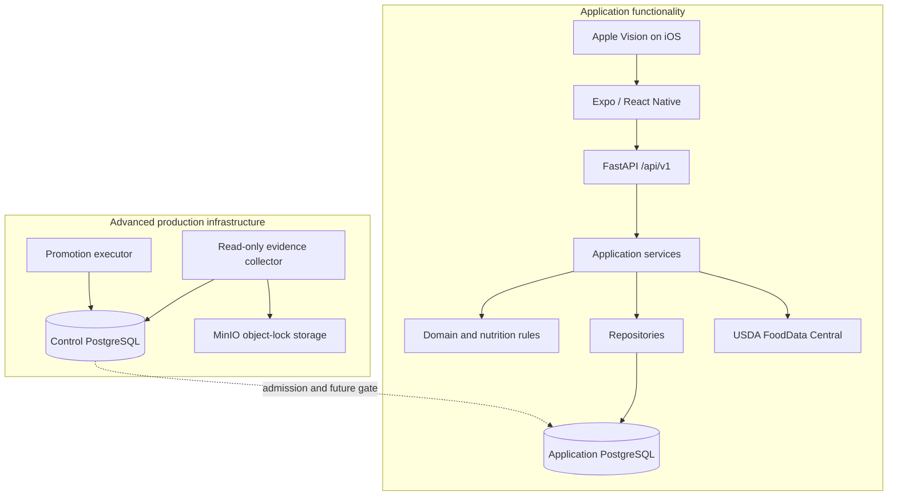
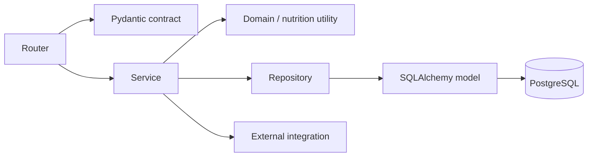

# Architecture guide

Nutrition App has a conventional mobile/API/data architecture at its center and a separate,
optional operations architecture around production promotion. Keeping those two views distinct is
the most important aid to understanding the repository.

## System boundaries



The application database is the authority for nutrition data. The control database is the
authority for operational evidence and promotion workflow. It is not a second application backend
and does not serve Foods, Recipes, or Daily Logs.

## Mobile layers

The mobile dependency direction is:

```text
screen and navigation
    -> feature hook or local use-case model
        -> feature API client
            -> shared API transport
```

| Layer | Responsibility | Typical location |
| --- | --- | --- |
| Navigation and screens | User flow, accessibility, loading/error presentation | `src/app`, `src/features/*/screens` |
| Hooks | Server-state queries, mutations, and cache invalidation | `src/features/*/hooks` |
| Feature utilities | Form state, display policy, validation, error mapping | `src/features/*/utils`, `validation`, `confirmation` |
| Feature API boundary | Request construction and runtime response validation | `src/features/*/api` |
| Shared transport | Base URL, headers, authentication, bounded error handling | `src/shared/api/client.ts` |
| Native boundary | Typed wrapper over the Swift OCR module | `src/native/ocr`, `modules/nutrition-ocr` |

TanStack Query owns in-process server-state caching. Zod validates important runtime boundaries,
particularly OCR and Food source contracts. React Hook Form and feature-specific models own draft
input. The mobile app does not calculate authoritative persisted nutrition totals.

## Backend layers



### Routers

Routers translate HTTP into application calls. They resolve the authenticated user, validate
Pydantic input, choose status codes, and map known domain failures to stable API errors. Routers
should not own nutrition math, transaction choreography, or external payload mapping.

The API is versioned under `/api/v1`. Health and readiness are public; all feature routes are
authenticated.

### Services

Services own transactional use cases: create or update a Food, publish a Recipe, snapshot a Log,
confirm OCR, import USDA data, or calculate a target comparison. They enforce user ownership,
coordinate locks, call domain functions, maintain idempotency receipts, and commit one coherent
result.

Services are the best backend starting point for behavioral changes.

### Repositories and models

Repositories centralize persistence queries that are reused or need a clear locking/ownership
contract. SQLAlchemy models define stored relationships and database constraints. Neither layer
should decide what an HTTP error means.

Database constraints intentionally reinforce service rules: owner-scoped composite foreign keys,
one default serving, immutable revision links, source identity uniqueness, and paired revision/log
references make invalid cross-domain states difficult to persist.

### Domain and nutrition modules

Pure modules own decimal-safe unit conversion, serving resolution, nutrient aggregation, Recipe
projection rules, and validation. They are kept independent of HTTP and normally independent of
session lifecycle so they can be tested exhaustively.

### Integrations

`app/integrations/usda` is the external FoodData Central boundary. The client owns HTTP and API-key
behavior; mappers translate variable upstream payloads into the app's stable nutrient and serving
model. The mobile app never receives the USDA key or raw upstream contract.

## API organization

| Prefix | Capability |
| --- | --- |
| `/api/v1/health`, `/api/v1/ready` | Liveness and bounded database readiness |
| `/api/v1/nutrients` | Canonical nutrient catalog |
| `/api/v1/foods` | Saved Foods, servings, favorites, recents, duplication, resolution |
| `/api/v1/recipes` | Recipe authoring, calculation, publication, deletion |
| `/api/v1/logs` | Daily Log creation, editing, deletion, and summaries |
| `/api/v1/usda` | USDA search, preview, and import |
| `/api/v1/ocr/nutrition-label` | Pure parsing and confirmed Food creation |
| `/api/v1/targets` | Profiles, overrides, effective targets, and daily comparison |

Use FastAPI's generated `/docs` for field-level request/response exploration. The guides explain
meaning and ownership rather than duplicating generated schema details.

## Persistence and transaction boundaries

### Application data

The application database stores mutable definitions and immutable historical facts together, with
explicit links between them:

- Foods, servings, and authored Recipes are mutable definitions.
- Recipe publication revisions are immutable snapshots.
- Daily Log nutrient snapshots are historical facts.
- OCR confirmation traces are append-only creation provenance.
- Create-idempotency rows bind retry identifiers to exact payloads and response snapshots.

The [domain guides](foods-and-nutrition.md) explain those relationships in user terms.

### Locking

Application mutations use deterministic lock protocols where Food and Recipe dependency graphs can
race. Food rows are locked in UUID order before dependent Recipe rows. Authored Recipe graph-edge
changes first lock the owning user row so graph discovery and cycle validation serialize per owner.
PostgreSQL concurrency tests—not SQLite behavior—are the authority for those guarantees.

### Migrations

Two Alembic streams exist:

1. `app/migrations` changes the application database. It currently runs through
   `0018_phase5c_promotion_prerequisites`.
2. `app/control_migrations` changes the independent operations database. It currently runs through
   `ops_0004_phase5c4_admission`.

Application migration 0004 deliberately refuses unsafe in-place migration of populated legacy
Recipe tables. The Phase 5 offline bridge and converter are the supported historical path. See the
[Control Plane Guide](control-plane.md) before changing any migration from 0015 onward or any
control migration.

## Configuration and authentication

Backend configuration is validated at construction time:

- `development` creates/uses one deterministic development user.
- `test` provides a deterministic test identity.
- `private_single_user` requires a long shared bearer secret and a configured user identity.
- `production` fails startup because no production identity provider is installed.

This is an explicit safety boundary. Private single-user mode is suitable only for a personally
controlled deployment; a credential embedded in a mobile binary is extractable.

The advanced PostgreSQL role profile separates owner, migrator, runtime, canary, qualifier, and
operations credentials. Local development's simple Compose role is not evidence of that production
topology.

## Runtime and canary modes

Normal `runtime` mode exposes the full application API. `canary` mode is a deliberately read-only,
allowlisted process:

- it requires private-single-user configuration;
- startup validates the local application database's 0018 admission view under a read-only
  repeatable snapshot and shared advisory lock;
- the database session must be exactly `nutrition_canary`;
- only the frozen GET allowlist is mounted.

The independent control-plane gate is not yet consumed by normal request handling. The local 0018
write-fence trigger and canary checks are prerequisites, not a completed production cutover path.

## Testing architecture

Tests are layered to match the claim being made:

- pure unit tests prove calculation and canonical-contract behavior;
- FastAPI tests prove ownership and API behavior;
- Jest tests prove mobile models and interaction flows;
- PostgreSQL tests prove locking, constraints, role boundaries, migrations, and concurrency;
- MinIO tests prove exact object-version and retention behavior;
- qualification tests deliberately tamper with security-critical objects to prevent false-green
  manifests.

See the [Testing Guide](testing.md) for commands and suite boundaries.

## Next reading

- Read the [Repository Tour](repository-tour.md) for a guided path through the directories.
- Choose [Foods and Nutrition](foods-and-nutrition.md),
  [Recipes and Nutrition History](recipes-and-logging.md), or
  [OCR, Search, and Offline Behavior](ocr-search-and-offline.md) for domain behavior.
- Use the [Development Guide](development-guide.md) to map a change to code and tests.

## See also

- [Architecture Decision Index](architecture-decisions.md) summarizes the major choices.
- [Why This Exists](why-this-exists.md) explains the rationale in depth.
- [Testing Guide](testing.md) maps tests to architectural claims.
- [Control Plane Guide](control-plane.md) covers the optional operational subsystem.
