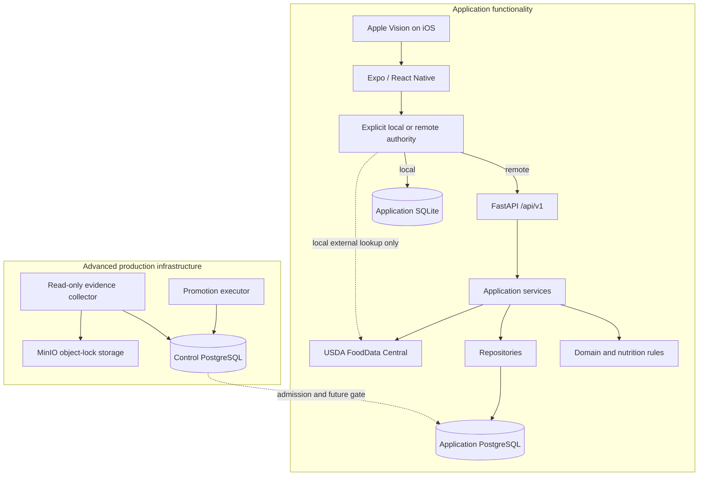
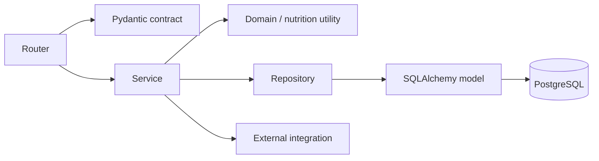

# Architecture overview

> **Document role: Current Guide.**

Nutrition App is local-first at the mobile runtime boundary. `NutritionRuntime` explicitly
selects one authoritative application-data runtime: on-device SQLite for local mode or the
preserved FastAPI/PostgreSQL system for remote mode. A separate optional operations architecture
surrounds the remote PostgreSQL promotion path. Keeping application authority selection and
production operations distinct is the most important aid to understanding the repository.

The [Project Constitution](../project/constitution.md) defines the boundaries this architecture
must serve. [Current State](../project/current-state.md) records active heads and limitations; this
document owns structural responsibilities rather than release status or rationale.

## System boundaries



The explicitly selected application-data authority is either local SQLite or the remote
FastAPI/PostgreSQL system, never both for one running context. The control database is the authority
for operational evidence and promotion workflow. It is not a second application backend and does
not serve Foods, Recipes, or Daily Logs.

## Mobile layers

The mobile dependency direction is:

```text
screen and navigation
    -> feature hook or local use-case model
        -> NutritionRuntime interface
            -> selected local SQLite adapter
            OR selected remote API adapter -> shared API transport
```

| Layer | Responsibility | Typical location |
| --- | --- | --- |
| Navigation and screens | User flow, accessibility, loading/error presentation | `src/app`, `src/features/*/screens` |
| Hooks | Server-state queries, mutations, and cache invalidation | `src/features/*/hooks` |
| Feature utilities | Form state, display policy, validation, error mapping | `src/features/*/utils`, `validation`, `confirmation` |
| Runtime boundary | One composed local or remote application-data authority | `src/runtime` |
| Feature/runtime boundary | Authority-neutral request/response contracts consumed through `NutritionRuntime` | `src/features/*/api`, `src/runtime/NutritionRuntime.ts` |
| Shared remote transport | Base URL, headers, authentication, bounded error handling for remote mode only | `src/shared/api/client.ts` |
| Native boundary | Typed wrapper over the Swift OCR module | `src/native/ocr`, `modules/nutrition-ocr` |

TanStack Query owns authority-scoped in-process application-state caching. Authority changes retire
the old Query client and recovery bootstrap before the new runtime becomes usable. Zod validates important runtime boundaries,
particularly OCR and Food source contracts. React Hook Form and feature-specific models own draft
input. Each selected runtime remains the sole authority for persisted nutrition totals.

## Backend layers

These layers describe the preserved **remote** authority. They remain authoritative whenever
`NutritionRuntime` selects `remote` and remain the PostgreSQL reference implementation for remote
transaction/concurrency behavior. Local mode does not route application-data operations through
these HTTP/service/repository layers.



### Routers

Routers translate HTTP into application calls. They resolve the authenticated user, validate
Pydantic input, choose status codes, and map known domain failures to stable API errors. Routers
should not own nutrition math, transaction choreography, or external payload mapping.

The API is versioned under `/api/v1`. Health and readiness are public; all feature routes are
authenticated.

### Services

Services own transactional use cases: create or update a Food, publish a Recipe, snapshot a Log,
confirm OCR, import USDA data, or calculate a target comparison. They enforce user ownership,
coordinate locks, call domain functions, maintain idempotency receipts, and commit one coherent
result.

Services are the best backend starting point for behavioral changes.

### Repositories and models

Repositories centralize persistence queries that are reused or need a clear locking/ownership
contract. SQLAlchemy models define stored relationships and database constraints. Neither layer
should decide what an HTTP error means.

Database constraints intentionally reinforce service rules: owner-scoped composite foreign keys,
one default serving, immutable revision links, source identity uniqueness, and paired revision/log
references make invalid cross-domain states difficult to persist.

### Domain and nutrition modules

Pure modules own decimal-safe unit conversion, serving resolution, nutrient aggregation, Recipe
projection rules, and validation. They are kept independent of HTTP and normally independent of
session lifecycle so they can be tested exhaustively.

### Integrations

`app/integrations/usda` is the remote FoodData Central boundary. In local mode, the local USDA
adapter talks directly to FoodData Central through the separately configured personal-credential
mechanism. Both paths map variable upstream payloads into the app's stable nutrient and serving
model; the shared backend USDA credential is never embedded in the mobile app.

## API organization

| Prefix | Capability |
| --- | --- |
| `/api/v1/health`, `/api/v1/ready` | Liveness and bounded database readiness |
| `/api/v1/nutrients` | Canonical nutrient catalog |
| `/api/v1/foods` | Saved Foods, servings, favorites, recents, duplication, resolution |
| `/api/v1/recipes` | Recipe authoring, calculation, publication, deletion |
| `/api/v1/logs` | Daily Log creation, editing, deletion, and summaries |
| `/api/v1/usda` | USDA search, preview, and import |
| `/api/v1/ocr/nutrition-label` | Pure parsing and confirmed Food creation |
| `/api/v1/targets` | Profiles, overrides, effective targets, and daily comparison |

Use FastAPI's generated `/docs` for field-level request/response exploration. The guides explain
meaning and ownership rather than duplicating generated schema details.

## Persistence and transaction boundaries

### Application data

The application has one semantic data model exposed through `NutritionRuntime`, but two alternative
physical authorities. A running context selects one before application-data bootstrap; local and
remote persistence are never merged implicitly.

The durable model includes mutable definitions and immutable historical facts:

- Foods, servings, and authored Recipes are mutable definitions.
- Recipe publication revisions are immutable snapshots.
- Daily Log nutrient snapshots are historical facts.
- OCR confirmation traces are append-only creation provenance.
- Create-idempotency rows bind retry identifiers to exact payloads and response snapshots.

The [domain guides](../features/foods-and-nutrition.md) explain those relationships in user terms.

#### Local SQLite authority

`apps/mobile/src/storage/sqlite/schema.ts` defines the fresh local semantic schema. It is
intentionally **not** a replay of PostgreSQL Alembic history. The baseline uses explicit
schema-version migration bookkeeping, exact canonical text encodings for decimal/domain values,
foreign-key enforcement, WAL mode, bounded busy handling, and local transaction/write
coordination.

Local runtime adapters under `apps/mobile/src/runtime/local` implement Foods, Recipes, immutable
publication, Daily Logs/snapshots, Targets, OCR, Calendar, and USDA against that authority. Phase 5
control-plane, role, promotion, fencing, and evidence infrastructure is not part of the SQLite
schema.

#### Remote PostgreSQL authority

The preserved FastAPI/SQLAlchemy implementation persists the same application semantics in
PostgreSQL when `NutritionRuntime` selects `remote`. PostgreSQL-specific constraints, lock
protocols, role topology, Alembic migration history, and production-hardening machinery remain
intact and are not weakened by local mode.

### Locking and write coordination

Remote mutations use deterministic PostgreSQL lock protocols where Food and Recipe dependency
graphs can race. Food rows are locked in UUID order before dependent Recipe rows; authored Recipe
graph-edge changes serialize graph discovery per owner. PostgreSQL concurrency tests are the
authority for those row-lock guarantees.

Local SQLite uses its own bounded write coordination and transactional semantics. It preserves the
same domain outcomes—atomic generations, immutable history, owner scope, replay, and rollback—
without pretending that SQLite implements PostgreSQL row locks.

### Migrations

Persistence evolution has three deliberately separate mechanisms:

1. **Local SQLite schema-version migrations** under `apps/mobile/src/storage/sqlite`. The local
   schema is a fresh semantic model and does not replay Alembic revision-by-revision.
2. **Remote application Alembic migrations** under `apps/backend/app/migrations`. They preserve the
   PostgreSQL application's historical migration lineage and production prerequisites.
3. **Control Alembic migrations** under `apps/backend/app/control_migrations`. They change only the
   independent operations database.

[Current State](../project/current-state.md) owns the active PostgreSQL heads. The remote
application lineage includes the specially authorized `0021_target_activation_execution`
activation revision, and the current control migration head is
`ops_0011_phase5c4_recovery_audit`. Application and control migration streams must never be pointed
at each other's database, and Phase 5/control-plane infrastructure must not leak into the local
SQLite schema.

## Configuration and authentication

Backend configuration is validated at construction time:

- `development` creates/uses one deterministic development user.
- `test` provides a deterministic test identity.
- `private_single_user` requires a long shared bearer secret and a configured user identity.
- `production` fails startup because no production identity provider is installed.

This is an explicit safety boundary. Private single-user mode is suitable only for a personally
controlled deployment; a credential embedded in a mobile binary is extractable.

The advanced PostgreSQL role profile separates owner, migrator, runtime, canary, qualifier, and
operations credentials. Local development's simple Compose role is not evidence of that production
topology.

## Runtime and canary modes

Normal `runtime` mode exposes the full application API. `canary` mode is a deliberately read-only,
allowlisted process:

- it requires private-single-user configuration;
- startup validates the exact schema-specific local admission view under a read-only repeatable
  snapshot and shared advisory lock: v3 at schema 0020 or v4 at schema 0021;
- the database session must be exactly `nutrition_canary`;
- only the frozen GET allowlist is mounted.

The independent control-plane gate is not consumed by normal request handling. The local 0018
write-fence trigger remains active; schema 0021 adds separately authorized runtime-write admission,
authoritative activation observation, reconciliation, and emergency close.

## Testing architecture

Tests are layered to match the claim being made:

- pure unit tests prove calculation and canonical-contract behavior;
- FastAPI tests prove ownership and API behavior;
- Jest tests prove mobile models, authority routing, local-runtime parity, and interaction flows;
- native SQLite qualification proves `expo-sqlite` lifecycle, migration, transaction, and restart claims that mocks cannot establish;
- PostgreSQL tests prove remote locking, constraints, role boundaries, Alembic migrations, and concurrency;
- MinIO tests prove exact object-version and retention behavior;
- qualification tests deliberately tamper with security-critical objects to prevent false-green
  manifests.

See the [Testing Guide](../operations/testing.md) for commands and suite boundaries.

## Next reading

- Read the [Repository Tour](../project/repository-tour.md) for a guided path through the directories.
- Choose [Foods and Nutrition](../features/foods-and-nutrition.md),
  [Recipes and Nutrition History](../features/recipes-and-logging.md), or
  [OCR, Search, and Offline Behavior](../features/ocr-search-and-offline.md) for domain behavior.
- Use the [Development Guide](../project/development-guide.md) to map a change to code and tests.

## See also

- [Project Constitution](../project/constitution.md) defines enduring scope and priorities.
- [Architecture Decision Index](decisions.md) summarizes the major choices.
- [Project Invariants](../project/invariants.md) explains the rationale in depth.
- [Testing Guide](../operations/testing.md) maps tests to architectural claims.
- [Control Plane Guide](../operations/control-plane.md) covers the optional operational subsystem.
