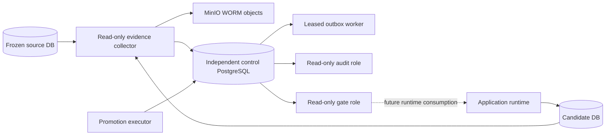
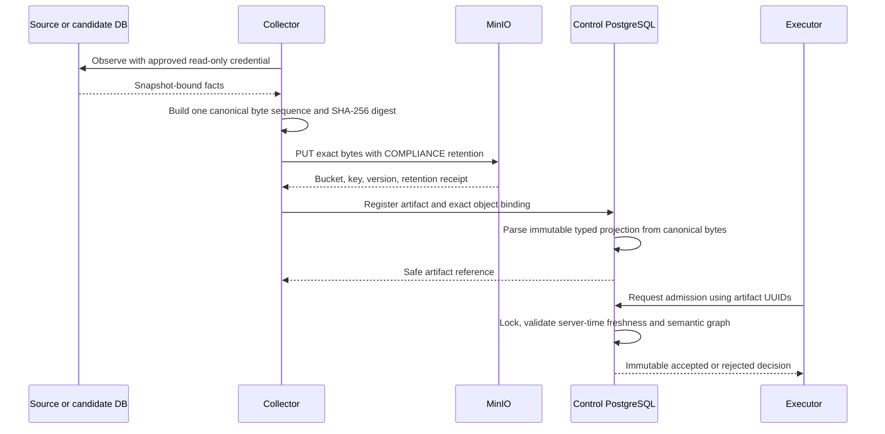

# Control Plane guide

> **Optional advanced reading.** You do not need the Control Plane to understand or modify Foods,
> Recipes, Daily Logs, USDA, OCR, Search, or Targets. Read this guide when working on historical
> database conversion, PostgreSQL role separation, write fencing, immutable operational evidence,
> canary admission, or production-like promotion.

## What it is

The Phase 5 control architecture is a safety system for moving a populated historical application
database through legacy Recipe conversion and, eventually, into production service. It separates
four questions that ordinary deployment scripts often blur:

1. **What data exists?** Read-only inventory and source identity.
2. **What conversion is authorized?** A deterministic plan plus execution authority.
3. **Is the result correct?** Independent qualification, reconciliation, and performance evidence.
4. **May this exact candidate serve traffic?** Independent promotion admission and workflow state.

Success at one layer never grants authority at the next. A conversion receipt is not a promotion
authorization; a performance pass cannot waive correctness; a process exit code is not durable
evidence.

## Why a personal deployment can ignore most of it

Normal application development uses one PostgreSQL database and the FastAPI/mobile stack described
in the [Architecture Guide](architecture.md). A fresh database does not need legacy Recipe
conversion. Local development does not need an independent promotion ledger or WORM evidence store.

The Control Plane exists for controlled production-like exercises where the cost of an ambiguous
source, incomplete conversion, stale candidate, privilege leak, or unsafe cutback is high. Its
complexity matches that operational risk rather than the complexity of nutrition tracking.

## Evolution of Production Hardening

| Phase | Purpose | Where to read |
| --- | --- | --- |
| Phase 1 | Explicit deployment modes, caller identity, fail-closed production auth | `production-hardening-phase1.md` |
| Phase 5A | Stop destructive upgrade of populated legacy Recipe tables | `production-hardening-phase5a.md` |
| Phase 5B | Read-only, privacy-safe historical database inventory | `production-hardening-phase5b.md` |
| Phase 5C1 | Isolated clone bridge, archive, deterministic conversion plan | `production-hardening-phase5c1.md` |
| Phase 5C2 | Authorized checkpointed conversion with restart-safe outcomes | `production-hardening-phase5c2.md` |
| Phase 5C3a | Independent PostgreSQL-only correctness qualification | `production-hardening-phase5c3a.md` |
| Phase 5C3b / 5C2.2 | Deterministic performance fixtures, evidence, and bounded optimization | `production-hardening-phase5c3b.md`, `production-hardening-phase5c2.2.md` |
| Phase 5C4.0 | Freeze the controlled portfolio deployment profile and trust decisions | `production-hardening-phase5c4.0.md` |
| Stage 5C4.1 | Versioned canonical promotion contracts and tamper validation | Contract modules and tests |
| Stage 5C4.2 | Least-privilege application roles, local target identity/write fence, canary prerequisites | `production-hardening-phase5c4.2a.md`, migration 0018 |
| Stage 5C4.3 | Independent control DB, immutable evidence/events, leases/outbox, MinIO anchoring, gate API | ops migrations 0001–0003 |
| Stage 5C4.4 | Collector-authored source observations and semantic admission/performance decisions | ops migration 0004 and admission modules |

The broad [Phase 5C4 design record](production-hardening-phase5c4.md) describes later promotion,
cutover, recovery, and authorization goals as well as implemented foundations. Do not read every
future design statement as a claim that provider adapters or runtime cutover are active today.

## Architecture

The control database must be independent of both application endpoints. Evidence remains available
even if the source or candidate is unhealthy. MinIO preserves the exact canonical object version;
the control database preserves the digest, byte count, binding, typed projection, event history,
and workflow authority.

## Authority boundaries

### Application database roles

The production-like role topology separates:

- `nutrition_owner`: non-login object owner;
- `nutrition_migrator`: the only login allowed to assume owner for Alembic;
- `nutrition_runtime`: ordinary bounded read/write API access;
- `nutrition_canary`: read-only allowlisted application access;
- `nutrition_qualifier`: independent read-only qualification;
- `nutrition_ops`: bounded maintenance authority.

The role provisioner is not an application feature. It verifies exact PostgreSQL version, object
surface, grants, default privileges, memberships, routine safety, extensions, and prepared
transaction state.

### Control database roles

The independent database has its own non-overlapping role family:

- `nutrition_control_owner` and `nutrition_control_migrator`;
- `nutrition_control_collector` for immutable evidence registration;
- `nutrition_control_executor` for workflow/admission requests;
- `nutrition_control_outbox` for leased delivery;
- `nutrition_control_audit` for read-only evidence review;
- `nutrition_control_gate` for the minimal environment gate.

Possessing more than one credential operationally does not merge their PostgreSQL authority. The
collector cannot admit or advance attempts; the executor cannot author registered source evidence.

## Application-side prerequisites

Application migration `0018_phase5c_promotion_prerequisites` adds target identity, append-only fence
events, a validated fence projection, database write-fence triggers, schema/role admission readers,
and immutability hardening without changing domain data.

The local database fence is defense in depth. It prevents ordinary runtime DML unless the target is
in the allowed production state and turns its SQLSTATE into a bounded API 503. It does not decide
that promotion is authorized.

Canary process mode performs a local startup admission through a read-only repeatable snapshot and
mounts only a frozen GET allowlist. It validates application-database prerequisites, not the
independent control gate.

## Canonical evidence flow

There is one canonical JSON serialization implementation shared by digest-producing contracts.
Artifact digests are computed from bytes, not trusted from caller input.

Stage 5C4.4's `phase5c4_source_dimensions_v1` illustrates the boundary: the collector directly
observes the source and registers WORM-bound bytes; PostgreSQL derives a typed immutable projection;
the executor references its UUID. The executor-facing admission APIs do not accept competing raw
authoritative dimensions.

## Evidence, workflow, and event integrity

The control migration stream builds three related surfaces:

- immutable registered artifacts and object bindings;
- an immutable chained event ledger plus atomic outbox entries;
- mutable workflow projections whose changes are authorized only through controlled routines.

Request IDs bind to canonical request bytes. Exact replay returns the original result. Reusing an ID
with a different request creates bounded conflict evidence rather than another transition.

Terminal mismatch handling cannot rewrite earlier evidence. Projection mutations and immutable
event/outbox inserts occur in the same transaction.

## Lease authority

Outbox delivery uses database leases. Acknowledgement, failure, retry scheduling, release, reclaim,
lost-PUT reconciliation, and terminal mismatch paths validate exact message identity, current lease
token, leased state, and unexpired server-time lease under the same row lock immediately before
mutation.

PostgreSQL server time—not worker wall-clock time—is authoritative. Reclaim establishes a new token;
a stale worker cannot acknowledge after that authority changes.

## Admission

Preflight and final-source admission run inside SERIALIZABLE transactions. They lock environment,
attempt, source/target instances, evidence artifacts, object bindings, performance authority, and
typed projections in deterministic order. After potentially blocking locks are acquired, they
capture control PostgreSQL time and repeat freshness/retention validation before inserting an
immutable decision and mutating the attempt projection.

Admission checks the entire evidence graph rather than isolated “valid” documents: environment,
source/candidate identity, freeze epoch, archive, plan, run, marker, inventory, schema authority,
reconciliation, qualification, performance tier, WORM object version, and retention must agree.

Dry-run follows the same validation and state-decision path but omits projection mutation. A changed
artifact under the same request ID is a request conflict.

## Qualification and migration safety

Control qualification inventories every authoritative table, function, trigger, index, constraint,
owner, grant, registry row, and immutable projection. Tamper tests alter parser/projector routines,
grants, or seed data and require qualification to fail.

Control downgrades are empty-only. They are for qualification of an uncommitted/empty schema path,
not rollback of a live ledger. A nonempty database fails closed because removing a control revision
would destroy evidence or authority that cannot be reconstructed safely.

The application and control Alembic streams use different configuration files, environment
variables, credentials, databases, and ownership assumptions.

## Current runtime boundary

The independent environment gate API exists as a minimal read-only control projection, but normal
application runtime does **not** yet consume it per request or at startup. Runtime gate wiring,
provider switching, activation, signature verification, backup/restore provider adapters, and
cutover are later work.

Therefore:

- the application 0018 trigger remains the active local write-fence prerequisite;
- canary startup validates local application-database state only;
- control admission does not by itself route traffic or enable production writes;
- no documentation should claim a completed production cutover pipeline.

## Where to look

| Concern | Primary location |
| --- | --- |
| Historical inventory/bridge/plan/conversion/qualification | `app/operators/historical_*`, `scripts/*historical*` |
| Canonical contracts | `app/operators/phase5c*_contracts.py` |
| Application role policy | `phase5c4_roles.py`, `phase5c4_prerequisites.py`, role-management script |
| Application fence prerequisites | migration `0018_phase5c_promotion_prerequisites.py` |
| Control role policy | `phase5c4_control_roles.py`, `manage_phase5c4_control_roles.py` |
| Evidence collection and WORM delivery | `phase5c4_control_evidence.py`, `phase5c4_minio.py` |
| Python control client | `phase5c4_control.py` |
| Control authority | `app/control_migrations/versions/ops_0001` through `ops_0004` |
| Admission rules | `phase5c4_admission.py`, `phase5c_performance_contracts.py`, ops 0004 |
| Qualification | control migration routines and `test_phase5c4_control_postgres.py` |

Always follow the SQL routine and role grant reached by a Python wrapper. The wrapper alone does not
prove the transaction or authority boundary.

## Before changing it

Read the governing phase record, then use the [Testing Guide](testing.md). A control-plane change
normally requires canonical/tamper tests, real PostgreSQL role tests, complete qualification,
migration round-trip and nonempty refusal, concurrency/failure injection, replay checks, and MinIO
integration if object identity changes.

Stop and revisit the architecture if a proposed change creates two authorities for the same fact,
trusts caller-provided digests, uses application credentials in the control database, depends on
process time for lease/freshness authority, mutates immutable evidence, or allows a downgrade to
discard a nonempty ledger.

## Next reading

- Read the [Testing Guide](testing.md#control-database-qualification) before changing control
  authority or qualification.
- Follow the stage links in [Evolution of Production Hardening](#evolution-of-production-hardening)
  for the exact governing design record.
- Use the [Architecture Decision Index](architecture-decisions.md#production-hardening-decisions) to
  refresh the specific operational decision first.

## See also

- [Why This Exists](why-this-exists.md#why-a-control-plane) for architectural rationale
- [Architecture Guide](architecture.md#runtime-and-canary-modes) for the current application boundary
- [Development Guide](development-guide.md#if-you-need-to-modify-the-control-plane) for code entry points
