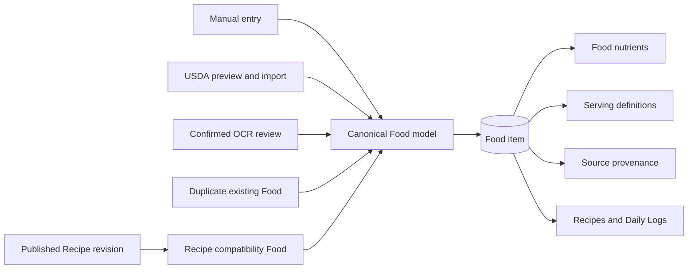
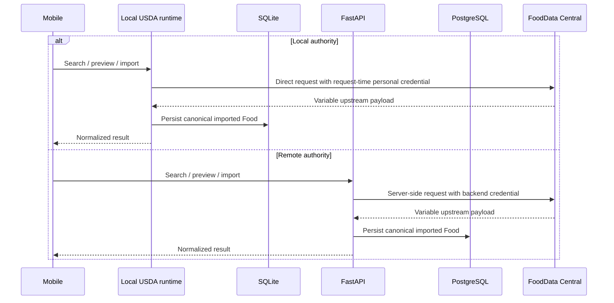

# Foods and nutrition domain

> **Document role: Current Guide.**

Foods are the reusable inputs to every nutrition workflow. A Food can be authored manually,
imported from USDA, created from a confirmed nutrition-label scan, duplicated from another Food, or
generated as a compatibility projection of a published Recipe. All sources converge on the same
stored nutrient and serving model so logging and Recipe calculation do not need source-specific
branches.

## Canonical nutrition model

A nutrient amount carries more meaning than a number:

- a canonical nutrient identity such as calories, protein, sodium, vitamin A, or Omega-3;
- an amount and compatible canonical/display unit;
- a basis: per serving, per 100 grams, or per gram;
- a status: known, estimated, explicit zero, or unknown;
- source and optional confidence/provenance fields.

Unknown and zero are intentionally different. Zero contributes a known amount of zero. Unknown
means the source does not support a numeric contribution and must remain visible in aggregate
quality information.

The supported unit system includes `kcal`, ordinary mass units (`g`, `mg`, `mcg`), and canonical
nutrient-specific semantic units such as `mcg RAE`, `mcg DFE`, `mg NE`, and
`mg alpha-tocopherol`. Ordinary mass units can normalize across compatible scales. Semantic units
are compatible only with the same canonical semantic unit; the application does not invent
cross-unit nutrition conversions that require biological equivalence rules. Exact decimal semantics
are preserved by both authorities: the remote backend uses Python `Decimal`, while the local
runtime uses fixed-scale canonical decimal text and exact TypeScript helpers rather than
floating-point persistence.

The canonical nutrient catalog owns stable identity, hierarchy, default unit, display order, and
reference metadata. Current coverage includes macronutrients, vitamins, minerals, fatty acids,
`total_omega_3`, ALA, EPA, DHA, and linoleic acid/Omega-6. FDA Daily Values and the canonical DRI
dataset are versioned reference data used by Targets; they are not mutable Food nutrient facts.

## Food lifecycle

### Mutable definitions

A normal Food is a mutable definition. Its name, nutrient rows, and serving definitions can change.
Deletion is soft so historical references remain understandable. Mutations are owner-scoped and
must account for Recipes that currently depend on the Food.

A Food may have several serving definitions but exactly one default. A serving records a display
label, quantity/unit, optional gram weight, source/confirmation metadata, and optional complete
reference measurement (`reference_quantity`, `reference_unit`, `reference_gram_weight`). A
reference measurement preserves the physical equivalence behind a serving when the displayed unit
changes. Partial reference measurements are invalid.

Household labels never imply a gram conversion on their own. Current authoring treats gram mass as
the authority for cross-dimension equivalence: changing a serving between mass and non-mass units
must preserve or explicitly establish a valid physical gram anchor rather than silently changing
the amount represented.

### Serving resolution

The resolver supports:

- **serving mode**, which requires an exact serving definition;
- **gram mode**, when nutrients or a selected/default serving provide a valid mass conversion.

Recipe ingredients are stricter than general Food logging. A serving-mode ingredient stores its
exact serving ID; a gram-mode ingredient stores no serving ID. When a Food's serving generation is
replaced, the service remaps an active Recipe ingredient only when exactly one successor preserves
the same normalized serving meaning. Missing or ambiguous successors reject the Food update
atomically.

The mobile serving editor uses structured unit selection and human-oriented decimal presentation,
but display rounding never becomes the persisted nutrition authority.

## Food sources

### Manual and duplicate

Manual Food creation validates one coherent serving/nutrient definition and persists it in one
transaction. Duplication produces a new user-owned Food and preserves bounded lineage without
making the copy depend on later source edits. Duplicate naming is collision-aware: generated names
advance through `Copy`, `Copy 2`, and later ordinals rather than creating an active-name collision.

Manual create and edit keep serving information before nutrient entry and present the conventional
Nutrition Facts core by default, in this order: Calories; Total Fat; Saturated Fat; Trans Fat;
Cholesterol; Sodium; Total Carbohydrate; Dietary Fiber; Total Sugars; Added Sugars; Protein; Vitamin
D; Calcium; Iron; and Potassium. This is presentation organization only: the complete canonical
nutrient collection remains in the existing form and mutation model.

`More nutrients` exposes remaining extended canonical nutrients through the shared grouped
discovery interaction: Vitamins, Minerals, Fatty Acids, and a trailing canonical Other group when
needed to preserve full-catalog reachability. New Food and Edit Food use the same interaction.
Already-populated extended nutrients remain visible on edit and are excluded from duplicate
candidate choices; adding an extended nutrient reveals its existing form value as unknown until the
user enters an amount. Omitting it returns it to unknown and makes it discoverable again. There is no
separate persisted selected-nutrient state and no giant Show All authority.

Blank, absent, cleared, or undisclosed values remain unknown. An explicit typed `0` retains exact
zero semantics, and existing known/estimated/zero values retain their canonical identity, unit,
basis, amount, and status unless changed. The organization does not infer zero from missing label
content or a `not a significant source` statement and does not make the app a regulatory label-
authoring tool.

Food views omit unresolved/unknown nutrient rows from ordinary presentation where no meaningful
amount is available while preserving explicit zero and other authoritative statuses in the model.

### USDA FoodData Central

USDA access follows the explicitly selected runtime:

Local mode must not embed or persist a shared backend USDA secret; its credential provider resolves
a personal credential at request time. Remote mode retains backend-owned credential handling.
Both paths normalize variable upstream payloads into the same stable nutrient/serving/source
semantics.

The mapper prefers stable USDA nutrient IDs, then nutrient numbers, with narrow display-name
fallbacks for upstream variation. Current mapping covers the expanded canonical micronutrient and
fatty-acid catalog rather than only the original core label nutrients. USDA nutrient records are
stored per 100 grams. Imported Foods always receive a `100 g` serving; branded/portion servings are
added only with valid gram weights.

Duplicate import is based on active `(owner, USDA source, FDC ID)` identity, not name. Repeated or
concurrent imports follow the selected authority's established source-identity/idempotency contract
rather than creating a second active source identity. A soft-deleted old import can be imported
again when the established flow permits it.

### OCR-confirmed Food

OCR confirmation creates an ordinary Manual Food plus a bounded append-only confirmation trace in
the same transaction. The trace explains how parsed values were confirmed or corrected; it is not
used by the nutrition resolver. Current OCR nutrient mapping follows the expanded canonical catalog.
See [OCR, Search, and Offline Behavior](ocr-search-and-offline.md).

### Recipe compatibility Food

A published Recipe has a generated Food projection so existing Food selection and logging flows can
reuse it. The projection points to an immutable Recipe revision. It is managed by Recipe publication,
not a generic editable Food. See [Recipes and Nutrition History](recipes-and-logging.md).

## Favorites, recents, and search

Favorites are naturally idempotent owner/Food relationships. Recents are derived from actual Daily
Log use and ordered deterministically. Saved Food search is owner-scoped within the selected
authority: SQLite in local mode or the FastAPI/PostgreSQL query in remote mode. The mobile
discovery screen combines saved results with selected-authority USDA results after a debounced
query of at least two characters. There is no separate full-text index or shared ranking service.

Search presentation and network behavior are documented in
[OCR, Search, and Offline Behavior](ocr-search-and-offline.md#unified-food-search).

## Targets and comparisons

Targets are presentation/configuration state, not historical nutrition data. Current target
resolution is nutrient-specific and begins with the user's tracking policy:

1. an explicit `ignored` tracking preference removes the nutrient from target comparison;
2. an explicit `amount_only` preference tracks consumption without a target/reference goal;
3. a manual override becomes the effective custom target;
4. calories use the calculated Mifflin–St Jeor maintenance estimate when its narrower profile scope
   is satisfied;
5. an available DRI RDA/AI recommendation is used where the canonical DRI dataset supports the
   nutrient/profile;
6. an available FDA Daily Value is used as the regulatory fallback/reference where applicable;
7. nutrients for which the DRI dataset explicitly establishes no RDA/AI goal default to neutral
   amount-only tracking rather than an invented target;
8. otherwise the target remains explicitly unavailable, with a reason code describing missing or
   unsupported profile/reference data.

Returned tracking modes are `recommended`, `custom`, `amount_only`, and `ignored`. Persisted
tracking-preference rows are only the explicit departures from dynamic defaults (`amount_only` or
`ignored`); a supplied empty preference map restores dynamic defaults. Manual overrides are
patch-like: omitted nutrient overrides remain unchanged and an explicit null removes an override.

The DRI resolver covers adults age 19 and older where a recommendation is established. It supports
`general_adult`, and pregnancy/lactation for female reference profiles age 19–50. It can resolve
fixed or per-kilogram recommendations and carries applicable DRI upper-limit metadata separately.
Pediatric profiles and `specialized_medical` context remain unsupported by this general DRI model.

The calorie estimate is intentionally narrower than DRI support. Mifflin–St Jeor maintenance
calories require the `general_adult` context, birth date, equation sex, height, weight, activity
level, and an age from 19 through 78. Pregnancy/lactation and specialized-medical contexts do not
receive a calculated calorie estimate from this equation.

Daily comparison reads the same snapshot-derived daily summary as the rest of the app, so changing
a profile, tracking preference, DRI dataset, FDA reference, or manual target never rewrites
historical Logs.

## Ownership and retry behavior

Every persisted Food is resolved through the selected authority's owner identity boundary.
Remote mode derives that identity through authentication; local mode uses its established local
profile/owner identity. Authority-specific checks and relational guards prevent one owner from
attaching another owner's Food, serving, Recipe revision, or target.

Retryable create operations use a client request UUID bound to a canonical payload fingerprint and
stored response snapshot. Exact replay returns the original committed resource. Reusing the UUID
with different input conflicts. If the original result is no longer safely returnable, replay fails
with `create_idempotency_result_unavailable` rather than creating a replacement.

## Where to look

| Concern | Backend | Mobile | Tests |
| --- | --- | --- | --- |
| Food CRUD, serving rules, and manual authoring presentation | `app/services/food_service.py`, `app/nutrition/serving_resolution.py`, `app/schemas/food.py` | `src/features/foods`, `foodAuthoringNutrients.ts`, `NutrientEntryList.tsx` | `test_stage2_foods.py`, E4-13/E4-14 Food-form tests, `foodForm.test.ts`, serving transition tests |
| Nutrient catalog, units, and aggregation | `app/catalog/nutrients.py`, `app/nutrition`, `app/domain/nutrition.py` | `src/shared/nutrition` | `test_nutrient_catalog.py`, `test_nutrition_resolution.py`, `test_aggregation.py`, `nutrientSections.test.ts` |
| USDA | `app/integrations/usda`, `app/services/usda_service.py` | `src/features/usda`, `src/runtime/local/localUsdaRuntime.ts` | `test_stage3_usda_*`, `localUsdaRuntime.test.ts`, `usda*.test.ts` |
| Favorites and recents | `food_service.py`, Food/log repositories | Food hooks/discovery utilities | Food discovery tests |
| Targets and DRI | `app/services/target_service.py`, `app/targets` | `src/features/targets`, `src/runtime/local/localTargetsRuntime.ts`, `src/shared/nutrition/dri*` | `test_targets.py`, `test_dri_recommendations.py`, `test_target_tracking_preferences.py`, `driRecommendations.test.ts`, `target*.test.ts` |

Use the [Development Guide](../project/development-guide.md) for exact router, schema, migration, and
qualification checkpoints.

## Next reading

- Continue with [Recipes and Nutrition History](recipes-and-logging.md) to see how Foods become
  ingredients, published revisions, and immutable Daily Log snapshots.
- Read [OCR, Search, and Offline Behavior](ocr-search-and-offline.md) for scanned Food creation,
  local backup/restore, and unified saved/USDA discovery.
- Use the [Development Guide](../project/development-guide.md#if-you-need-to-modify-foods-or-servings) before
  changing Food or serving behavior.

## See also

- [Architecture Decision Index](../architecture/decisions.md) for the key Food and nutrition choices
- [Architecture Overview](../architecture/overview.md) for layer ownership
- [Testing Guide](../operations/testing.md) for Food, USDA, Targets, ownership, and concurrency coverage
