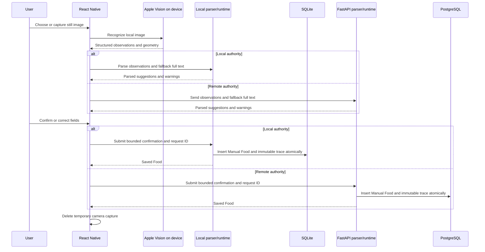
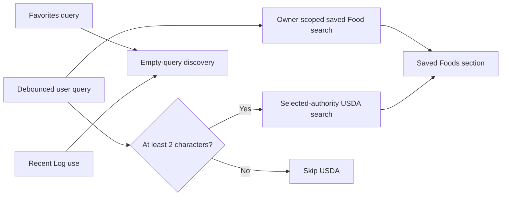

# OCR, search, and offline behavior

> **Document role: Current Guide.**

The mobile application combines device-native capture with parser and confirmation logic behind the
explicitly selected application-data authority. A running context uses either composed local
SQLite or the remote FastAPI/PostgreSQL runtime, never both. There is no synchronization, fallback,
dual write, background sync, or cloud backup.

## Nutrition-label OCR flow

### On-device responsibilities

The Swift Expo module wraps Apple Vision. It receives a local image URI and returns validated text
observations, normalized bounding boxes, image metadata, languages, recognition level, and timing.
Recognition is iOS-only and requires a development/native build.

The mobile capture screen owns camera/photo permissions, local temporary-file cleanup, progress,
cancellation, and user-facing recovery. It does not persist label images to the backend.

### Parser and runtime responsibilities

The local and backend parsers are parity implementations over normalized OCR input. Observations
are authoritative when present; `full_text` is fallback-only when observations are absent. Each
normalizes numbers, maps nutrient labels to the canonical catalog, classifies ambiguous or
unsupported values, and returns warnings with source observation IDs. The selected runtime owns
confirmation validation, persistence, and idempotent replay.

Parsing does not persist drafts or images. Keeping it pure makes golden label fixtures and parser
version regressions deterministic.

### Confirmation and provenance

The review screen makes uncertainty visible and lets the user confirm or edit values. Confirmation
persists:

- an ordinary Manual Food, nutrients, and serving definitions;
- parser and trace schema versions;
- bounded field/nutrient suggestions and confirmation actions;
- observation IDs and selected source text needed to explain the correction;
- one owner-scoped client request ID and payload fingerprint.

It does **not** persist the image, image path, complete raw OCR text, or an unbounded parser response.
The trace is append-only creation provenance and is never nutrition resolver input.

## Unified Food search

The Saved Foods screen composes two independent authority-scoped queries:

There is no local full-text index and no shared ranking engine. Saved results come from the selected
application-data authority. USDA results come from `localUsdaRuntime` directly to FoodData Central
in local mode or through the backend integration in remote mode. The client suppresses results for
stale debounced queries and restores the in-session query/scroll position.

Recipe ingredient selection searches saved Foods, including active Recipe projections. It does not
silently import USDA results; importing creates a normal saved Food first.

## Offline and caching behavior

The app is authority-selected rather than synchronized. Local mode is durable on-device SQLite;
remote mode requires its API. Neither mode silently falls back to the other.

| Capability | Offline behavior |
| --- | --- |
| Previously fetched remote data | May remain in TanStack Query's in-memory cache for the running process |
| Durable nutrition data | Local mode uses its selected SQLite database; remote mode has no local durable replica |
| Offline create/update/delete queue | Not implemented |
| Conflict reconciliation or synchronization | Not implemented |
| Theme preference | Persisted best-effort in AsyncStorage |
| Apple Vision text recognition | Runs on-device after a local image is acquired |
| OCR parsing and confirmation | Local mode uses the local parser/runtime; remote mode requires the backend |
| USDA search and import | Requires upstream network availability; local mode also requires a request-time personal USDA credential, while remote mode requires the backend |
| Retry after uncertain response | Safe for covered creates through payload-bound request IDs |

TanStack Query's provider currently uses its normal in-memory `QueryClient`; no cache persister is
installed. Closing or evicting the app can discard in-process query data, but local-mode committed
nutrition remains in SQLite. Screens show bounded errors and explicit retry rather than mixing
authorities or presenting an uncommitted write as committed.

This distinction matters: idempotency makes retrying an uncertain network outcome safe, but it does
not make the application offline-capable. Any future durable offline work would need an explicit
sync/conflict architecture and should not be inferred from current caches.

## Runtime and remote API boundary

Feature code targets `NutritionRuntime`; it must not choose persistence authority ad hoc. Remote
runtime adapters call `src/shared/api/client.ts`; local adapters use the composed SQLite runtime.
Runtime configuration has no localhost fallback for remote mode, and private remote builds attach
the configured bearer token centrally. Feature modules should not construct independent base URLs,
duplicate credentials, bypass the selected runtime, or log secrets.

Mobile response validation is strongest at variable or privacy-sensitive boundaries, especially
OCR and Food source contracts. Pydantic remains the authoritative server-side request/response
schema.

## Where to look

| Concern | Code | Tests |
| --- | --- | --- |
| Native recognition | `apps/mobile/modules/nutrition-ocr`, `src/native/ocr` | Swift `ios-tests`, `nutritionOcr.test.ts` |
| Capture and diagnostics | `src/features/ocr/screens`, `diagnostics` | `ocrDiagnostics*.test.ts`, `ocrOverlayLayout.test.ts` |
| Pure parser | `apps/backend/app/ocr/parser.py` | `test_ocr_parser.py`, golden fixtures |
| Confirmation | `app/ocr/confirmation_service.py`, confirmation schemas | `test_ocr_confirmation.py`, `ocrConfirmation.test.ts` |
| Unified discovery | `SavedFoodsScreen.tsx`, `unifiedFoodSearch.ts`, Food/USDA hooks | `unifiedFoodSearch.test.ts`, `foodDiscovery*.test.ts` |
| API configuration | `config/runtimeConfig.js`, `src/shared/api/client.ts` | `runtimeConfig.test.ts`, `apiClientAuthentication.test.ts` |

For physical capture limitations and release checks, see [Stage 5 OCR](../historical/stages/stage5-ocr.md) and
[Release Candidate QA](../historical/releases/rc1-qa.md).

## Next reading

- Continue with [Foods and Nutrition](foods-and-nutrition.md) to see how imported or confirmed
  results become normal saved Foods.
- Use the [Development Guide](../project/development-guide.md#if-you-need-to-modify-ocr) for exact native,
  parser, confirmation, and test entry points.
- Read the [Testing Guide](../operations/testing.md) before changing golden parser behavior or native OCR claims.

## See also

- [Architecture Decision Index](../architecture/decisions.md) for OCR, search, and offline decisions
- [Architecture Overview](../architecture/overview.md) for mobile/backend responsibilities
- [Stage 5 OCR](../historical/stages/stage5-ocr.md) and [Release Candidate QA](../historical/releases/rc1-qa.md) for physical-device scope
