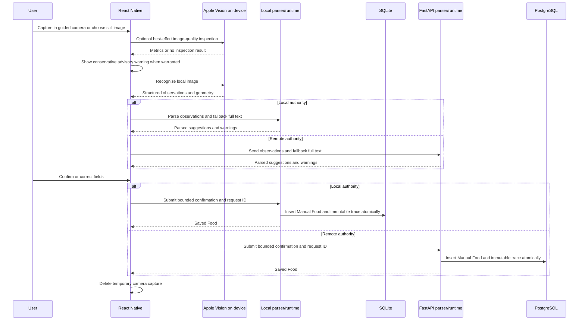
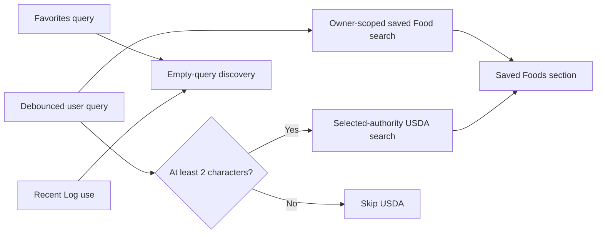

# OCR, search, offline behavior, and local backup

> **Document role: Current Guide.**

The mobile application combines device-native capture with parser and confirmation logic behind the
explicitly selected application-data authority. A running context uses either composed local
SQLite or the remote FastAPI/PostgreSQL runtime, never both. There is no synchronization, fallback,
dual write, background sync, or automatic cloud backup. Local mode does provide an explicit,
validated SQLite backup/export and staged replacement restore workflow; that is a maintenance
operation on one authority, not synchronization.

## Nutrition-label OCR flow

### Guided capture and on-device responsibilities

The app now owns the nutrition-label camera preview through `expo-camera` instead of delegating
camera acquisition to a generic image-picker camera flow. The capture view selects a supported back
camera lens when available, displays nutrition-label framing guidance/corner marks, provides
accessible capture/cancel behavior, and returns a local still image for the existing OCR pipeline.
The framing marks are guidance; they are not a mandatory crop boundary.

The Swift Expo module wraps Apple Vision. It receives a local image URI and returns validated text
observations, normalized bounding boxes, image metadata, languages, recognition level, and timing.
Recognition is iOS-only and requires a development/native build.

Before recognition, the TypeScript/native OCR boundary can perform best-effort capture-quality
inspection. The native inspector reports bounded image/focus/luminance/text-region metrics. Mobile
policy converts only sufficiently strong signals into conservative user warnings. Inspection is
advisory: an older native build without the method, malformed metrics, or an inspection failure
returns no quality result and does not prevent OCR recognition. A quality warning likewise does not
replace the confirmation screen or automatically reject a label.

The mobile capture flow owns camera/photo permissions, local temporary-file cleanup, progress,
cancellation, retake/reselect recovery, and user-facing error states. It does not persist label
images to the backend or long-lived local application data.

### Parser and runtime responsibilities

The local and backend parsers are parity implementations over normalized OCR input. Observations
are authoritative when present; `full_text` is fallback-only when observations are absent. Each
normalizes numbers, maps nutrient labels to the canonical catalog, classifies ambiguous or
unsupported values, and returns warnings with source observation IDs. The parser and mapping now
cover the expanded canonical nutrient catalog, including current vitamin/mineral and fatty-acid
identities. The selected runtime owns confirmation validation, persistence, and idempotent replay.

Parsing does not persist drafts or images. Keeping it pure makes golden label fixtures and parser
version regressions deterministic. The parser contract is versioned; changes to nutrient matching
or interpretation require parity/golden-fixture review rather than silent client-only drift.

### Confirmation and provenance

The review screen makes uncertainty visible and lets the user confirm or edit values, serving
meaning, and recognized nutrient values. Confirmation persists:

- an ordinary Manual Food, nutrients, and serving definitions;
- parser and trace schema versions;
- bounded field/nutrient suggestions and confirmation actions;
- observation IDs and selected source text needed to explain the correction;
- one owner-scoped client request ID and payload fingerprint.

It does **not** persist the image, image path, complete raw OCR text, or an unbounded parser response.
The trace is append-only creation provenance and is never nutrition resolver input.

Unsaved-draft protection applies to the confirmation route: navigation away from a changed review
requires an explicit discard decision, and a busy mutation cannot be abandoned through the normal
draft-exit path.

## Unified Food search

The Saved Foods screen composes two independent authority-scoped queries:

There is no local full-text index and no shared ranking engine. Saved results come from the selected
application-data authority. USDA results come from `localUsdaRuntime` directly to FoodData Central
in local mode or through the backend integration in remote mode. The client suppresses results for
stale debounced queries and restores the in-session query/scroll position.

Recipe ingredient selection searches saved Foods, including active Recipe projections. It does not
silently import USDA results; importing creates a normal saved Food first.

## Offline and caching behavior

The app is authority-selected rather than synchronized. Local mode is durable on-device SQLite;
remote mode requires its API. Neither mode silently falls back to the other.

| Capability | Offline behavior |
| --- | --- |
| Previously fetched remote data | May remain in TanStack Query's in-memory cache for the running process |
| Durable nutrition data | Local mode uses its selected SQLite database; remote mode has no local durable replica |
| Offline create/update/delete queue | Not implemented |
| Conflict reconciliation or synchronization | Not implemented |
| Theme preference | Persisted best-effort in AsyncStorage |
| Apple Vision text recognition | Runs on-device after a local image is acquired |
| OCR image-quality inspection | Runs on-device when the current native module supports it; failure/absence does not block recognition |
| OCR parsing and confirmation | Local mode uses the local parser/runtime; remote mode requires the backend |
| USDA search and import | Requires upstream network availability; local mode also requires a request-time personal USDA credential, while remote mode requires the backend |
| Local backup export/restore | Available only for the local SQLite authority; user-selected file/share destinations are external to the runtime |
| Retry after uncertain response | Safe for covered creates through payload-bound request IDs |

TanStack Query's provider currently uses its normal in-memory `QueryClient`; no durable query-cache
persister is installed. Closing or evicting the app can discard in-process query data, but
local-mode committed nutrition remains in SQLite. Screens show bounded errors and explicit retry
rather than mixing authorities or presenting an uncommitted write as committed.

This distinction matters: idempotency makes retrying an uncertain network outcome safe, but it does
not create synchronization. Local SQLite makes the normal local authority usable without the
backend, while remote mode remains network dependent.

## Local backup and restore

Local backup/restore is implemented under `apps/mobile/src/storage/backup` and surfaced from
Settings. It is deliberately scoped to the local SQLite authority.

### Backup export

`createLocalBackupArtifact()` opens a maintenance connection to the active application database and
uses SQLite's backup API to create one coherent database snapshot. The exported artifact is made
standalone, marked with the Nutrition App backup application ID/format version, and validated before
it is offered through the system share sheet. Temporary export artifacts are deleted after the
share workflow. USDA credentials and other secrets are not part of the application SQLite backup.

The app can confirm that it created and validated an artifact; the user must still confirm the file
was actually retained by the destination selected in the operating-system share sheet.

### Restore inspection and staging

A selected file is copied to a temporary candidate and validated without modifying the active
database. Settings shows the validated candidate for explicit review. Confirming restore creates and
revalidates a staged standalone copy, then moves that copy into the pending-restore namespace.
Staging alone does not replace the open application database and can be canceled before restart.

### Restart-time activation and rollback

Pending restore activation occurs at the local-runtime bootstrap boundary before a normal local
SQLite connection is opened. The pending artifact is validated again. If an active database already
exists, the app first creates a rollback snapshot. The pending database is then copied into the
active database and validated in active mode.

A failed replacement restores the prior database from the rollback snapshot when one exists; a
failed restore on a previously empty installation removes the unsuccessful active database. If the
application cannot restore the rollback snapshot safely, bootstrap raises a fatal activation error
instead of opening an ambiguous local authority. Success/failure restore evidence is retained in
AsyncStorage for Settings/startup presentation.

This workflow is not cloud backup, remote PostgreSQL backup, merge/import, cross-device sync, or
conflict resolution. Restoring replaces the local authority with one validated backup snapshot.

## Runtime and remote API boundary

Feature code targets `NutritionRuntime`; it must not choose persistence authority ad hoc. Remote
runtime adapters call `src/shared/api/client.ts`; local adapters use the composed SQLite runtime.
Runtime configuration has no localhost fallback for remote mode, and private remote builds attach
the configured bearer token centrally. Feature modules should not construct independent base URLs,
duplicate credentials, bypass the selected runtime, or log secrets.

Local backup activation is intentionally earlier than normal `NutritionRuntime` construction: it is
a bootstrap/maintenance boundary needed to replace the local database safely before the selected
local authority opens. This exception does not allow ordinary feature code to bypass
`NutritionRuntime` for application operations.

Mobile response validation is strongest at variable or privacy-sensitive boundaries, especially
OCR and Food source contracts. Pydantic remains the authoritative server-side request/response
schema for remote mode.

## Where to look

| Concern | Code | Tests |
| --- | --- | --- |
| Guided camera capture | `src/features/ocr/components/NutritionCameraCapture.tsx`, `src/native/camera` | `nutritionScanAccessibility.test.ts`, camera interaction coverage |
| Native recognition and quality inspection | `apps/mobile/modules/nutrition-ocr`, `src/native/ocr`, `src/features/ocr/quality` | Swift `ios-tests`, `nutritionOcr.test.ts`, `ocrImageQuality.test.ts` |
| Capture/review/diagnostics | `src/features/ocr/screens`, `components`, `diagnostics` | `nutritionScanAccessibility.test.ts`, `nutritionConfirmationScreen.test.ts`, OCR diagnostics tests |
| Pure parser | `apps/backend/app/ocr/parser.py`, mobile local parser | `test_ocr_parser.py`, `localOcrParser.test.ts`, golden fixtures |
| Confirmation | `app/ocr/confirmation_service.py`, confirmation schemas, local OCR runtime | `test_ocr_confirmation.py`, `ocrConfirmation.test.ts`, `localOcrRuntime.test.ts` |
| Unified discovery | `SavedFoodsScreen.tsx`, `unifiedFoodSearch.ts`, Food/USDA hooks | unified search and Food discovery tests |
| Local backup/restore | `src/storage/backup`, `src/app/settings/LocalBackupSettings.tsx`, local bootstrap | `localBackupValidation.test.ts`, `localBackupActivation.test.ts`, `localBackupSettings.test.ts`, `localFirstStartRestoreGate.test.ts` |
| API configuration | `config/runtimeConfig.js`, `src/shared/api/client.ts` | `runtimeConfig.test.ts`, `apiClientAuthentication.test.ts` |

For physical capture limitations and historical release checks, see [Stage 5 OCR](../historical/stages/stage5-ocr.md) and
[Release Candidate QA](../historical/releases/rc1-qa.md). Those records preserve their original
qualification scope and are not the current OCR capability inventory.

## Next reading

- Continue with [Foods and Nutrition](foods-and-nutrition.md) to see how imported or confirmed
  results become normal saved Foods.
- Use the [Development Guide](../project/development-guide.md#if-you-need-to-modify-ocr) for exact native,
  parser, confirmation, camera-quality, and test entry points.
- Read the [Testing Guide](../operations/testing.md) before changing golden parser behavior, backup
  activation, or native OCR claims.

## See also

- [Architecture Decision Index](../architecture/decisions.md) for OCR, search, authority, and local-backup decisions
- [Architecture Overview](../architecture/overview.md) for mobile/backend/bootstrap responsibilities
- [Stage 5 OCR](../historical/stages/stage5-ocr.md) and [Release Candidate QA](../historical/releases/rc1-qa.md) for historical physical-device scope
