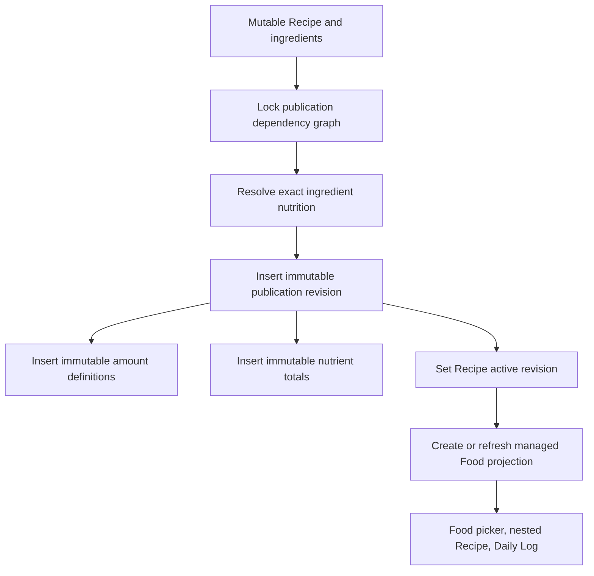
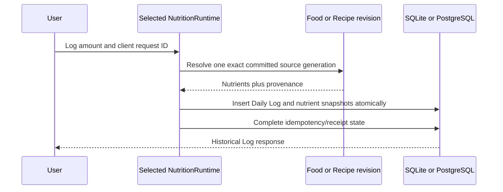

# Recipes and nutrition history

> **Document role: Current Guide.**

Recipes connect mutable authoring with immutable use. An author can keep editing a Recipe, while a
published revision preserves exactly what was available when someone logged it. Daily Logs then
snapshot resolved nutrient amounts so later Food or Recipe changes cannot rewrite history.

This guide distinguishes two related layers. Immutable Recipe revisions and Daily Log nutrient
snapshots are the historical substrate. The implemented Nutrition History and Trends experience is
a bounded multi-day presentation and projection over that substrate; it does not create another
historical authority.

## Current Recipe reuse and discovery

The current product presents Recipes as Recipes rather than requiring users to understand the
managed Food compatibility layer used internally by publication and logging.

The implemented reuse/discovery experience includes:

- Recipe-list lifecycle presentation that distinguishes Draft, Published/current, and Update Needed
  (`needs_republish`) state with explicit semantics rather than color alone;
- Recipe-oriented search and recent-use discovery for reusable published Recipes, while recents
  continue to derive from actual Log history rather than a second Recipe ranking/history authority;
- direct `Log Recipe` from Recipe context through the established amount/serving selection flow,
  resolving one exact immutable publication revision;
- deliberate duplication into a new independent editable Recipe with a distinct identity and
  unpublished state, without copying immutable publication revisions, managed projection identity,
  historical Daily Logs, or mutable coupling to the source Recipe; and
- collision-aware and retry-safe duplicate creation so replay does not silently create additional
  Recipe copies.

Draft or otherwise unpublished Recipes are not presented as reusable published Log sources. Editing,
publishing, republishing, deleting, or later logging either the source or duplicate does not create
cross-Recipe mutation coupling.

GH-149 is the bounded delivery evidence for first-class lifecycle/reuse/discovery presentation and
Recipe-oriented logging language. GH-150 is the bounded delivery evidence for independent Recipe
duplication. The deeper projection and immutable-revision sections below remain maintainer
architecture; they are not concepts a user must understand to reuse, log, or duplicate a Recipe.

## Authored Recipes

A Recipe is a mutable user-owned definition containing:

- name and notes;
- serving-count yield and/or final cooked-weight yield;
- ordered ingredients;
- publication state and `needs_republish` status.

An ingredient points to a Food. A published child Recipe appears as a managed Food projection, so
the same ingredient representation supports nested Recipes without storing a second graph model.
Ingredient amounts are either exact serving references or explicit mass quantities.

The current mobile Recipe form treats serving count and cooked-weight yield as first-class authored
values and keeps serving-unit choice explicit. Serving-based ingredients preserve the selected
serving identity; gram-based ingredients preserve explicit mass. UI conversion/display helpers may
make those values easier to enter, but they do not replace the underlying amount definition or gram
authority.

Unsaved Recipe authoring is one guarded navigation flow across the Recipe form, ingredient picker,
USDA search/preview, and serving-management routes. Leaving a semantically changed draft requires an
explicit discard decision; normal navigation does not silently throw away authored Recipe changes.

### Graph safety

Recipe graphs must remain owner-local, active, and acyclic. Mutations that add or replace graph
edges use this database lock order:

1. the owning user row;
2. referenced Food rows in UUID order;
3. the Recipe being changed;
4. current graph traversal and cycle validation;
5. ingredient replacement.

The user-row lock serializes graph changes for one owner while allowing different owners to proceed
independently in the remote PostgreSQL authority. Local SQLite preserves the same owner-local,
active, acyclic graph semantics through its local transaction/write-coordination model rather than
pretending to provide PostgreSQL row locks. PostgreSQL tests remain authoritative for the remote
lock protocol; local runtime/native SQLite tests are authoritative for local transaction behavior.

## Publication

Publication converts the current authored graph into immutable loggable state.

Each publication revision records canonical Recipe content, revision number, yields, totals,
ingredient snapshot, content digest, and ownership. Amount definitions describe the supported
ways to consume that revision—for example a serving or a gram amount. Publication nutrient rows
contain the calculated revision totals.

Previously published revisions are never updated. Publishing again inserts another revision and
moves only the Recipe's active-revision pointer and compatibility projection.

### `needs_republish`

Food nutrient or serving changes can make the authored Recipe differ from its active publication.
The service marks affected published Recipes as needing republication. Existing revision data and
historical logs remain unchanged; the author must explicitly publish the new state.

Nested Recipe publication also validates parent amount definitions. If a child projection changes
in a way that cannot be remapped unambiguously, the parent publication fails atomically rather than
silently changing its meaning.

## Recipe compatibility projection

The projection is a Food-shaped view of one exact publication revision. It exists because Foods
already participate in ingredient selection, serving resolution, logging, search, and ownership.
The projection avoids duplicating those workflows while retaining revision identity.

The projection is managed state:

- generic Food editing is not its authority;
- it must point to the same owner's immutable revision;
- publication refreshes it to the new active revision;
- retention audits detect orphaned or inconsistent projections.

## Daily Log creation

Local and remote authorities must produce the same historical meaning, but their concurrency
mechanisms differ. Remote mode uses PostgreSQL transactions/locks; local mode uses coordinated
SQLite transactions. Neither may expose a committed Log before the selected authority has actually
committed it.

### Logging a mutable Food

The selected runtime resolves one coherent committed Food generation and writes the resulting
nutrient snapshots atomically. Remote mode locks the Food and reloads its serving/nutrient children
inside the PostgreSQL transaction. Local mode serializes the SQLite mutation path and resolves the
same generation inside the local transaction. A snapshot must never combine children from
different committed Food generations.

### Logging a published Recipe

The service locks and resolves the immutable publication revision and an exact amount definition.
The Daily Log stores both IDs. It does not recalculate against the currently authored Recipe or the
latest active revision.

### Snapshot contents

Each nutrient snapshot stores the resolved amount, unit, data status, consumed quantity/mass, and
bounded calculation provenance. Foreign keys to replaceable nutrient or serving child rows may
become null, but the resolved amount remains. The Food link is retained because Foods are soft
deleted.

## Editing and deleting Logs

Editing a Log is a new historical observation of the edited amount, not retroactive reaction to a
Food edit. The service deletes and rebuilds only that Log's snapshots in the same transaction:

- a mutable-Food Log uses the current Food definition at edit time;
- a Recipe Log remains revision-aware and resolves against an allowed immutable amount definition;
- a Log whose mutable source Food is deleted may be non-editable, but its historical snapshots
  remain readable.

Deleting a Log removes that Log and its snapshots. It can affect recents because recents derive from
actual log history; it does not delete the source Food or Recipe revision.

Current mobile Log flows preserve authoritative amount/serving meaning while using human-oriented
serving presentation. Mutation results are surfaced explicitly; success state is not inferred only
from navigation or cache refresh.

## Complete day state

`Complete` is an explicit durable assertion that logging is finished for one authoritative Daily
Log calendar date. It belongs to the date, not an individual Log, and it is never inferred from Log
presence, nutrient values, older backup/transfer formats, or historical data. An absent assertion
means not confirmed complete; it is not a persisted `Incomplete` classification.

Nutrition-changing Log mutations invalidate Complete for every affected date in the same selected-
authority transaction. Moves invalidate source and destination dates. Note-only and meal-label-only
edits preserve Complete, as does a serving/amount edit whose resulting immutable nutrient snapshot
is exactly unchanged. Later Food or Recipe edits do not invalidate historical Complete because they
do not rewrite stored Log snapshots. Supported local backup/restore and one-time transfer preserve
explicit Complete state without introducing synchronization or inferring it where absent.

## Daily summaries

Daily summaries aggregate `daily_log_nutrient_snapshots` only. They never join current
`food_nutrients` to recalculate the past. Per nutrient, the response reports:

- known amount;
- estimated amount;
- display unit;
- whether unknown contributors exist;
- unknown-contributor count.

Target comparison consumes this same summary, which keeps target/profile/tracking-preference changes
outside the historical record.

## Nutrition History and Trends

History is a secondary analysis route owned by Daily Log, not a fourth tab or a separate runtime
capability. The product exposes 7-day and 30-day calendar ranges ending yesterday. The underlying
Daily Logs contract accepts bounded 1–30-date evidence reads; the product UI offers only 7/30-day
ranges. Today remains the in-progress Daily Log date.

One selected authority returns an inclusive record for every requested date plus the earliest logged
date. Local SQLite and remote FastAPI/PostgreSQL expose equivalent evidence, and one shared mobile
projection calculates Complete-day and Logged-day averages, usable-day counts, chart points, gaps,
and grouped nutrient rows. A remote failure never falls back to SQLite, and range/cache evidence is
never mixed across authorities.

History preserves the stored evidence distinctions:

- a date with no Logs is a gap, not zero intake;
- explicit numerical zero is a usable zero observation;
- estimated evidence remains numerical with estimated provenance;
- numeric evidence with unknown contributors remains usable while retaining uncertainty; and
- unknown-only nutrient evidence is unavailable and does not enter that nutrient's denominator.

Complete-day mode includes only Complete dates with usable numerical evidence for the selected
nutrient; Logged-day mode uses logged dates with usable numerical evidence. Exact stored decimals
are summed before division and final presentation rounding. Current Target/reference values are a
separately labeled present-day lens and are never reconstructed as historical goal state.

The Daily Log remains logging-first, with History one interaction away and a compact four-macro
summary. History presents four overview cards (Calories, Protein, Carbohydrate, and Fat), a distinct
grouped Nutrition Details surface, and focused nutrient History with exact daily values. Thirty-day
charts retain all daily observations through horizontal scrolling. Daily rows navigate to the exact
Daily Log date, and returning preserves the History context. Automatic coaching, adherence scores,
prior-period judgments, and 90-day/custom ranges are not implemented.

## Deletion and retention

Foods and Recipes are soft deleted where historical or dependency references require identity.
Deletion services lock and inspect active dependencies. Removing edges cannot create a graph cycle,
but adding or remapping edges follows the stricter graph-lock protocol.

Publication revisions and their amount/nutrient children are retained as immutable history.
`apps/backend/scripts/audit_recipe_retention.py` classifies retained revisions, projections, and
references without making repair decisions.

## Current mobile route behavior

Cross-cutting UI work now applies to Recipe and Log routes as well as other feature screens:

- detail/authoring routes use the shared fixed route-header pattern so Back/Cancel/title actions do
  not scroll away with long content;
- fixed navigation chrome caps visual text growth while preserving accessible content semantics;
- unsaved draft guards block accidental exit from dirty Recipe authoring and other guarded forms;
- busy mutation state prevents normal discard/navigation actions from racing an in-flight write;
- recovery/success messaging is explicit and accessible rather than relying on visual-only state.

These are presentation/navigation guarantees. They do not change Recipe revision authority or Log
snapshot semantics.

## Where to look

| Concern | Primary code | Tests |
| --- | --- | --- |
| Recipe authoring and graphs | `app/services/recipe_service.py`, `app/domain/recipe_*` | `test_stage4_recipes.py`, `test_recipe_nested_publication.py` |
| Publication snapshots | `app/publication/recipe_revision.py`, publication repository/models | `test_recipe_publication_*`, `test_recipe_revision_publication.py` |
| Projection integrity | `app/domain/recipe_projection.py`, Food/Recipe services | `test_recipe_projection_ownership.py`, `test_food_recipe_serving_integrity.py` |
| Logging and editing | `app/services/log_service.py`, `app/nutrition/revision_resolution.py` | `test_stage2_logs.py`, `test_recipe_revision_logging.py`, `test_recipe_revision_log_editing.py` |
| Complete persistence and mutation | `app/services/log_day_completion_service.py`, `app/repositories/log_repository.py`, local `localDailyLogCompleteState.ts` | E4-01 through E4-03 Complete suites |
| History evidence and shared projection | `app/services/log_service.py`, Logs history-range API, `src/runtime/local/localDailyLogsRuntime.ts`, `src/features/history/historyProjection.ts` | E4-04 through E4-06 and E4-16 History suites |
| History presentation | `apps/mobile/src/features/history`, Daily Log navigation | E4-09 through E4-12 and E4-16 mobile suites |
| Mobile Recipe/yield/serving flow | `apps/mobile/src/features/recipes`, `src/shared/navigation/draftGuard.ts` | `recipe*.test.ts`, `recipeServingChoice.test.ts`, `recipeServingUnitPicker.test.ts`, `draftGuard.test.ts` |
| Mobile Log flow | `apps/mobile/src/features/logging` | `log*.test.ts`, `dailyLog*.test.ts`, logging integration tests |

## Next reading

- Return to [Foods and Nutrition](foods-and-nutrition.md) for serving resolution and mutable Food
  behavior.
- Read [Project Invariants](../project/invariants.md#why-immutable-recipe-revisions) for the historical
  rationale behind revision-backed logging.
- Use the [Development Guide](../project/development-guide.md#if-you-need-to-modify-recipes) before changing
  Recipe graphs, publication, or Log snapshots.

## See also

- [Architecture Decision Index](../architecture/decisions.md) for revision and projection decisions
- [OCR, Search, and Offline Behavior](ocr-search-and-offline.md) for another immutable provenance flow
- [Testing Guide](../operations/testing.md) for publication, logging, Complete/History parity, E4-16 qualification, and PostgreSQL concurrency coverage
