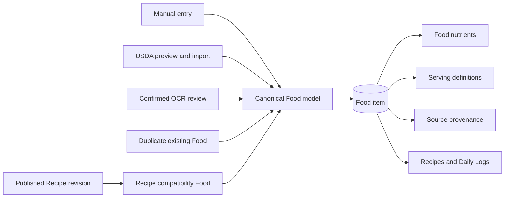
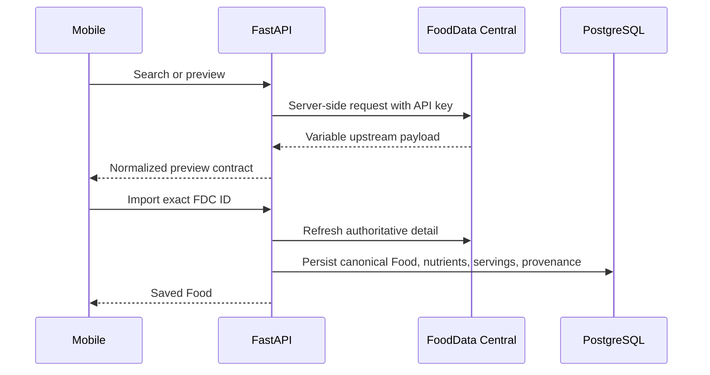

# Foods and nutrition domain

Foods are the reusable inputs to every nutrition workflow. A Food can be authored manually,
imported from USDA, created from a confirmed nutrition-label scan, duplicated from another Food, or
generated as a compatibility projection of a published Recipe. All sources converge on the same
stored nutrient and serving model so logging and Recipe calculation do not need source-specific
branches.

## Canonical nutrition model

A nutrient amount carries more meaning than a number:

- a canonical nutrient identity such as calories, protein, or sodium;
- an amount and compatible display unit;
- a basis: per serving, per 100 grams, or per gram;
- a status: known, estimated, explicit zero, or unknown;
- source and optional confidence/provenance fields.

Unknown and zero are intentionally different. Zero contributes a known amount of zero. Unknown
means the source does not support a numeric contribution and must remain visible in aggregate
quality information.

Supported calculation units are `kcal`, `g`, `mg`, and `mcg`. Compatible mass units normalize
before aggregation; incompatible units fail instead of being silently combined. Authoritative
backend calculations use Python `Decimal`, and API values are represented without floating-point
assumptions.

The nutrient catalog defines stable identity and display ordering. FDA Daily Values live in a
separate reference table because regulatory targets are versioned reference data, not properties
of nutrient identity.

## Food lifecycle

### Mutable definitions

A normal Food is a mutable definition. Its name, nutrient rows, and serving definitions can change.
Deletion is soft so historical references remain understandable. Mutations are owner-scoped and
must account for Recipes that currently depend on the Food.

A Food may have several serving definitions but exactly one default. A serving records quantity,
unit, optional gram weight, source, and confirmation metadata. Household labels do not imply a gram
conversion unless a gram weight is explicitly present.

### Serving resolution

The resolver supports:

- **serving mode**, which requires an exact serving definition;
- **gram mode**, when nutrients or a selected/default serving provide a valid mass conversion.

Recipe ingredients are stricter than general Food logging. A serving-mode ingredient stores its
exact serving ID; a gram-mode ingredient stores no serving ID. When a Food's serving generation is
replaced, the service remaps an active Recipe ingredient only when exactly one successor has the
same normalized quantity, unit, and gram weight. Missing or ambiguous successors reject the Food
update atomically.

## Food sources

### Manual and duplicate

Manual Food creation validates one coherent serving/nutrient definition and persists it in one
transaction. Duplication produces a new user-owned Food and preserves bounded lineage without
making the copy depend on later source edits.

### USDA FoodData Central

USDA access is backend-only:

The mapper prefers stable USDA nutrient IDs, then nutrient numbers, with narrow display-name
fallbacks for upstream variation. USDA nutrient records are stored per 100 grams. Imported Foods
always receive a `100 g` serving; branded/portion servings are added only with valid gram weights.

Duplicate import is based on active `(user, USDA source, FDC ID)` identity, not name. A concurrent
unique-index race returns the newly existing Food. A soft-deleted old import can be imported again.

### OCR-confirmed Food

OCR confirmation creates an ordinary Manual Food plus a bounded append-only confirmation trace in
the same transaction. The trace explains how parsed values were confirmed or corrected; it is not
used by the nutrition resolver. See [OCR, Search, and Offline Behavior](ocr-search-and-offline.md).

### Recipe compatibility Food

A published Recipe has a generated Food projection so existing Food selection and logging flows can
reuse it. The projection points to an immutable Recipe revision. It is managed by Recipe publication,
not a generic editable Food. See [Recipes and Nutrition History](recipes-and-logging.md).

## Favorites, recents, and search

Favorites are naturally idempotent owner/Food relationships. Recents are derived from actual Daily
Log use and ordered deterministically. Saved Food search is an owner-scoped backend query; the
mobile discovery screen combines it with USDA results after a debounced query of at least two
characters. There is no separate search index or ranking service.

Search presentation and network behavior are documented in
[OCR, Search, and Offline Behavior](ocr-search-and-offline.md#unified-food-search).

## Targets and comparisons

Targets are deliberately outside historical nutrition data. The effective target order is:

1. explicit user override;
2. optional calculated maintenance-calorie estimate;
3. versioned FDA Daily Value fallback;
4. unavailable.

Mifflin–St Jeor supplies an optional general calorie estimate from profile inputs. Protein,
carbohydrate, and fat personal targets remain manual. Daily comparison reads the same
snapshot-derived daily summary as the rest of the app, so changing a profile or target never changes
historical Logs.

## Ownership and retry behavior

Every persisted Food is resolved through the authenticated user's boundary. Service checks and
owner-aware foreign keys prevent a user from attaching another user's Food, serving, Recipe
revision, or target.

Retryable create operations use a client request UUID bound to a canonical payload fingerprint and
stored response snapshot. Exact replay returns the original committed resource. Reusing the UUID
with different input conflicts. If the original result is no longer safely returnable, replay fails
with `create_idempotency_result_unavailable` rather than creating a replacement.

## Where to look

| Concern | Backend | Mobile | Tests |
| --- | --- | --- | --- |
| Food CRUD and serving rules | `app/services/food_service.py`, `app/nutrition/serving_resolution.py` | `src/features/foods` | `test_stage2_foods.py`, `foodForm.test.ts` |
| Nutrient resolution and aggregation | `app/nutrition`, `app/domain/nutrition.py` | `src/shared/nutrition` | `test_nutrition_resolution.py`, `test_aggregation.py` |
| USDA | `app/integrations/usda`, `app/services/usda_service.py` | `src/features/usda` | `test_stage3_usda_*`, `usda*.test.ts` |
| Favorites and recents | `food_service.py`, Food/log repositories | `useFoods.ts`, `foodDiscovery.ts` | `test_food_discovery.py`, `foodDiscovery*.test.ts` |
| Targets | `app/services/target_service.py`, `app/targets` | `src/features/targets` | `test_targets.py`, `target*.test.ts` |

Use the [Development Guide](development-guide.md) for exact router, schema, migration, and
qualification checkpoints.

## Next reading

- Continue with [Recipes and Nutrition History](recipes-and-logging.md) to see how Foods become
  ingredients, published revisions, and immutable Daily Log snapshots.
- Read [OCR, Search, and Offline Behavior](ocr-search-and-offline.md) for scanned Food creation and
  unified saved/USDA discovery.
- Use the [Development Guide](development-guide.md#if-you-need-to-modify-foods-or-servings) before
  changing Food or serving behavior.

## See also

- [Architecture Decision Index](architecture-decisions.md) for the key Food and nutrition choices
- [Architecture Guide](architecture.md) for layer ownership
- [Testing Guide](testing.md) for Food, USDA, ownership, and concurrency coverage
