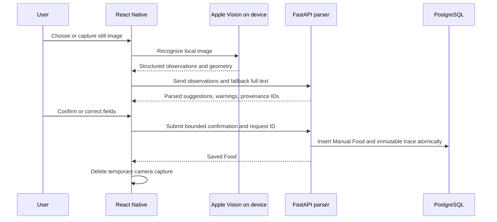
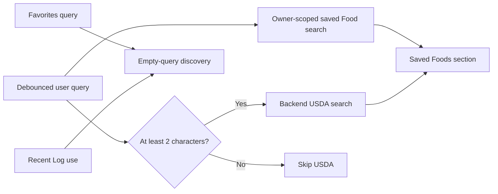

# OCR, search, and offline behavior

The mobile application combines device-native capture with backend-owned parsing and persistence.
It is online-first: retry safety is strong, but there is no durable offline mutation queue or local
replica of the nutrition database.

## Nutrition-label OCR flow

### On-device responsibilities

The Swift Expo module wraps Apple Vision. It receives a local image URI and returns validated text
observations, normalized bounding boxes, image metadata, languages, recognition level, and timing.
Recognition is iOS-only and requires a development/native build.

The mobile capture screen owns camera/photo permissions, local temporary-file cleanup, progress,
cancellation, and user-facing recovery. It does not persist label images to the backend.

### Backend parser responsibilities

The parser is a pure operation over normalized OCR input. Observations are authoritative when
present; `full_text` is fallback-only when observations are absent. It normalizes numbers, maps
nutrient labels to the canonical catalog, classifies ambiguous or unsupported values, and returns
warnings with source observation IDs.

Parsing does not persist drafts or images. Keeping it pure makes golden label fixtures and parser
version regressions deterministic.

### Confirmation and provenance

The review screen makes uncertainty visible and lets the user confirm or edit values. Confirmation
persists:

- an ordinary Manual Food, nutrients, and serving definitions;
- parser and trace schema versions;
- bounded field/nutrient suggestions and confirmation actions;
- observation IDs and selected source text needed to explain the correction;
- one owner-scoped client request ID and payload fingerprint.

It does **not** persist the image, image path, complete raw OCR text, or an unbounded parser response.
The trace is append-only creation provenance and is never nutrition resolver input.

## Unified Food search

The Saved Foods screen composes two independent server queries:

There is no local full-text index and no shared backend ranking engine. Saved results come from the
application database; USDA results come through the backend integration. The client suppresses
results for stale debounced queries and restores the in-session query/scroll position.

Recipe ingredient selection searches saved Foods, including active Recipe projections. It does not
silently import USDA results; importing creates a normal saved Food first.

## Offline and caching behavior

The app is deliberately online-first.

| Capability | Offline behavior |
| --- | --- |
| Previously fetched server data | May remain in TanStack Query's in-memory cache for the running process |
| Durable nutrition cache | Not implemented |
| Offline create/update/delete queue | Not implemented |
| Conflict reconciliation or synchronization | Not implemented |
| Theme preference | Persisted best-effort in AsyncStorage |
| Apple Vision text recognition | Runs on-device after a local image is acquired |
| OCR parsing and confirmation | Requires the backend |
| USDA search and import | Requires backend and upstream network availability |
| Retry after uncertain response | Safe for covered creates through payload-bound request IDs |

TanStack Query's provider currently uses its normal in-memory `QueryClient`; no cache persister is
installed. Closing or evicting the app can discard cached server data. Screens show bounded errors
and explicit retry rather than presenting a local write as committed.

This distinction matters: idempotency makes retrying an uncertain network outcome safe, but it does
not make the application offline-capable. Any future durable offline work would need an explicit
sync/conflict architecture and should not be inferred from current caches.

## Central API and authentication boundary

All feature clients call `src/shared/api/client.ts`. Runtime configuration has no localhost
fallback, and private builds attach the configured bearer token centrally. Feature modules should
not construct independent base URLs, duplicate credentials, or log secrets.

Mobile response validation is strongest at variable or privacy-sensitive boundaries, especially
OCR and Food source contracts. Pydantic remains the authoritative server-side request/response
schema.

## Where to look

| Concern | Code | Tests |
| --- | --- | --- |
| Native recognition | `apps/mobile/modules/nutrition-ocr`, `src/native/ocr` | Swift `ios-tests`, `nutritionOcr.test.ts` |
| Capture and diagnostics | `src/features/ocr/screens`, `diagnostics` | `ocrDiagnostics*.test.ts`, `ocrOverlayLayout.test.ts` |
| Pure parser | `apps/backend/app/ocr/parser.py` | `test_ocr_parser.py`, golden fixtures |
| Confirmation | `app/ocr/confirmation_service.py`, confirmation schemas | `test_ocr_confirmation.py`, `ocrConfirmation.test.ts` |
| Unified discovery | `SavedFoodsScreen.tsx`, `unifiedFoodSearch.ts`, Food/USDA hooks | `unifiedFoodSearch.test.ts`, `foodDiscovery*.test.ts` |
| API configuration | `config/runtimeConfig.js`, `src/shared/api/client.ts` | `runtimeConfig.test.ts`, `apiClientAuthentication.test.ts` |

For physical capture limitations and release checks, see [Stage 5 OCR](stage5-ocr.md) and
[Release Candidate QA](rc1-release-qa.md).

## Next reading

- Continue with [Foods and Nutrition](foods-and-nutrition.md) to see how imported or confirmed
  results become normal saved Foods.
- Use the [Development Guide](development-guide.md#if-you-need-to-modify-ocr) for exact native,
  parser, confirmation, and test entry points.
- Read the [Testing Guide](testing.md) before changing golden parser behavior or native OCR claims.

## See also

- [Architecture Decision Index](architecture-decisions.md) for OCR, search, and offline decisions
- [Architecture Guide](architecture.md) for mobile/backend responsibilities
- [Stage 5 OCR](stage5-ocr.md) and [Release Candidate QA](rc1-release-qa.md) for physical-device scope
