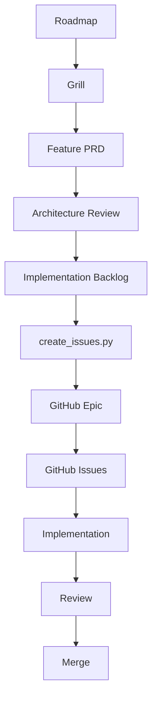

# GitHub implementation workflow

> **Document role: Engineering Process.** This guide explains how approved planning artifacts
> become GitHub execution records. Product and architecture decisions remain authoritative in the
> repository documents; GitHub organizes delivery without replacing those documents.

## Workflow



The sequence is a gate, not merely a suggested reading order. Implementation begins from approved
GitHub Issues only after the preceding product and architecture artifacts are complete.

## Artifact responsibilities

### Roadmap

The Roadmap authorizes an Epic's product outcome, boundaries, ordering, and architectural impact.
It does not define implementation tasks. The GitHub Epic links back to the Roadmap so scope can be
checked without copying it into issue discussion.

### Grill

The Grill resolves product behavior and edge cases. Once complete, it is authoritative for those
decisions and should not be reopened during decomposition or implementation unless a direct
contradiction is found.

The Grill remains a planning document. GitHub Issues may summarize the behavior they implement but
must not reinterpret it.

### Feature PRD

The Feature PRD converts accepted Grill decisions into stable, implementation-independent
requirements. It is the primary product source for acceptance criteria in the implementation
backlog and child issues.

### Architecture Review

The Architecture Review confirms whether the PRD fits established system boundaries and records
any implementation gate. Task decomposition must stop rather than inventing a solution if a
requirement falls outside the approved architecture.

### Implementation Backlog

The Implementation Backlog is the source for GitHub issue creation. It defines:

- the Epic title and optional Epic labels;
- milestone headings;
- stable child identifiers and titles;
- optional child labels;
- acceptance criteria, dependencies, work by layer, migration impact, tests, and size; and
- recommended implementation ordering and safe parallelism.

Backlog issue identifiers are durable automation identities. Do not reuse an identifier for a
different task.

## GitHub translation

### `create_issues.py`

Run the reusable [GitHub backlog issue creator](../../scripts/github/README.md) against the approved
Implementation Backlog. Begin with `--dry-run`.

The utility validates the document, then creates or reconciles:

- requested repository labels;
- GitHub Milestones corresponding to backlog milestone headings;
- one GitHub Epic;
- every child issue;
- the Epic's generated planning links, progress summary, milestone summary, and checklist; and
- optional GitHub Project membership when `--project` is supplied.

Ownership markers and the state file make reruns idempotent and recover interrupted execution.

### GitHub Epic

The Epic is the delivery index for the approved feature. Its generated section links back to the
planning authority, summarizes progress, and links every child issue. Manual coordination notes
may be added outside the generated boundaries and are preserved on rerun.

The Epic does not become a new product or architecture authority.

### GitHub Issues

Each child issue is the smallest reviewable implementation unit from the backlog. The issue owns
its acceptance criteria and named implementation surface while retaining links through the Epic to
the authoritative planning documents.

During implementation:

- follow the listed dependencies and recommended order;
- keep unrelated behavior outside the issue;
- open a separate reviewed planning change if accepted scope must change;
- preserve manual GitHub discussion and metadata; and
- close the issue only when its acceptance and testing requirements are satisfied.

Closing a child issue updates the Epic checklist and progress summary on the next tooling rerun.


### Task capsules

A repository [task capsule](../../engineering/capsules/README.md) may bind one approved child
issue to an exact base commit, execution boundary, verification plan, return evidence, and
escalation conditions. It is an execution contract, not a new product or architecture
authority. It may narrow an issue into a reviewable stage but may not reinterpret acceptance,
bypass dependencies, or expand scope without updating the owning artifact or issue first.

During Workflow v3's experimental period, capsule use is explicit and evidence-backed rather
than mandatory. The GitHub Issue remains the delivery record; the capsule records one bounded
repository execution attempt.

### GitHub Milestones

Backlog milestone headings become GitHub Milestones with identical titles. Every child issue is
assigned to exactly one source milestone. Milestones provide delivery grouping; they do not alter
dependencies or authorize scope.

### GitHub Projects

A Project is an optional execution view across the Epic and child issues. A newly tool-created
Project starts with:

```text
Backlog → Ready → In Progress → Review → Done
```

Existing Projects are reused without replacing user-customized fields, options, views, or
workflows. Project status is execution state, not product approval state.

## Implementation, review, and merge

Implementation work follows the repository's normal branch, testing, and review conventions. A
pull request should identify the GitHub Issue it implements and show evidence for that issue's
acceptance criteria.

Review checks two distinct questions:

1. Does the change satisfy its approved issue and source requirements?
2. Does it preserve repository standards and architectural invariants?

Merge closes the implementation loop for that issue. The Epic is complete only when all required
child issues and release-qualification work are complete.

## Changes after issue creation

The automation intentionally does not overwrite existing child issue bodies. If the backlog
changes after creation, reruns reconcile additive labels, milestones, Project membership, and Epic
metadata, but report body drift for human review.

When a change affects accepted product behavior or architecture, update and reapprove the
authoritative planning artifact before editing the GitHub issue. GitHub must reflect approved
scope; it must not become the place where that scope is silently redefined.

## No schema migration

This workflow creates GitHub metadata and a local JSON state file. It requires no application,
control-plane, or database migration.
