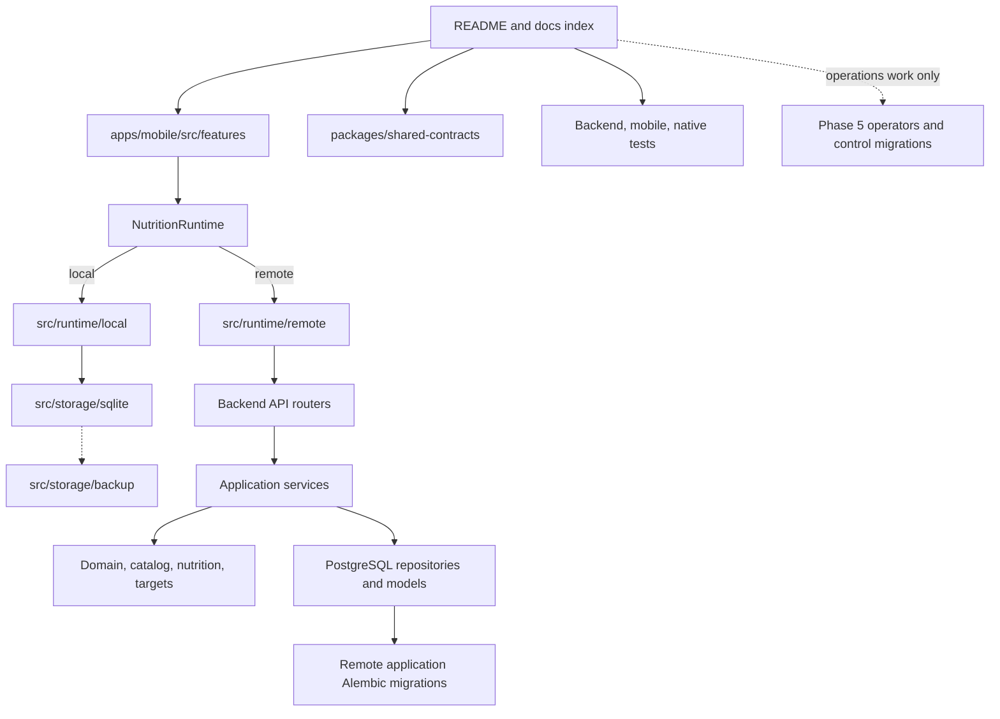

# Repository tour

> **Document role: Current Guide.**

This is the best first read after time away from the project. It describes the repository in the
order a developer should explore it rather than alphabetically.

## Start here



For a feature change, follow one real user action end to end:

1. Find the screen under `apps/mobile/src/features/<feature>`.
2. Follow its hook/API contract into `NutritionRuntime`.
3. Determine the selected implementation path: `src/runtime/local` + SQLite or
   `src/runtime/remote` + FastAPI.
4. For local behavior, follow the local runtime/use-case code into `src/storage/sqlite` only when
   persistence matters.
5. For remote behavior, follow the router into its service/domain/repository as needed.
6. Find the matching mobile tests plus local or remote qualification before changing the contract.

Do not assume a mobile feature call crosses HTTP. Local mode is the normal application-data path.

## Top-level map

### `apps/mobile`

The iOS-first Expo/React Native client and primary local-first application runtime.

```text
src/app/                  Navigation, providers, settings, theme
src/features/             Foods, Recipes, Logging, History, USDA, OCR, Targets, Calendar-facing UI
src/runtime/              NutritionRuntime plus local and remote authority adapters
src/storage/sqlite/       Local semantic schema, schema-version migrations, SQLite foundation
src/storage/backup/       Validated local backup/export, staged restore, activation/rollback
src/shared/nutrition/     Canonical nutrient presentation, qualified units, DRI/reference helpers
src/shared/navigation/    Dirty/busy draft-exit policy
src/shared/components/    Shared route/root chrome
src/shared/accessibility/ Focus, status, accessible interaction primitives
src/native/camera/        Nutrition-camera device/lens helpers
src/native/ocr/           TypeScript boundary to native OCR and image-quality inspection
modules/nutrition-ocr/    Swift Apple Vision Expo module and native tests
__tests__/                Jest unit, runtime, component, backup, and flow tests
config/                   Runtime/deployment configuration validation
```

Start with a feature's screen/component, then its hooks/API/utilities. Follow the feature call
through `NutritionRuntime` before choosing an implementation path. Base URL and authentication
policy belong only to remote transport.

Two local boundaries intentionally sit outside ordinary feature calls. Local backup restore runs at
startup before the SQLite authority opens because it may replace the database. Native camera/OCR
acquisition produces input for the selected OCR runtime but does not itself become application-data
authority.

### `apps/backend`

The preserved FastAPI/PostgreSQL remote authority and PostgreSQL reference implementation. It is
authoritative when mobile authority is `remote`; local application-data operations do not require
this process.

```text
app/api/v1/routers/       HTTP translation and response status mapping
app/services/             Transactional use cases and ownership boundaries
app/repositories/         Reusable persistence queries
app/domain/               Domain calculations and validation
app/catalog/              Canonical nutrient identity, hierarchy, units/reference metadata
app/nutrition/            Serving resolution, revision resolution, units, aggregation
app/targets/              DRI data/resolution, FDA reference projection, calorie estimation, comparison
app/models/               SQLAlchemy persistence model
app/schemas/              Public request and response contracts
app/integrations/usda/    FoodData Central HTTP and expanded nutrient mapping
app/ocr/                  Pure parser and confirmation persistence
app/migrations/           Application-database Alembic stream for the preserved remote authority
app/operators/            Offline conversion, qualification, control-plane clients
app/control_migrations/   Independent control-database Alembic stream
scripts/                  Explicit operator, transfer, and audit entry points
tests/                    Unit, API, PostgreSQL, migration, control, integration tests
```

The backend is not a strict one-class-per-layer framework. Routers are thin, services own use-case
transactions, repositories hold shared queries, and pure domain/reference modules own calculations.
Some small services query SQLAlchemy directly when another repository would not clarify ownership.

### `packages/shared-contracts`

This directory contains retained machine-readable cross-runtime/transfer contracts from completed
Epic 2, Epic 4 History evidence/projection/qualification fixtures, and a small nutrition type
reference. It is not a generated API SDK and is not the source of truth for backend Pydantic
schemas.

Current retained contract areas include `e2-02`, `e2-05`, `e2-07`, `e2-08`, `e2-09`, `e2-15`,
`e4-04`, `e4-05`, and `e4-16`.
The E2-15 directory contains versioned source-schema, target-schema, transfer-contract, and
representative-package artifacts used by PostgreSQL-to-SQLite transfer qualification. Treat these
as bounded regression/compatibility evidence. Do not reinterpret an existing version silently when
a current schema changes.

### `engineering`

Current generated-reference-data inputs/tooling live here rather than in historical docs. The DRI
reference dataset and parity cases under `engineering/reference-data` are source material for the
checked-in backend/mobile DRI representations. `generate_dri_reference.py` owns deterministic
regeneration.

### `docs`

The [Documentation Index](../README.md) separates current project knowledge, architecture, feature
guides, operations, reference material, and historical records. Ordinary implementation begins in
`project/` and the affected feature guide. Version 1.1/Epic 2 planning and closure material remains
under `docs/historical/programs/version-1.1/` as completed evidence, not an active backlog.

### Root Compose and scripts

- `docker-compose.yml` runs the normal local PostgreSQL 16 database.
- `docker-compose.phase5c4.yml` runs disposable MinIO for control-plane qualification.
- `docker-compose.phase5c4-qualification.yml` runs the opt-in disposable local recovery
  qualification topology; it is not an application development stack.
- `scripts/start-backend.sh` starts only the qualified remote runtime process with the
  `nutrition_runtime` database identity. Apply migrations separately as `nutrition_migrator`.
- `scripts/session-start.sh` and `scripts/session-end.sh` report and validate repository state.
- `scripts/zip-project.sh` creates a bounded review archive without local secrets/generated output.

## The persistence map

There are three distinct durable persistence domains plus one local replacement/backup mechanism:

| Authority/domain | Evolution or maintenance mechanism | Contains |
| --- | --- | --- |
| Local application SQLite | `apps/mobile/src/storage/sqlite` schema version + migrations | Local profile/User, Foods/servings/nutrients, Recipes/revisions, Logs/snapshots, OCR traces, Targets/tracking preferences, favorites, idempotency, runtime state |
| Local SQLite backup artifact | `apps/mobile/src/storage/backup` validation/staging/bootstrap replacement | One coherent standalone snapshot of the local application database; no secrets, merge state, or sync ledger |
| Remote application PostgreSQL | `apps/backend/app/migrations` Alembic stream | Preserved remote application data plus PostgreSQL-specific historical conversion/production prerequisites |
| Control PostgreSQL | `apps/backend/app/control_migrations` Alembic stream | Immutable operational evidence, promotion workflow, leases/outbox, admission decisions, typed evidence projections |

Only one **application-data** authority is selected for a running mobile context. Control PostgreSQL
is operations-only. A local backup is not a concurrent authority. Local SQLite is not a cache of
remote PostgreSQL, and PostgreSQL Alembic history is not mechanically replayed into SQLite.

Current migration identities are owned by [Current State](current-state.md). This tour maps persistence domains and code locations; it does not duplicate live migration-head or pinned operational-boundary status.

### Authority-first rule

Before following any walkthrough, decide whether the change is:

- authority-neutral contract/presentation work;
- local SQLite runtime work;
- remote FastAPI/PostgreSQL work;
- local startup/backup maintenance work; or
- parity work that must preserve both application authorities.

That decision determines which implementation and tests are authoritative.

## Find your change

The [Development Guide](development-guide.md) owns detailed task-to-code and
task-to-test routing. Use the entries below only as topology shortcuts.

### If you're working on Foods

Use the [Development Guide](development-guide.md#if-you-need-to-modify-foods-or-servings)
and [Foods and Nutrition](../features/foods-and-nutrition.md).

### If you're working on Recipes or Daily Logs

Use the [Development Guide](development-guide.md#if-you-need-to-modify-recipes)
and [Recipes and Nutrition History](../features/recipes-and-logging.md).

### If you're working on Targets and DRI/FDA references

Use the [Development Guide](development-guide.md#if-you-need-to-modify-targets)
and [Foods and Nutrition](../features/foods-and-nutrition.md#targets-and-comparisons).

### If you're working on OCR

Use the [Development Guide](development-guide.md#if-you-need-to-modify-ocr)
and [OCR, Search, Offline Behavior, and Local Backup](../features/ocr-search-and-offline.md).

### If you're working on local backup or restore

Use the [Development Guide](development-guide.md#if-you-need-to-modify-local-backup-or-restore).

### If you're working on Search

Use the [Development Guide](development-guide.md#if-you-need-to-modify-search-or-discovery).

### If you're working on Epic 2 transfer or parity fixtures

Use the current [PostgreSQL-to-SQLite Transfer](../operations/postgresql-to-sqlite-transfer.md)
guide. Historical E2-15 material is provenance, not current operator guidance.

### If you're working on Phase 5

Use the [Control Plane Guide](../operations/control-plane.md). This path is
operations engineering around the preserved remote authority.
## Typical Change Walkthroughs

The [Development Guide](development-guide.md) owns modification procedures.
These headings remain as stable navigation anchors.

### Adding a new Food property

See the Development Guide's Foods/servings path.

### Extending Recipe publication

See the Development Guide's Recipes path.

### Modifying OCR processing

See the Development Guide's OCR path.

### Adding a Daily Log feature

See the Development Guide's Daily Log path.

### Extending USDA import

See the Development Guide's USDA path.

### Adding a repository method

Use the owning feature path in the Development Guide and follow the selected
runtime authority.

### Adding a backend endpoint

Use the remote-authority path in the Development Guide and Architecture
Overview.

### Adding a mobile screen

Use the owning feature path plus the shared navigation/accessibility
infrastructure described below.

### Changing local SQLite persistence

Use the Development Guide's local SQLite migration path and native/file-backed
qualification.
## Cross-cutting mobile UI paths

Recent UI work deliberately centralizes repeated navigation/accessibility behavior:

| Concern | Start here |
| --- | --- |
| Fixed/sticky detail and authoring headers | `src/shared/components/RouteScreenHeader.tsx` |
| Dirty/busy draft-exit policy | `src/shared/navigation/draftGuard.ts`, `UnsavedDraftDialog.tsx` |
| Focus restoration/status announcements | `src/shared/accessibility`, `src/shared/forms` |
| Root tabs/settings routing | `src/app/navigation` |
| Dynamic Type behavior of fixed chrome | shared header/navigation tests and `fixedChromeDynamicType.test.ts` |

Keep these helpers as presentation/navigation policy. They do not own nutrition or persistence
semantics.

## Testing map

The [Testing Guide](../operations/testing.md) owns test selection and
qualification commands. This tour intentionally does not maintain a second
test inventory.
## What to ignore

When working on ordinary local-first features, initially ignore:

- `app/operators/phase5c*`;
- `app/control_migrations/`;
- `scripts/*phase5c*`;
- `docs/historical/`;
- production qualification Compose profiles.

Return to them when a change actually touches remote migration/role topology, historical
conversion, control evidence, promotion admission, or recovery qualification. Completed
Version 1.1/Epic 2 planning is likewise not ordinary implementation context unless a retained
compatibility contract explicitly points there.

## Next reading

- Use the [Development Guide](development-guide.md) for a bounded modification checklist.
- Use [Current State](current-state.md) for active heads and current limitations.
- Use [Project Invariants](invariants.md) for the reasoning behind these boundaries.
- Use the relevant feature guide before changing user-visible semantics.
- Open versioned/historical records only for provenance or a compatibility boundary they explicitly own.

## See also

- [Architecture Decision Index](../architecture/decisions.md) for a quick rationale refresher
- [Glossary](../reference/glossary.md) for project-specific terminology
- [Documentation index](../README.md) for role-based reading paths
- [Control Plane Guide](../operations/control-plane.md) for Phase 5 work only
