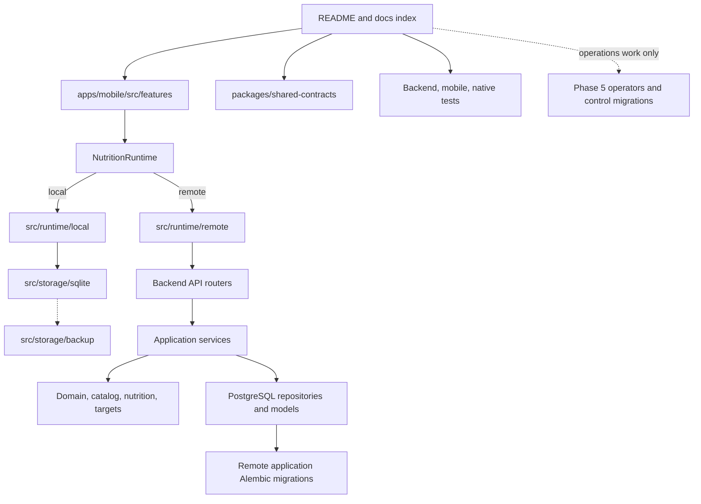

# Repository tour

> **Document role: Current Guide.**

This is the best first read after time away from the project. It describes the repository in the
order a developer should explore it rather than alphabetically.

## Start here



For a feature change, follow one real user action end to end:

1. Find the screen under `apps/mobile/src/features/<feature>`.
2. Follow its hook/API contract into `NutritionRuntime`.
3. Determine the selected implementation path: `src/runtime/local` + SQLite or
   `src/runtime/remote` + FastAPI.
4. For local behavior, follow the local runtime/use-case code into `src/storage/sqlite` only when
   persistence matters.
5. For remote behavior, follow the router into its service/domain/repository as needed.
6. Find the matching mobile tests plus local or remote qualification before changing the contract.

Do not assume a mobile feature call crosses HTTP. Local mode is the normal application-data path.

## Top-level map

### `apps/mobile`

The iOS-first Expo/React Native client and primary local-first application runtime.

```text
src/app/                  Navigation, providers, settings, theme
src/features/             Foods, Recipes, Logging, History, USDA, OCR, Targets, Calendar-facing UI
src/runtime/              NutritionRuntime plus local and remote authority adapters
src/storage/sqlite/       Local semantic schema, schema-version migrations, SQLite foundation
src/storage/backup/       Validated local backup/export, staged restore, activation/rollback
src/shared/nutrition/     Canonical nutrient presentation, qualified units, DRI/reference helpers
src/shared/navigation/    Dirty/busy draft-exit policy
src/shared/components/    Shared route/root chrome
src/shared/accessibility/ Focus, status, accessible interaction primitives
src/native/camera/        Nutrition-camera device/lens helpers
src/native/ocr/           TypeScript boundary to native OCR and image-quality inspection
modules/nutrition-ocr/    Swift Apple Vision Expo module and native tests
__tests__/                Jest unit, runtime, component, backup, and flow tests
config/                   Runtime/deployment configuration validation
```

Start with a feature's screen/component, then its hooks/API/utilities. Follow the feature call
through `NutritionRuntime` before choosing an implementation path. Base URL and authentication
policy belong only to remote transport.

Two local boundaries intentionally sit outside ordinary feature calls. Local backup restore runs at
startup before the SQLite authority opens because it may replace the database. Native camera/OCR
acquisition produces input for the selected OCR runtime but does not itself become application-data
authority.

### `apps/backend`

The preserved FastAPI/PostgreSQL remote authority and PostgreSQL reference implementation. It is
authoritative when mobile authority is `remote`; local application-data operations do not require
this process.

```text
app/api/v1/routers/       HTTP translation and response status mapping
app/services/             Transactional use cases and ownership boundaries
app/repositories/         Reusable persistence queries
app/domain/               Domain calculations and validation
app/catalog/              Canonical nutrient identity, hierarchy, units/reference metadata
app/nutrition/            Serving resolution, revision resolution, units, aggregation
app/targets/              DRI data/resolution, FDA reference projection, calorie estimation, comparison
app/models/               SQLAlchemy persistence model
app/schemas/              Public request and response contracts
app/integrations/usda/    FoodData Central HTTP and expanded nutrient mapping
app/ocr/                  Pure parser and confirmation persistence
app/migrations/           Application-database Alembic stream; current head 0033_complete_runtime_authority
app/operators/            Offline conversion, qualification, control-plane clients
app/control_migrations/   Independent control-database Alembic stream
scripts/                  Explicit operator, transfer, and audit entry points
tests/                    Unit, API, PostgreSQL, migration, control, integration tests
```

The backend is not a strict one-class-per-layer framework. Routers are thin, services own use-case
transactions, repositories hold shared queries, and pure domain/reference modules own calculations.
Some small services query SQLAlchemy directly when another repository would not clarify ownership.

### `packages/shared-contracts`

This directory contains retained machine-readable cross-runtime/transfer contracts from completed
Epic 2, Epic 4 History evidence/projection/qualification fixtures, and a small nutrition type
reference. It is not a generated API SDK and is not the source of truth for backend Pydantic
schemas.

Current retained contract areas include `e2-02`, `e2-05`, `e2-07`, `e2-08`, `e2-09`, `e2-15`,
`e4-04`, `e4-05`, and `e4-16`.
The E2-15 directory contains versioned source-schema, target-schema, transfer-contract, and
representative-package artifacts used by PostgreSQL-to-SQLite transfer qualification. Treat these
as bounded regression/compatibility evidence. Do not reinterpret an existing version silently when
a current schema changes.

### `engineering`

Current generated-reference-data inputs/tooling live here rather than in historical docs. The DRI
reference dataset and parity cases under `engineering/reference-data` are source material for the
checked-in backend/mobile DRI representations. `generate_dri_reference.py` owns deterministic
regeneration.

### `docs`

The [Documentation Index](../README.md) separates current project knowledge, architecture, feature
guides, operations, reference material, and historical records. Ordinary implementation begins in
`project/` and the affected feature guide. Version 1.1/Epic 2 planning and closure material remains
under `docs/historical/programs/version-1.1/` as completed evidence, not an active backlog.

### Root Compose and scripts

- `docker-compose.yml` runs the normal local PostgreSQL 16 database.
- `docker-compose.phase5c4.yml` runs disposable MinIO for control-plane qualification.
- `docker-compose.phase5c4-qualification.yml` runs the opt-in disposable local recovery
  qualification topology; it is not an application development stack.
- `scripts/start-backend.sh` starts only the qualified remote runtime process with the
  `nutrition_runtime` database identity. Apply migrations separately as `nutrition_migrator`.
- `scripts/session-start.sh` and `scripts/session-end.sh` report and validate repository state.
- `scripts/zip-project.sh` creates a bounded review archive without local secrets/generated output.

## The persistence map

There are three distinct durable persistence domains plus one local replacement/backup mechanism:

| Authority/domain | Evolution or maintenance mechanism | Contains |
| --- | --- | --- |
| Local application SQLite | `apps/mobile/src/storage/sqlite` schema version + migrations | Local profile/User, Foods/servings/nutrients, Recipes/revisions, Logs/snapshots, OCR traces, Targets/tracking preferences, favorites, idempotency, runtime state |
| Local SQLite backup artifact | `apps/mobile/src/storage/backup` validation/staging/bootstrap replacement | One coherent standalone snapshot of the local application database; no secrets, merge state, or sync ledger |
| Remote application PostgreSQL | `apps/backend/app/migrations` Alembic stream | Preserved remote application data plus PostgreSQL-specific historical conversion/production prerequisites |
| Control PostgreSQL | `apps/backend/app/control_migrations` Alembic stream | Immutable operational evidence, promotion workflow, leases/outbox, admission decisions, typed evidence projections |

Only one **application-data** authority is selected for a running mobile context. Control PostgreSQL
is operations-only. A local backup is not a concurrent authority. Local SQLite is not a cache of
remote PostgreSQL, and PostgreSQL Alembic history is not mechanically replayed into SQLite.

Current PostgreSQL heads are canonical in [Current State](current-state.md): remote application
`0033_complete_runtime_authority` and control `ops_0011_phase5c4_recovery_audit`. The specially
authorized `0021_target_activation_execution` boundary remains part of remote operational history;
it is not the current feature-development head.

### Authority-first rule

Before following any walkthrough, decide whether the change is:

- authority-neutral contract/presentation work;
- local SQLite runtime work;
- remote FastAPI/PostgreSQL work;
- local startup/backup maintenance work; or
- parity work that must preserve both application authorities.

That decision determines which implementation and tests are authoritative.

## Find your change

### If you're working on Foods

Read [Foods and Nutrition Domain](../features/foods-and-nutrition.md). Start at
`apps/mobile/src/features/foods`; then follow `NutritionRuntime.foods` into local Foods runtime or
the remote Food router/service. Canonical nutrient identity begins at `app/catalog/nutrients.py`;
serving/unit semantics begin in `app/nutrition` and the Food schemas. Check Recipes whenever a
serving generation or Food nutrition changes.

### If you're working on Recipes or Daily Logs

Read [Recipes and Nutrition History](../features/recipes-and-logging.md). Recipe behavior begins in
`apps/mobile/src/features/recipes` and `app/services/recipe_service.py`; Log behavior begins in
`apps/mobile/src/features/logging` and `app/services/log_service.py`. Read publication/revision
resolution before changing historical behavior. Complete mutation/recovery adds
`app/services/log_day_completion_service.py` and local `localDailyLogCompleteState.ts`; bounded
History evidence flows through the Logs service/local runtime into `apps/mobile/src/features/history`,
whose projection is shared across authorities. For navigation changes, also read the shared draft
guard and route-header components.

### If you're working on Targets and DRI/FDA references

Read [Targets and comparisons](../features/foods-and-nutrition.md#targets-and-comparisons). Start at
`NutritionRuntime.targets`, local `localTargetsRuntime.ts`, remote `target_service.py`, and
`app/targets`. Reference-data work also involves `app/catalog/nutrients.py`, mobile
`src/shared/nutrition`, and `engineering/reference-data`. Keep DRI scope separate from the narrower
calorie-estimation scope.

### If you're working on OCR

Read [OCR, Search, Offline Behavior, and Local Backup](../features/ocr-search-and-offline.md). Start
at `NutritionScanScreen.tsx` for the user flow, `NutritionCameraCapture.tsx`/`src/native/camera` for
guided acquisition, `modules/nutrition-ocr` for Apple Vision and image-quality metrics,
`app/ocr/parser.py` for remote deterministic parsing, or confirmation services/runtimes for
persistence.

### If you're working on local backup or restore

Start at `src/storage/backup`, then Settings and the application-runtime bootstrap. Restore is
validated replacement before the local authority opens. It is not an ordinary feature mutation and
must not be converted into a merge/synchronization flow implicitly.

### If you're working on Search

Start with [Unified Food search](../features/ocr-search-and-offline.md#unified-food-search), then
follow the Saved Foods screen, unified-search/debounce utilities, Food query hook, and USDA query
hook. Search is a client composition of two sources, not a standalone backend subsystem.

### If you're working on Epic 2 transfer or parity fixtures

Epic 2 is complete. Begin with the current [PostgreSQL-to-SQLite Transfer](../operations/postgresql-to-sqlite-transfer.md) guide and the `packages/shared-contracts/e2-15` artifacts. Use the [historical E2-15 architecture record](../historical/programs/version-1.1/epic-2/e2-15-transfer-architecture.md) only for the original acceptance and design provenance. Do not reopen completed Epic 2 planning merely because a current compatibility fixture needs a new version.

### If you're working on Phase 5

Begin with the optional [Control Plane Guide](../operations/control-plane.md) and identify the exact
stage before opening implementation files. Historical conversion lives in `app/operators`; remote
application prerequisites live in the applicable migration/role modules; independent authority
lives in `app/control_migrations` and `phase5c4_*` operator modules.

Feature developers generally do not need this path. Phase 5 is production operations engineering
around the preserved remote authority, not a prerequisite for ordinary local-first feature work.

## Typical Change Walkthroughs

These stable walkthrough anchors are retained because other project documentation can link directly
to them. The detailed implementation checklist lives in the [Development Guide](development-guide.md).

### Adding a new Food property

Start with the canonical/domain meaning, then remote model/schema/service only if the remote
contract changes, and the owning local runtime/mobile representation if local behavior changes.
Include nutrient catalog/qualified-unit and serving-reference semantics when applicable. Preserve
unknown-versus-zero, owner scope, idempotency, and immutable historical snapshots.

### Extending Recipe publication

Begin at Recipe service/publication and determine whether mutable authoring, immutable revision
content, amount definitions, projection state, or nested dependency behavior changes. Preserve
insert-only revision history and exact revision/amount authority.

### Modifying OCR processing

Identify the boundary first: guided acquisition, native recognition/image-quality inspection,
TypeScript normalization, parser, or confirmation persistence. Preserve bounded provenance and the
best-effort nature of image-quality inspection.

### Adding a Daily Log feature

Start at Log service/local Log runtime and snapshot/revision resolution. Preserve totals derived
from snapshots, exact Recipe revision/amount bindings, owner scope, atomic mutation, and explicit
confirmed-versus-unresolved results. Complete is explicit owner/date state and must be invalidated
atomically when stored nutrition changes. History stays a bounded Daily Logs read with a shared
projection, current Targets only as a presentation lens, and no local/remote fallback or mixing.

### Extending USDA import

Separate upstream transport, nutrient/serving mapping, preview, and persistent import. Preserve
request-time credential boundaries, explicit import, expanded canonical nutrient mapping,
per-100g normalization, source identity, and owner scope.

### Adding a repository method

Start from the owning remote service and add a repository method only when query reuse,
lock-sensitive behavior, or persistence clarity earns the abstraction. Repositories do not replace
service-owned transaction/ownership authority.

### Adding a backend endpoint

Define the use case/schema, keep the router thin, delegate to the owning service, and preserve
central authentication, ownership, stable errors, transaction boundaries, and payload-bound replay
where applicable.

### Adding a mobile screen

Start in the owning feature, determine its `NutritionRuntime` capability, and reuse shared route
headers, draft guards, accessibility/status primitives, and central remote transport where
appropriate. Never imply a mutation succeeded before the selected authority confirms it.

### Changing local SQLite persistence

Local SQLite is the implemented local authority, not a future cache. Start with the owning local
runtime plus `src/storage/sqlite`; include `src/storage/backup` when schema/lifecycle changes can
affect exported or restored databases. Preserve one selected authority, exact values, immutable
history, idempotency, rollback, and native qualification for lifecycle claims.

Any future synchronization or multi-device merge remains a new architecture decision; local SQLite
and local backup are already implemented without those semantics.

## Cross-cutting mobile UI paths

Recent UI work deliberately centralizes repeated navigation/accessibility behavior:

| Concern | Start here |
| --- | --- |
| Fixed/sticky detail and authoring headers | `src/shared/components/RouteScreenHeader.tsx` |
| Dirty/busy draft-exit policy | `src/shared/navigation/draftGuard.ts`, `UnsavedDraftDialog.tsx` |
| Focus restoration/status announcements | `src/shared/accessibility`, `src/shared/forms` |
| Root tabs/settings routing | `src/app/navigation` |
| Dynamic Type behavior of fixed chrome | shared header/navigation tests and `fixedChromeDynamicType.test.ts` |

Keep these helpers as presentation/navigation policy. They do not own nutrition or persistence
semantics.

## Testing map

- Backend unit/API/reference behavior: `apps/backend/tests`.
- Real remote PostgreSQL concurrency/migration/role claims: `*_postgres.py` and marked PostgreSQL
  suites.
- Mobile behavior/local parity/UI: `apps/mobile/__tests__`.
- Native Apple Vision/image-quality behavior: `apps/mobile/modules/nutrition-ocr/ios-tests`.
- Native/file-backed local SQLite lifecycle claims: the documented Expo/native SQLite qualification
  harnesses.
- Transfer contract parity: backend/mobile E2-15 tests plus `packages/shared-contracts/e2-15`.
- Epic 4 Complete/History release parity: `scripts/run-e4-16-qualification.sh` plus E4-16 shared,
  backend/PostgreSQL, and mobile evidence.
- Control/WORM/production hardening: Phase 5C4 PostgreSQL/MinIO/qualification suites.

Use the [Testing Guide](../operations/testing.md) to choose the minimum proof for a change.

## What to ignore

When working on ordinary local-first features, initially ignore:

- `app/operators/phase5c*`;
- `app/control_migrations/`;
- `scripts/*phase5c*`;
- `docs/historical/`;
- production qualification Compose profiles.

Return to them when a change actually touches remote migration/role topology, historical
conversion, control evidence, promotion admission, or recovery qualification. Completed
Version 1.1/Epic 2 planning is likewise not ordinary implementation context unless a retained
compatibility contract explicitly points there.

## Next reading

- Use the [Development Guide](development-guide.md) for a bounded modification checklist.
- Use [Current State](current-state.md) for active heads and current limitations.
- Use [Project Invariants](invariants.md) for the reasoning behind these boundaries.
- Use the relevant feature guide before changing user-visible semantics.
- Open versioned/historical records only for provenance or a compatibility boundary they explicitly own.

## See also

- [Architecture Decision Index](../architecture/decisions.md) for a quick rationale refresher
- [Glossary](../reference/glossary.md) for project-specific terminology
- [Documentation index](../README.md) for role-based reading paths
- [Control Plane Guide](../operations/control-plane.md) for Phase 5 work only
