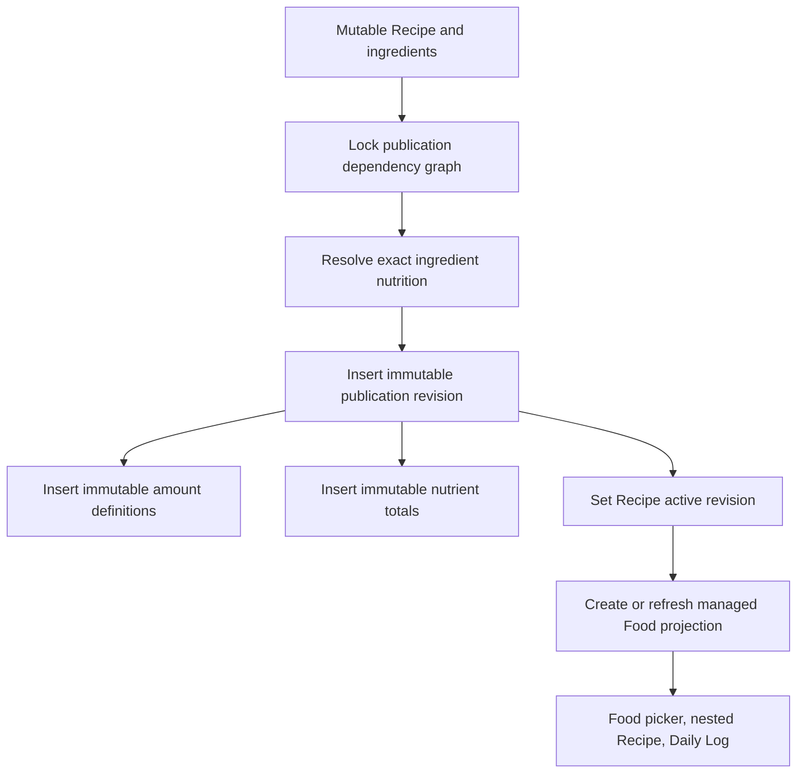
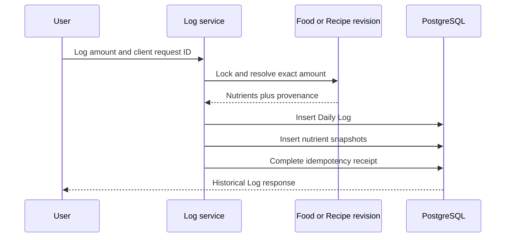

# Recipes and nutrition history

Recipes connect mutable authoring with immutable use. An author can keep editing a Recipe, while a
published revision preserves exactly what was available when someone logged it. Daily Logs then
snapshot resolved nutrient amounts so later Food or Recipe changes cannot rewrite history.

## Authored Recipes

A Recipe is a mutable user-owned definition containing:

- name and notes;
- serving-count yield and/or final cooked-weight yield;
- ordered ingredients;
- publication state and `needs_republish` status.

An ingredient points to a Food. A published child Recipe appears as a managed Food projection, so
the same ingredient representation supports nested Recipes without storing a second graph model.
Ingredient amounts are either exact serving references or explicit mass quantities.

### Graph safety

Recipe graphs must remain owner-local, active, and acyclic. Mutations that add or replace graph
edges use this database lock order:

1. the owning user row;
2. referenced Food rows in UUID order;
3. the Recipe being changed;
4. current graph traversal and cycle validation;
5. ingredient replacement.

The user-row lock serializes graph changes for one owner while allowing different owners to proceed
independently. PostgreSQL tests prove this behavior under real concurrency.

## Publication

Publication converts the current authored graph into immutable loggable state.

Each publication revision records canonical Recipe content, revision number, yields, totals,
ingredient snapshot, content digest, and ownership. Amount definitions describe the supported
ways to consume that revision—for example a serving or a gram amount. Publication nutrient rows
contain the calculated revision totals.

Previously published revisions are never updated. Publishing again inserts another revision and
moves only the Recipe's active-revision pointer and compatibility projection.

### `needs_republish`

Food nutrient or serving changes can make the authored Recipe differ from its active publication.
The service marks affected published Recipes as needing republication. Existing revision data and
historical logs remain unchanged; the author must explicitly publish the new state.

Nested Recipe publication also validates parent amount definitions. If a child projection changes
in a way that cannot be remapped unambiguously, the parent publication fails atomically rather than
silently changing its meaning.

## Recipe compatibility projection

The projection is a Food-shaped view of one exact publication revision. It exists because Foods
already participate in ingredient selection, serving resolution, logging, search, and ownership.
The projection avoids duplicating those workflows while retaining revision identity.

The projection is managed state:

- generic Food editing is not its authority;
- it must point to the same owner's immutable revision;
- publication refreshes it to the new active revision;
- retention audits detect orphaned or inconsistent projections.

## Daily Log creation

### Logging a mutable Food

The service locks the Food, reloads its current serving and nutrient children, resolves the consumed
amount, and writes nutrient snapshots in the same transaction. This prevents a snapshot from
combining children from different committed Food generations.

### Logging a published Recipe

The service locks and resolves the immutable publication revision and an exact amount definition.
The Daily Log stores both IDs. It does not recalculate against the currently authored Recipe or the
latest active revision.

### Snapshot contents

Each nutrient snapshot stores the resolved amount, unit, data status, consumed quantity/mass, and
bounded calculation provenance. Foreign keys to replaceable nutrient or serving child rows may
become null, but the resolved amount remains. The Food link is retained because Foods are soft
deleted.

## Editing and deleting Logs

Editing a Log is a new historical observation of the edited amount, not retroactive reaction to a
Food edit. The service deletes and rebuilds only that Log's snapshots in the same transaction:

- a mutable-Food Log uses the current Food definition at edit time;
- a Recipe Log remains revision-aware and resolves against an allowed immutable amount definition;
- a Log whose mutable source Food is deleted may be non-editable, but its historical snapshots
  remain readable.

Deleting a Log removes that Log and its snapshots. It can affect recents because recents derive from
actual log history; it does not delete the source Food or Recipe revision.

## Daily summaries

Daily summaries aggregate `daily_log_nutrient_snapshots` only. They never join current
`food_nutrients` to recalculate the past. Per nutrient, the response reports:

- known amount;
- estimated amount;
- display unit;
- whether unknown contributors exist;
- unknown-contributor count.

Target comparison consumes this same summary, which keeps target/profile changes outside the
historical record.

## Deletion and retention

Foods and Recipes are soft deleted where historical or dependency references require identity.
Deletion services lock and inspect active dependencies. Removing edges cannot create a graph cycle,
but adding or remapping edges follows the stricter graph-lock protocol.

Publication revisions and their amount/nutrient children are retained as immutable history.
`scripts/audit_recipe_retention.py` classifies retained revisions, projections, and references
without making repair decisions.

## Where to look

| Concern | Primary code | Tests |
| --- | --- | --- |
| Recipe authoring and graphs | `app/services/recipe_service.py`, `app/domain/recipe_*` | `test_stage4_recipes.py`, `test_recipe_nested_publication.py` |
| Publication snapshots | `app/publication/recipe_revision.py`, publication repository/models | `test_recipe_publication_*`, `test_recipe_revision_publication.py` |
| Projection integrity | `app/domain/recipe_projection.py`, Food/Recipe services | `test_recipe_projection_ownership.py`, `test_food_recipe_serving_integrity.py` |
| Logging and editing | `app/services/log_service.py`, `app/nutrition/revision_resolution.py` | `test_stage2_logs.py`, `test_recipe_revision_logging.py`, `test_recipe_revision_log_editing.py` |
| Mobile Recipe flow | `apps/mobile/src/features/recipes` | `recipe*.test.ts`, `ingredientPicker.test.ts` |
| Mobile Log flow | `apps/mobile/src/features/logging` | `log*.test.ts`, logging integration tests |

## Next reading

- Return to [Foods and Nutrition](foods-and-nutrition.md) for serving resolution and mutable Food
  behavior.
- Read [Why This Exists](why-this-exists.md#why-immutable-recipe-revisions) for the historical
  rationale behind revision-backed logging.
- Use the [Development Guide](development-guide.md#if-you-need-to-modify-recipes) before changing
  Recipe graphs, publication, or Log snapshots.

## See also

- [Architecture Decision Index](architecture-decisions.md) for revision and projection decisions
- [OCR, Search, and Offline Behavior](ocr-search-and-offline.md) for another immutable provenance flow
- [Testing Guide](testing.md) for publication, logging, and PostgreSQL concurrency coverage
