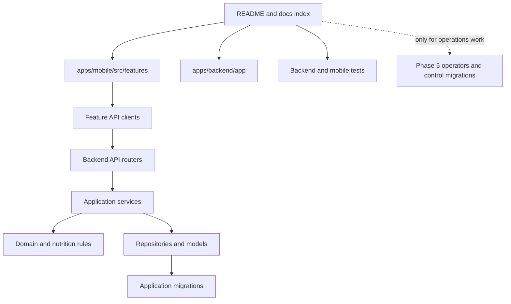

# Repository tour

This is the best first read after several months away. It describes the repository in the order a
developer should explore it, rather than alphabetically.

## Start here



For a feature change, follow one real user action end to end:

1. Find the screen under `apps/mobile/src/features/<feature>/screens`.
2. Follow its hook into `api/` and then the corresponding FastAPI router.
3. Follow the router into its service.
4. Read the domain or nutrition utility called by that service.
5. Inspect the repository and model only when persistence behavior matters.
6. Find the matching backend and mobile tests before changing the contract.

## Top-level map

### `apps/mobile`

The iOS-first Expo/React Native client. Feature code is grouped by user capability rather than by
technical layer across the whole app.

```text
src/app/                  Navigation, providers, settings, and theme
src/features/             Foods, Recipes, Logging, USDA, OCR, and Targets
src/shared/               API transport, forms, idempotency, and display utilities
src/native/ocr/           TypeScript boundary to the native OCR module
modules/nutrition-ocr/    Swift Apple Vision Expo module and native tests
__tests__/                Jest unit, component-model, and flow tests
config/                   Runtime configuration validation
```

Start with a feature's `screens/`, then `hooks/`, `api/`, and `utils/`. The shared API client is the
only place that should apply base URL and authentication policy.

### `apps/backend`

The FastAPI application and all authoritative domain behavior.

```text
app/api/v1/routers/       HTTP translation and response status mapping
app/services/             Transactional use cases and ownership boundaries
app/repositories/         Reusable persistence queries
app/domain/               Domain calculations and validation
app/nutrition/            Serving resolution, revision resolution, units, aggregation
app/models/               SQLAlchemy persistence model
app/schemas/              Public request and response contracts
app/integrations/usda/    FoodData Central HTTP and mapping boundary
app/ocr/                  Pure parser and confirmation persistence
app/migrations/           Application-database Alembic stream
app/operators/            Offline conversion, qualification, and control-plane clients
app/control_migrations/   Independent control-database Alembic stream
scripts/                  Explicit operator and audit entry points
tests/                    Unit, API, PostgreSQL, migration, control, and integration tests
```

The backend is not a strict one-class-per-layer framework. Routers are thin, services own use-case
transactions, repositories hold shared queries, and pure domain modules own calculations. Some
small services query SQLAlchemy directly when a separate repository would not clarify ownership.

### `packages/shared-contracts`

This currently holds a small TypeScript nutrition type reference. It is not a generated API SDK and
is not the source of truth for backend Pydantic schemas. Check actual imports before assuming a type
here is wired into either application.

### `docs`

Reader guides live beside design records. Use [the index](README.md) to distinguish them. Files
named `production-hardening-*` and `stage*` preserve detailed decisions and qualification history;
they are not the shortest path to understanding ordinary feature code.

### Root Compose and scripts

- `docker-compose.yml` runs the normal local PostgreSQL 16 database.
- `docker-compose.phase5c4.yml` runs disposable MinIO for control-plane qualification.
- `scripts/start-backend.sh` is a development convenience command, not a production deployment
  mechanism.

## The persistence map

There are two independent database domains:

| Database | Migration stream | Contains |
| --- | --- | --- |
| Application PostgreSQL | `apps/backend/app/migrations` | Users, Foods, Recipes, revisions, Logs, OCR traces, Targets, historical conversion metadata, and local write-fence prerequisites |
| Control PostgreSQL | `apps/backend/app/control_migrations` | Immutable operational evidence, promotion workflow, leases/outbox, admission decisions, and typed evidence projections |

Most developers use only the application database. Never run the control migration stream against
the application database or infer that a control-table model belongs in the user-facing API.

## Find your change

### If you're working on Foods

Read [Foods and Nutrition Domain](foods-and-nutrition.md), then start at
`apps/mobile/src/features/foods` or `apps/backend/app/api/v1/routers/foods.py`. Follow the backend
route into `food_service.py`, serving/nutrition utilities, repositories, and Food tests.

### If you're working on Recipes or Daily Logs

Read [Recipes and Nutrition History](recipes-and-logging.md). Recipe behavior begins in
`apps/mobile/src/features/recipes` and `app/services/recipe_service.py`; Log behavior begins in
`apps/mobile/src/features/logging` and `app/services/log_service.py`. Read publication and revision
resolution code before changing historical behavior.

### If you're working on OCR

Read [OCR, Search, and Offline Behavior](ocr-search-and-offline.md). Start at
`NutritionScanScreen.tsx` for the user flow, `modules/nutrition-ocr` for Apple Vision,
`app/ocr/parser.py` for deterministic parsing, or `confirmation_service.py` for persistence.

### If you're working on Search

Start with [Unified Food search](ocr-search-and-offline.md#unified-food-search), then follow
`SavedFoodsScreen.tsx`, `unifiedFoodSearch.ts`, the Food query hook, and the USDA query hook. Search
is a client composition of two sources, not a standalone backend subsystem.

### If you're working on Phase 5

Begin with the optional [Control Plane Guide](control-plane.md) and identify the exact stage before
opening implementation files. Historical conversion lives in `app/operators/historical_*`;
application prerequisites live in migration 0018 and role modules; independent authority lives in
`app/control_migrations` and `phase5c4_*` operator modules.

Feature developers generally do not need this path. Phase 5 is substantial production operations
engineering around the primary Nutrition App, not a prerequisite for changing its feature domains.

## Typical Change Walkthroughs

These are navigation maps, not implementation recipes. Each starts at the layer that owns the
decision and then identifies the contracts and proofs that normally move with it.

### Adding a new Food property

- **Begin:** Decide whether the property is authoritative Food data, source provenance, or derived
  display state. Start with `app/models/food.py`, `app/schemas/food.py`, and
  `app/services/food_service.py`; follow the value into the Food API and mobile Food types only if
  it crosses those boundaries.
- **Architecture and reading:** Read [Foods and Nutrition](foods-and-nutrition.md),
  [backend layers](architecture.md#backend-layers), and the
  [Food change guide](development-guide.md#if-you-need-to-modify-foods-or-servings).
- **Typical directories:** `apps/backend/app/models`, `schemas`, `services`, `repositories`, and
  possibly `migrations`; `apps/mobile/src/features/foods` and `src/shared/nutrition` when visible.
- **Expected tests:** Food API/service tests, nutrition and serving-resolution tests, ownership and
  idempotency tests, plus affected mobile form, display, and API-mapping tests.
- **Preserve:** Unknown-versus-zero semantics, source identity, owner scope, create replay, and the
  rule that a source Food edit does not rewrite existing Log snapshots or publication revisions.
- **Decisions:** [Unknown nutrients](architecture-decisions.md#unknown-nutrients-are-not-zero),
  [serving identities](architecture-decisions.md#explicit-serving-identities-and-gram-weights), and
  [ownership](architecture-decisions.md#ownership-is-enforced-at-multiple-layers).

### Extending Recipe publication

- **Begin:** Start with `app/services/recipe_service.py`, then the publication domain module and
  `recipe_publication_repository.py`. Establish whether the change affects mutable authoring,
  immutable captured content, the active-revision pointer, or the compatibility projection.
- **Architecture and reading:** Read [Publication](recipes-and-logging.md#publication), the
  [Recipe change guide](development-guide.md#if-you-need-to-modify-recipes), and transaction
  boundaries in the [Architecture Guide](architecture.md#persistence-and-transaction-boundaries).
- **Typical directories:** `app/services`, `app/publication`, `app/domain`, `app/repositories`,
  `app/models`, `app/schemas`, and `apps/mobile/src/features/recipes`.
- **Expected tests:** Publication persistence, immutable revision capture, nested publication,
  projection ownership, revision logging/editing, idempotency, and Recipe mobile contract tests.
- **Preserve:** One transactional publication, insert-only revision history, exact ingredient and
  amount identity, same-owner graphs, and `needs_republish` until a successful new publication.
- **Decisions:** [Immutable Recipe revisions](architecture-decisions.md#immutable-recipe-revisions),
  [compatibility projections](architecture-decisions.md#recipe-food-compatibility-projections), and
  [revision-backed logging](architecture-decisions.md#revision-backed-nutrition-logging).

### Modifying OCR processing

- **Begin:** Identify the boundary: Apple Vision recognition, TypeScript normalization, the pure
  backend parser, or confirmation persistence. Start at that boundary instead of changing the
  confirmed Food model first.
- **Architecture and reading:** Follow the [OCR flow](ocr-search-and-offline.md#nutrition-label-ocr-flow)
  and the [OCR change guide](development-guide.md#if-you-need-to-modify-ocr).
- **Typical directories:** `apps/mobile/modules/nutrition-ocr`, `src/native/ocr`,
  `src/features/ocr`, `apps/backend/app/ocr`, and the OCR router.
- **Expected tests:** Native fixture tests, TypeScript OCR/confirmation tests, parser unit and golden
  fixtures, parser API tests, confirmation idempotency/ownership tests, and trace retention tests.
- **Preserve:** On-device image handling, bounded structured provenance, stable observation IDs,
  explicit confirmation, and the rule that provenance never becomes nutrition resolver input.
- **Decisions:** [Bounded OCR correction provenance](architecture-decisions.md#bounded-ocr-correction-provenance).

### Adding a Daily Log feature

- **Begin:** Start with `app/services/log_service.py` and `app/repositories/log_repository.py`, then
  trace revision or mutable-Food resolution before opening the mobile screen.
- **Architecture and reading:** Read [Daily Log creation](recipes-and-logging.md#daily-log-creation)
  and the [Daily Log change guide](development-guide.md#if-you-need-to-modify-daily-logs).
- **Typical directories:** Backend `services`, `repositories`, `nutrition`, `models`, and `schemas`;
  mobile `src/features/logging`.
- **Expected tests:** Log API/idempotency tests, aggregation, mutable-Food and Recipe-revision
  resolution, PostgreSQL concurrency, Log editing, and mobile validation/retry/display tests.
- **Preserve:** Totals derived only from snapshots, exact Recipe revision and amount bindings,
  owner scope, deterministic locks, and atomic replacement of snapshots during an explicit edit.
- **Decisions:** [Immutable Daily Log nutrition](architecture-decisions.md#immutable-daily-log-nutrition)
  and [revision-backed logging](architecture-decisions.md#revision-backed-nutrition-logging).

### Extending USDA import

- **Begin:** Separate upstream transport, response mapping, preview, and persistent import. Start at
  `app/services/usda_service.py` and then open only the integration or mobile layer being changed.
- **Architecture and reading:** Read [USDA FoodData Central](foods-and-nutrition.md#usda-fooddata-central)
  and the [USDA change guide](development-guide.md#if-you-need-to-modify-usda).
- **Typical directories:** `app/integrations/usda`, the USDA router/service, Food persistence, and
  `apps/mobile/src/features/usda` plus saved-Food discovery when presentation changes.
- **Expected tests:** Client error/timeout tests, mapper fixtures, API authentication, import and
  source-deduplication tests, and mobile search/preview/import tests.
- **Preserve:** Backend-only API credentials, explicit import, per-100g normalization,
  unknown-versus-zero, valid measured gram weights, source identity, and owner scope.
- **Decisions:** [Saved and USDA Foods remain distinct](architecture-decisions.md#saved-foods-and-usda-foods-remain-distinct)
  and [search is composed](architecture-decisions.md#search-is-composed-not-centralized).

### Adding a repository method

- **Begin:** Start from the owning service and prove that the query is reused, lock-sensitive, or
  clearer as a persistence contract. Add it to the existing domain repository; do not create a
  repository or provider layer solely to mirror a table.
- **Architecture and reading:** Read [Repositories and models](architecture.md#repositories-and-models)
  and the [service-first decision](architecture-decisions.md#service-first-selective-repository-abstraction).
- **Typical directories:** `apps/backend/app/repositories`, the owning service, models, and focused
  backend tests. A schema migration is involved only when persistence itself changes.
- **Expected tests:** Repository/service behavior and API regression; use PostgreSQL concurrency or
  constraint tests when the method depends on row locks, isolation, or database error identity.
- **Preserve:** Service-owned transaction boundaries, owner-scoped predicates, deterministic lock
  ordering, explicit flush/commit ownership, and narrow integrity-error recovery.
- **Decisions:** [Service-first, selective repository abstraction](architecture-decisions.md#service-first-selective-repository-abstraction).

### Adding a backend endpoint

- **Begin:** Define the use case and public schema, then add a thin router that delegates to the
  owning service. Reuse the central identity and database dependencies.
- **Architecture and reading:** Read [API organization](architecture.md#api-organization), the
  relevant domain guide, and [Development Guide](development-guide.md).
- **Typical directories:** `app/api/v1/routers`, `app/schemas`, `app/services`, and only the domain,
  repository, or model modules needed by the use case.
- **Expected tests:** Request/response and error mapping, ownership, authentication, transaction
  rollback, idempotency for retryable creates, and domain-specific service tests.
- **Preserve:** No business authority in the router, no caller-selected owner, stable public error
  semantics, one service-owned transaction, and payload-bound replay where applicable.
- **Decisions:** [Ownership](architecture-decisions.md#ownership-is-enforced-at-multiple-layers),
  [payload-bound idempotency](architecture-decisions.md#payload-bound-create-idempotency), and
  [service-first structure](architecture-decisions.md#service-first-selective-repository-abstraction).

### Adding a mobile screen

- **Begin:** Start in the owning feature's `screens` directory, then identify the hook/API contract
  and whether navigation belongs in `src/app/navigation`.
- **Architecture and reading:** Read [Mobile layers](architecture.md#mobile-layers), the relevant
  domain guide, and [configuration and startup](development-guide.md#configuration-and-startup).
- **Typical directories:** `apps/mobile/src/features/<feature>`, `src/app/navigation`, and shared
  components only for behavior genuinely reused across features.
- **Expected tests:** Screen/model state, validation, API mapping, loading/error/retry behavior,
  navigation handoff, accessibility-sensitive layout, and affected integration flows.
- **Preserve:** The central API/authentication client, explicit server authority, safe retry IDs,
  stale-response suppression, and no implied success before the backend commits.
- **Decisions:** [Online-first mobile architecture](architecture-decisions.md#online-first-mobile-architecture)
  and [fail-closed configuration](architecture-decisions.md#fail-closed-deployment-configuration).

### Adding offline persistence

- **Begin:** Treat this as an architecture change, not a storage-library task. Start with the
  [offline boundary](ocr-search-and-offline.md#offline-and-caching-behavior) and enumerate which
  reads, mutations, conflicts, identities, and historical records would be synchronized.
- **Architecture and reading:** Read [Why an online-first design?](why-this-exists.md#why-an-online-first-design),
  transaction boundaries, ownership, idempotency, and revision-backed history before proposing a
  local schema or queue.
- **Typical directories:** A future design would cross feature hooks, the shared API/idempotency
  client, runtime configuration, and backend replay contracts. There is currently no native SQLite
  persistence layer or Repository Provider/Factory to extend.
- **Expected tests:** Restart persistence, queue replay, payload conflicts, ordering, identity
  changes, schema migration, partial synchronization, deletion, stale revision, and network
  failure injection across backend and mobile.
- **Preserve:** PostgreSQL remains authoritative; a queued mutation is not displayed as committed;
  immutable snapshots/revisions and owner boundaries survive replay; conflicts are explicit.
- **Decisions:** [Online-first mobile architecture](architecture-decisions.md#online-first-mobile-architecture).
  A durable offline mutation system requires a new bounded ADR because it changes this accepted
  decision.

## What to ignore

When working on ordinary features, you can initially ignore:

- `app/operators/phase5c*`
- `app/control_migrations/`
- `scripts/*phase5c*`
- `docs/production-hardening-*`
- `docker-compose.phase5c4.yml`

Return to them if a change touches application migration 0018, database role topology, canary
startup, historical conversion, immutable evidence, or promotion admission.

The root `src/Main.java`, `.idea/`, `.DS_Store` files, build output, caches, virtual environments,
and `node_modules/` are not architectural components.

## Next reading

- Continue with [Why This Exists](why-this-exists.md) for the reasoning behind these boundaries.
- Then read the [Architecture Guide](architecture.md) for layer responsibilities.
- Choose [Foods and Nutrition](foods-and-nutrition.md),
  [Recipes and Nutrition History](recipes-and-logging.md), or
  [OCR, Search, and Offline Behavior](ocr-search-and-offline.md) for feature work.
- Use the [Development Guide](development-guide.md) once you know the affected domain.

## See also

- [Architecture Decision Index](architecture-decisions.md) for a quick rationale refresher
- [Glossary](reference/glossary.md) for project-specific terminology
- [Documentation index](README.md) for role-based reading paths
- [Control Plane Guide](control-plane.md) for Phase 5 work only
