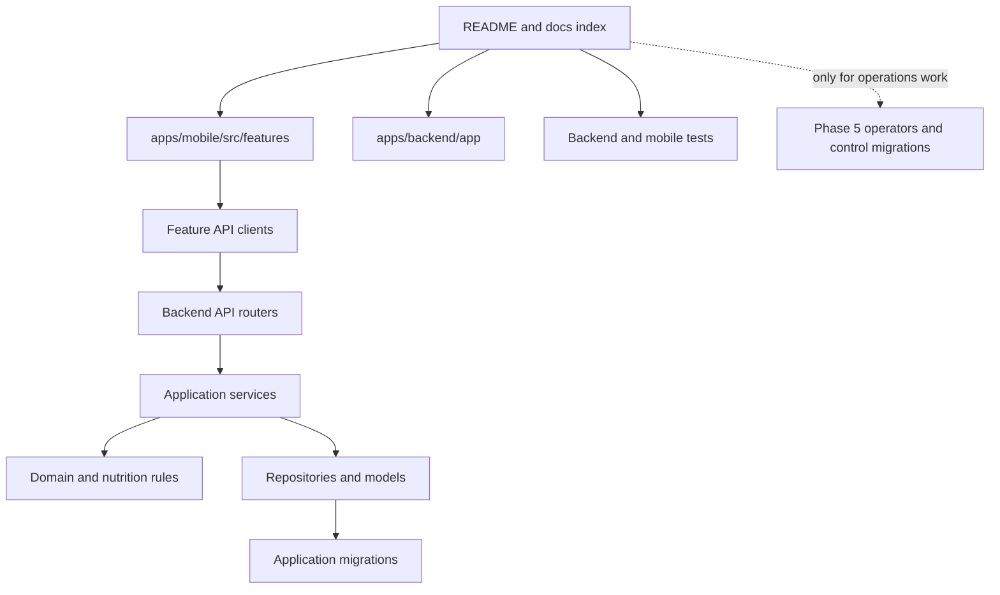

# Repository tour

This is the best first read after several months away. It describes the repository in the order a
developer should explore it, rather than alphabetically.

## Start here



For a feature change, follow one real user action end to end:

1. Find the screen under `apps/mobile/src/features/<feature>/screens`.
2. Follow its hook into `api/` and then the corresponding FastAPI router.
3. Follow the router into its service.
4. Read the domain or nutrition utility called by that service.
5. Inspect the repository and model only when persistence behavior matters.
6. Find the matching backend and mobile tests before changing the contract.

## Top-level map

### `apps/mobile`

The iOS-first Expo/React Native client. Feature code is grouped by user capability rather than by
technical layer across the whole app.

```text
src/app/                  Navigation, providers, settings, and theme
src/features/             Foods, Recipes, Logging, USDA, OCR, and Targets
src/shared/               API transport, forms, idempotency, and display utilities
src/native/ocr/           TypeScript boundary to the native OCR module
modules/nutrition-ocr/    Swift Apple Vision Expo module and native tests
__tests__/                Jest unit, component-model, and flow tests
config/                   Runtime configuration validation
```

Start with a feature's `screens/`, then `hooks/`, `api/`, and `utils/`. The shared API client is the
only place that should apply base URL and authentication policy.

### `apps/backend`

The FastAPI application and all authoritative domain behavior.

```text
app/api/v1/routers/       HTTP translation and response status mapping
app/services/             Transactional use cases and ownership boundaries
app/repositories/         Reusable persistence queries
app/domain/               Domain calculations and validation
app/nutrition/            Serving resolution, revision resolution, units, aggregation
app/models/               SQLAlchemy persistence model
app/schemas/              Public request and response contracts
app/integrations/usda/    FoodData Central HTTP and mapping boundary
app/ocr/                  Pure parser and confirmation persistence
app/migrations/           Application-database Alembic stream
app/operators/            Offline conversion, qualification, and control-plane clients
app/control_migrations/   Independent control-database Alembic stream
scripts/                  Explicit operator and audit entry points
tests/                    Unit, API, PostgreSQL, migration, control, and integration tests
```

The backend is not a strict one-class-per-layer framework. Routers are thin, services own use-case
transactions, repositories hold shared queries, and pure domain modules own calculations. Some
small services query SQLAlchemy directly when a separate repository would not clarify ownership.

### `packages/shared-contracts`

This currently holds a small TypeScript nutrition type reference. It is not a generated API SDK and
is not the source of truth for backend Pydantic schemas. Check actual imports before assuming a type
here is wired into either application.

### `docs`

Reader guides live beside design records. Use [the index](README.md) to distinguish them. Files
named `production-hardening-*` and `stage*` preserve detailed decisions and qualification history;
they are not the shortest path to understanding ordinary feature code.

### Root Compose and scripts

- `docker-compose.yml` runs the normal local PostgreSQL 16 database.
- `docker-compose.phase5c4.yml` runs disposable MinIO for control-plane qualification.
- `scripts/start-backend.sh` is a development convenience command, not a production deployment
  mechanism.

## The persistence map

There are two independent database domains:

| Database | Migration stream | Contains |
| --- | --- | --- |
| Application PostgreSQL | `apps/backend/app/migrations` | Users, Foods, Recipes, revisions, Logs, OCR traces, Targets, historical conversion metadata, and local write-fence prerequisites |
| Control PostgreSQL | `apps/backend/app/control_migrations` | Immutable operational evidence, promotion workflow, leases/outbox, admission decisions, and typed evidence projections |

Most developers use only the application database. Never run the control migration stream against
the application database or infer that a control-table model belongs in the user-facing API.

## Find your change

### If you're working on Foods

Read [Foods and Nutrition Domain](foods-and-nutrition.md), then start at
`apps/mobile/src/features/foods` or `apps/backend/app/api/v1/routers/foods.py`. Follow the backend
route into `food_service.py`, serving/nutrition utilities, repositories, and Food tests.

### If you're working on Recipes or Daily Logs

Read [Recipes and Nutrition History](recipes-and-logging.md). Recipe behavior begins in
`apps/mobile/src/features/recipes` and `app/services/recipe_service.py`; Log behavior begins in
`apps/mobile/src/features/logging` and `app/services/log_service.py`. Read publication and revision
resolution code before changing historical behavior.

### If you're working on OCR

Read [OCR, Search, and Offline Behavior](ocr-search-and-offline.md). Start at
`NutritionScanScreen.tsx` for the user flow, `modules/nutrition-ocr` for Apple Vision,
`app/ocr/parser.py` for deterministic parsing, or `confirmation_service.py` for persistence.

### If you're working on Search

Start with [Unified Food search](ocr-search-and-offline.md#unified-food-search), then follow
`SavedFoodsScreen.tsx`, `unifiedFoodSearch.ts`, the Food query hook, and the USDA query hook. Search
is a client composition of two sources, not a standalone backend subsystem.

### If you're working on Phase 5

Begin with the optional [Control Plane Guide](control-plane.md) and identify the exact stage before
opening implementation files. Historical conversion lives in `app/operators/historical_*`;
application prerequisites live in migration 0018 and role modules; independent authority lives in
`app/control_migrations` and `phase5c4_*` operator modules.

Feature developers generally do not need this path. Phase 5 is substantial production operations
engineering around the primary Nutrition App, not a prerequisite for changing its feature domains.

## What to ignore

When working on ordinary features, you can initially ignore:

- `app/operators/phase5c*`
- `app/control_migrations/`
- `scripts/*phase5c*`
- `docs/production-hardening-*`
- `docker-compose.phase5c4.yml`

Return to them if a change touches application migration 0018, database role topology, canary
startup, historical conversion, immutable evidence, or promotion admission.

The root `src/Main.java`, `.idea/`, `.DS_Store` files, build output, caches, virtual environments,
and `node_modules/` are not architectural components.

## Next reading

- Continue with the [Architecture Guide](architecture.md) for layer responsibilities.
- Choose [Foods and Nutrition](foods-and-nutrition.md),
  [Recipes and Nutrition History](recipes-and-logging.md), or
  [OCR, Search, and Offline Behavior](ocr-search-and-offline.md) for feature work.
- Use the [Development Guide](development-guide.md) once you know the affected domain.

## See also

- [Architecture Decision Index](architecture-decisions.md) for a quick rationale refresher
- [Documentation index](README.md) for role-based reading paths
- [Control Plane Guide](control-plane.md) for Phase 5 work only
