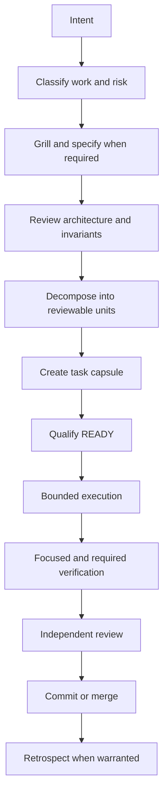

# Task workflow

> **Document role: Engineering Process.** This page owns the end-to-end repository task flow.

The process is proportional. A mechanical documentation task may mark product grilling or
architecture review `Not applicable — <reason>`. New user behavior, persistence, migrations,
concurrency, public contracts, trust boundaries, security, destructive operations, or irreversible
work may not bypass them.

## Gates

1. **Route:** classify task type, risk, authority, controller, executor, reviewer, and required
   qualification using [Routing](ROUTING.md).
2. **Plan:** move ambiguity upstream. Resolve user-visible behavior before implementation.
3. **Decompose:** keep one coherent, independently reviewable outcome per capsule. The controller
   retains shared contracts, migrations, transaction semantics, locking, integration, and final
   validation.
4. **Qualify:** copy the [template](../capsules/TEMPLATE.md), pass the `READY` checklist in
   [States](STATES.md), commit only the qualified capsule overlay, run strict execution preflight,
   and generate the repository-owned handoff with `scripts/render-task-handoff.py`.
5. **Execute:** consume the generated handoff only after it verifies branch, exact base commit, clean
   worktree, blocking state, authority, delegation, and scope. Stop at an escalation condition rather
   than improvising.
6. **Verify:** run focused checks, the affected baseline, and every specialized suite selected by
   risk. An ordinary baseline never implies PostgreSQL, MinIO, Docker, performance, native, or
   manual accessibility qualification.
7. **Review:** compare the capsule, authority, changed code, implementation return, and review
   bundle. Disposition is `approved`, `bounded correction`, or `stop and replan`.
8. **Complete:** after successful integration or cancellation, write or update the task's unique
   terminal record in `engineering/capsules/HISTORY.md` with final evidence and an exact
   full-capsule Git recovery commit/path plus SHA-256; remove the active capsule in the same
   closeout change. Do not move or copy the capsule into a per-task `completed/` archive.

## Exception paths

- **Blocked:** preserve the current state and use the blocking metadata in
  [States](STATES.md).
- **Capsule revision before execution:** return `READY` to `DECOMPOSED`, increment the revision,
  append history, and requalify.
- **Bounded correction:** return `REVIEWED` to `IN_PROGRESS` only when goal, authority, acceptance,
  risk, owned surface, and qualification remain valid.
- **Cancellation:** record reason, authority, and partial-work disposition, then use `CANCELLED`.
- **Emergency:** immediate harm may justify starting early, but authority, scope, and evidence must
  be captured afterward; review is never waived.

## Human decision boundary

Escalate when work would introduce or change product policy, trust/privacy/security/ownership,
data retention or destruction, migration/recovery authority, irreversible behavior, accepted risk,
a material complexity/performance/compatibility tradeoff, conflicting authority, or scope large
enough to invalidate the capsule. Routine choices within accepted policy may be controller-resolved.

## Automation eligibility

Automate only when inputs and outputs have stable schemas; success, failure, and stop conditions are
mechanically detectable; reruns are idempotent or recoverable; the step has been manually
exercised; automation cannot silently decide policy or irreversible actions; evidence is
inspectable; and maintenance cost is lower than repeated manual work. Every automation begins
`EXPERIMENTAL`.
