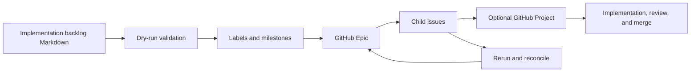

# GitHub backlog issue creator

`create_issues.py` converts a structured Markdown implementation backlog into one GitHub Epic
issue and its child issues. It creates requested labels and source milestones, can place every
issue in a GitHub Project, and maintains generated Epic metadata and a linked checklist.

The utility is repository tooling rather than feature-specific code. It uses only the Python
standard library and delegates GitHub authentication and API access to the GitHub CLI.

## Requirements

- Python 3.9 or newer.
- [GitHub CLI](https://cli.github.com/) installed and available as `gh`.
- Issue write permission in the target repository.
- The GitHub CLI `project` token scope when `--project` is used.

No Python package installation or virtual environment is required.

## Installation

The script is already executable in this repository. Run it with `python3` or directly:

```bash
python3 scripts/github/create_issues.py --help
./scripts/github/create_issues.py --help
```

Install the GitHub CLI with the package manager appropriate to the workstation. Common examples
are:

```bash
# macOS
brew install gh

# Windows
winget install --id GitHub.cli
```

For Debian, Ubuntu, Fedora, and other supported systems, follow the official
[GitHub CLI installation instructions](https://github.com/cli/cli/blob/trunk/docs/install_linux.md)
so the GitHub package-signing and update configuration remains current.

## GitHub CLI authentication

Authenticate interactively:

```bash
gh auth login
```

Confirm the active account and host:

```bash
gh auth status
```

Project management requires an additional token scope:

```bash
gh auth refresh -s project
```

When the repository is on GitHub Enterprise, authenticate against that host and run the utility
from a checkout whose `gh` repository context resolves to the same host. An explicit `--repo`
accepts the usual `OWNER/REPO` form.

## Backlog format

The first level-one heading is the Epic title. Child issues must be grouped beneath level-one
Milestone headings and use stable identifiers in level-two headings:

```markdown
# Example Epic

Labels: epic, planning

# Milestone 1 — Foundation

## EX-01 — Add the first capability

Labels: backend, api

### Purpose

Explain the issue outcome.

### Background

Explain the relevant context.
```

Every child issue must contain these non-empty level-three sections:

- Purpose
- Background
- Acceptance criteria
- Out of scope
- Dependencies
- Backend work
- Frontend work
- API work
- Migration work
- Testing requirements
- Estimated implementation size

Issue identifiers may contain letters, numbers, periods, underscores, and hyphens. The identifier
is part of the GitHub issue title and is the stable child identity across reruns. Content outside a
Milestone after issue definitions, such as ordering or traceability appendices, is not turned into
an issue.

`Labels:` is optional. On an Epic it must appear before the first level-two introduction heading;
on a child issue it must appear before the first level-three issue section. Names are
comma-separated, case-insensitively deduplicated, and removed from the created issue body.

## Labels

Every requested label is reconciled before issue creation:

- an existing label is reused without changing its color or description;
- a missing label is created with a deterministic color;
- labels are applied during creation; and
- reruns add missing requested labels without removing manually applied labels.

Removing a label from the backlog does not remove it from an existing GitHub issue. This additive
behavior protects manually maintained issue metadata.

## Milestones

Each level-one `# Milestone …` heading maps to a GitHub Milestone with the exact same title. The
utility creates missing milestones, reuses open or closed milestones on rerun, and assigns every
child issue to its source milestone. The Epic spans the complete backlog and therefore is not
assigned to a single milestone.

If duplicate GitHub Milestones have the same case-insensitive title, the utility stops rather than
choosing one.

## GitHub Projects

Projects are opt-in:

```bash
python3 scripts/github/create_issues.py docs/project/example-backlog.md \
  --project "Engineering Delivery"
```

The Project is owned by the repository owner. The utility creates it when absent, reuses a unique
matching Project on rerun, and adds the Epic and every child issue. Project membership is checked
before each add, so reruns do not create duplicate items.

A Project created by the utility receives this Status workflow:

```text
Backlog → Ready → In Progress → Review → Done
```

Newly added items start in Backlog when that option is available. A pre-existing Project is never
reconfigured; its fields, options, views, workflows, and other user customization remain intact.
If it already has a Backlog option, the utility may use it for newly added items.

The Project title is stored in the state file. A rerun using that state automatically continues to
manage the same Project even when the flag is omitted. An explicit conflicting `--project`,
duplicate Project titles, or a closed matching Project produces a fail-closed error.

## Validate with a dry run

Always validate the source before creating issues:

```bash
python3 scripts/github/create_issues.py docs/project/example-backlog.md --dry-run
```

Dry-run mode parses and fully validates the backlog, reports labels, milestones, optional Project,
Epic, and child issues, and reads an existing state file when present. It does not invoke `gh`,
contact GitHub, create metadata, or write state.

## Create the issues

From inside the target repository:

```bash
python3 scripts/github/create_issues.py docs/project/example-backlog.md
```

Or identify the target explicitly:

```bash
python3 scripts/github/create_issues.py docs/project/example-backlog.md \
  --repo owner/repository
```

For the complete Project workflow:

```bash
python3 scripts/github/create_issues.py docs/project/example-backlog.md \
  --repo owner/repository \
  --project "Engineering Delivery" \
  --state-file .local/github/example-backlog-state.json
```

The default state file is a hidden JSON file adjacent to the backlog, named
`.BACKLOG-STEM.github-issues.json`. Choose another location with `--state-file`:

```bash
python3 scripts/github/create_issues.py docs/project/example-backlog.md \
  --repo owner/repository \
  --state-file .local/github/example-backlog-state.json
```

Retain the state file until the operation is complete. Decide according to the repository's
workflow whether it should be committed, stored as build evidence, or kept in an ignored local
directory. It contains issue metadata but no GitHub credentials.

## Reruns and idempotency

The command is safe to rerun with the same backlog identity:

1. The state file records the Epic and every child immediately after creation or recovery.
2. Hidden HTML ownership markers allow the utility to recover existing issues from GitHub if the
   state file is missing or a process stops between GitHub creation and the local state write.
3. Existing child issues are reused rather than recreated.
4. Labels, milestones, and Project membership are reconciled additively.
5. Only the marked generated block in the Epic body is replaced. Manual Epic text outside that
   block is preserved.

The default ownership key is derived from the Epic title. If the same repository intentionally
needs more than one backlog with an identical Epic title, give each a stable explicit key:

```bash
python3 scripts/github/create_issues.py path/to/backlog.md --key mobile-v2-logging
```

Use the same `--key`, `--repo`, and state file on every rerun. The utility stops rather than acting
when state points to a missing issue, an ownership marker was removed, or duplicate ownership
markers exist.

Existing child bodies are not overwritten. If a child section changes after its issue was created,
the rerun reports a warning and keeps the GitHub issue unchanged so manual discussion and edits are
not lost. Apply intentional issue-body changes through normal GitHub review.

## Generated Epic metadata

The utility-owned Epic section contains:

- purpose, using an optional introductory `## Purpose` section when present;
- milestone links and per-milestone completion counts;
- total open, closed, and percentage progress;
- a Project link when `--project` is active;
- links to nearby Roadmap, Grill, Feature PRD, Architecture Review, and Implementation Backlog
  documents in the repository's default branch; and
- a milestone-grouped checklist whose checked state follows whether each issue is closed.

The existing HTML boundaries are retained for backward compatibility. Reruns replace only content
between those boundaries, never manual Epic content before or after them.

### Example generated view

```text
Generated Epic metadata
├── Purpose
├── Milestone summary             3/8 complete
├── Progress summary              6 of 18 issues complete (33%)
├── Source planning documents     Roadmap · Grill · PRD · Architecture · Backlog
└── Implementation checklist
    ├── Milestone 1               ☑ #11  ☐ #12
    └── Milestone 2               ☐ #13  ☐ #14
```

## Complete workflow



## Interruption recovery

After a network failure or interrupted process, run the identical command again. The utility
reconciles both the state file and exact remote ownership markers, creates only missing issues, and
rebuilds the complete Epic checklist.

Do not manually copy an ownership marker into another issue. Duplicate markers cause a fail-closed
error and must be resolved before continuing.

## Command reference

```text
usage: create_issues.py [-h] [--repo OWNER/REPO] [--state-file STATE_FILE]
                        [--key KEY] [--dry-run] [--project TITLE]
                        backlog
```

- `backlog`: structured Markdown backlog path.
- `--repo OWNER/REPO`: target repository; otherwise `gh` resolves the current repository.
- `--state-file PATH`: explicit JSON state location.
- `--key KEY`: stable ownership namespace for this backlog.
- `--dry-run`: validate and print the plan without GitHub or filesystem mutations.
- `--project TITLE`: create or reuse an owner-level Project and add the Epic and children.

For complete option help:

```bash
python3 scripts/github/create_issues.py --help
```
